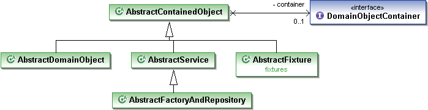

How to have a domain service be a POJO (not inherit from framework superclasses)
--------------------------------------------------------------------------------

Like entities, it isn't mandatory for domain services to inherit from
any framework superclass; they can be plain-old pojos if required.
However, again, like entities, they do at a minimum need to have a
org.apache.isis.applib.DomainObjectContainer injected into them (an
interface), from which other framework services can be accessed.

If you don't have a requirement to inherit from any other superclass,
then it usually makes sense to inherit from one of the abstract classes
in the applib, either org.apache.isis.applib.AbstractService or
org.apache.isis.applib.AbstractRepositoryAndFactory. These already
supports the DomainObjectContainer and have a number of convenience
helper methods.

The UML class diagram below shows the relationship between these types
and the DomainObjectContainer.

What this means is that *Apache Isis* treats factories and repositories
as just another type of domain service.
