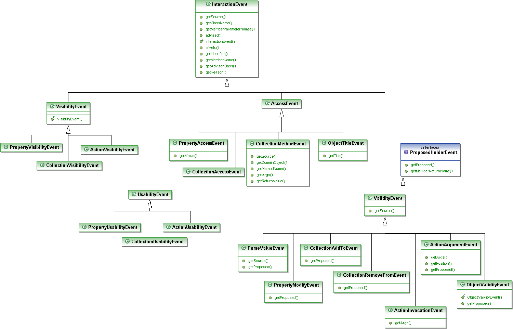

@PublishedAction
----------------

See [Isis website](http://isis.apache.org/core/publishing-service.html).

@PublishedObject
----------------

See [Isis website](http://isis.apache.org/core/publishing-service.html).

@Programmatic
-------------

The @Programmatic annotation can be used to cause Apache Isis to
complete ignore a class member. This means it won't appear in any
viewer, its value will not be persisted, and it won't appear in any XML
snapshots (see ?).

A common use-case is to ignore implementation-level artifacts. For
example:

    public class Customer implements Comparable<Customer> {
        ...
        @Programmatic
        public int compareTo(Customer c) { 
            return getSalary() - c.getSalary();
        }
        ...
    }

Note that @Programmatic does not simply imply @Hidden and @NotPersisted;
it actually means that the class member will not be part of the Isis
metamodel.

@QueryOnly (deprecated)
-----------------------

Equivalent to using `@ActionSemantics(Of.SAFE)` on an action.

@RegEx
------

The `@RegEx` annotation may be applied to any string property, or to any
parameter within an action method. It can also be applied to any
string-based value type. It serves both to validate and potentially to
normalise the format of the input. `@Regex` is therefore similar in use
to `@Mask` (see ?) but provides more flexibility.

The syntax is:

`@RegEx(validation = "regEx string",
        format = "regEx string", caseSensitive =
        <true|false>)`

Only the first parameter is required; the format defaults to "no
formatting", and caseSensitive defaults to false.

For example, on a property:

    public class Customer {
        @RegEx(validation = "(\\w+\\.)*\\w+@(\\w+\\.)+[A-Za-z]+")
        public String getEmail() {}
        ...
    }

Or, on a parameter:

    public class Customer {
        public void updateEmail(
                @RegEx(validation = "(\\w+\\.)*\\w+@(\\w+\\.)+[A-Za-z]+")
                @Named("Email") String email) {
            ...
        }
        ...
    )

Or, on a value type:

    @Value(...)
    @RegEx(validation = "(\\w+\\.)*\\w+@(\\w+\\.)+[A-Za-z]+")
    public class EmailAddress {
       ...
    y}

@Render
-------

The @Render annotation is a hint for properties and collections to
indicate that a value property should be rendered lazily (rather than
eagerly, as usual), or that a reference property or collection should be
rendered eagerly (rather than lazily, as usual).

Viewers can use this to present the property/collection in an
appropriate manner:

-   an Order's lineItems collection might initially be rendered expanded
    form so that the user could see a list of line items immediately
    when the order is rendered. This is the most common use case.

-   a (reference) property of type Address might show the details of the
    referenced Address in a box

At the same time, an object store might use this to defer lazy loading
of values that represent blobs or clobs.

For example:

    public class Order {
        @Render(Type.EAGERLY)
        public List<LineItem> getDetails() { ... }

        ...
    }

For properties and collections there is some similarity between this
concept and that of eager-loading as supported by some object stores.
Indeed, some object stores may choose use their own specific annotations
(eg a JDO default fetch group) in order to infer this semantic.

@Resolve (deprecated)
---------------------

The `@Resolve` annotation is deprecated, and has been replaced by the
`@Render` annotation (with exact same semantics).

@Title
------

The `@Title` annotation is used to indicate which property or properties
make up the object title. If more than one property is used, the order
can be specified (using the same Dewey-decimal notation as used by
@MemberOrder) and the string to use between the components can also be
specified.

For example:

    public void Customer {
        @Title(sequence="1.0")
        public String lastName() { ... }
        ...
        @Title(sequence="1.5", prepend=", ")
        public String firstName() { ... }
        ...
        @Title(sequence="1.7", append=".")
        public String midInitial() { ... }
        ...
    }

could be used to create names of the style "Bloggs, Joe K."

It is also possible to annotate reference properties; in this case the
title will return the title of the referenced object (rather than, say,
its string representation).

An additional convention for @Title properties is that they are hidden
in tables (in other words, it implies `@Hidden(where=Where.ALL_TABLES)`.
For viewers that support this annotation (for example, the Wicket
viewer), this convention excludes any properties whose value is already
present in the title column. This convention can be overridden using
`@Hidden(where=Where.NOWHERE)`.

@TypeOf
-------

The `@TypeOf` annotation is used to specify the type of elements in a
collection, when for whatever reason it is not possible to use generics.

> **Note**
>
> Given that Apache Isis only supports Java 1.6 and later, it's not that
> obvious what such a reason might be...

For example:

    public void AccountService {
        @TypeOf(Customer.class)
        public List errantAccounts() {
            return CustomerDatabase.allNewCustomers();
        }
        ...
    }

@TypicalLength
--------------

The `@TypicalLength` annotation indicates the typical length of a
`String` property or `String` parameter in an action. It can also be
specified for string-based value types.

The information is generally used by the viewing mechanism to determine
the space that should be given to that property or parameter in the
appropriate view. If the typical length is the same as the `@MaxLength`
(see ?) then there is no need to specify `@TypicalLength` as well. If
the value specified is zero or negative then it will be ignored.

For example, for a property:

    public class Customer {
        @MaxLength(30)
        @TypicalLength(20)
        public String getFirstName() { ... }
        public void setFirstName(String firstName) { ... }
    }

Or, for a parameter:

    public class CustomerRepository {
        public Customer newCustomer(
                @TypicalLength(20)
                @Named("First Name") String firstName
               ,@TypicalLength(20)
                @Named("Last Name") String lastName) {
            ...
        }
        ...
    }

Or, for value type:

    @Value(...)
    @TypicalLength(20)
    public class FirstName {
        ...
    }

@Value
------

The `@Value` annotation indicates that a class should be treated as a
value type rather than as a reference (or entity) type. It does this
providing an implementation of a
org.apache.isis.applib.adapters.ValueSemanticsProvider.

For example:

    @Value(semanticsProviderClass=ComplexNumberValueSemanticsProvider.class)
    public class ComplexNumber {
        ...
    }

The ValueSemanticsProvider allows the framework to interact with the
value, parsing strings and displaying as text, and encoding/decoding
(for serialization). For more information, see ?.

@ViewModel
----------

The @ViewModel annotation allows the developer to declare that a domain
object is intended to be used as a view model. As such, any changes to
its structure are guaranteed to be backwardly compatible.

The annotation was originally introduced to support a requirement of the
RestfulObjects viewer which directly expose the domain objects as
RESTful representations

For example, a domain object that represents a summary of a Customer and
their most recent Orders might be annotated as:

    @NotPersistable
    @ViewModel
    public class CustomerAndOrdersViewModel {
       ...
    }

DomainObjectContainer interface
===============================

> Provides a single point of contact from domain objects into the
> *Apache Isis* framework.

The DomainObjectContainer interface provides a single point of contact
from domain objects into the *Isis* framework. It can also be used as a
lightweight general purpose repository during prototyping.

                Category                Method                                                             Description
  ------------------------------------- ------------------------------------------------------------------ -------------------------------------------
             Object creation            newTransientInstance(Class\<T\>)                                   Creates new non-persisted object
    newPersistentInstance(Class\<T\>)   Creates new object, will be persisted at end of action
     newInstance(Class\<T\>, Object)    Creates object in state persistence state as that provided
               Validation               isValid(Object)                                                    whether object is valid
            validate(Object)            reason why object is invalid (if any)
           Generic Repository           allInstances(Class\<T\>)                                           All persisted instances of specified type
   allMatches(Class\<T\>, Filter\<T\>)  All persistenced instances of specified type matching filter
     allMatches(Class\<T\>, String)     All persisted instances with the specified string as their title
     allMatches(Class\<T\>, Object)     All persisted instances matching object (query-by-example)
         allMatches(Query\<T\>)         All instances satisfying the provided query
             firstMatch(...)            As for allMatches(...), but returning first instance
            uniqueMatch(...)            As for firstMatch(...), but requiring there to be only one match

  : DomainObjectContainer methods (1 of 2)

                   Category                  Method                                                                                                 Description
  ------------------------------------------ ------------------------------------------------------------------------------------------------------ -----------------------------------------------------------------------
              Object persistence             isPersistent(Object)                                                                                   whether object is persistent
               persist(Object)               persist the transient object
         persistIfNotAlready(Object)         persist the object (provided is not already persisted)
                remove(Object)               remove the persisted object
          removeIfNotAlready(Object)         remove the object (provided is not already transient)
                 Presentation                titleOf(Object)                                                                                        Returns the title of the object.
            Messages and warnings            informUser(String)                                                                                     Inform the user
               warnUser(String)              Warn the user about a situation, requiring acknowledgement.
              raiseError(String)             Notify user of a serious application error, typically requiring further action on behalf of the user
                   Security                  getUser()                                                                                              The currently-logged on user
                  Properties                 getProperty(String)                                                                                    Value of configuration property
              getPropertyNames()             All configuration properties available
   Lazy loading, dirty object tracking (\*)  resolve(Object)                                                                                        Lazy load object (overloaded to optionally load a property of object)
            objectChanged(Object)            Mark object as dirty
         Object store control (\*\*)         flush()                                                                                                Flush all pending changes to object store
                   commit()                  Commit all pending changes to object store

  : DomainObjectContainer methods (2 of 2)

> **Note**
>
> (\*) generally not necessary to call - performed by bytecode proxies

> **Note**
>
> (\*\*) the use of these methods is discouraged - they are typically
> used only for tests

Security Classes
================

> A simple set of classes to represent the currently logged on user and
> their roles.

When the user logs onto an Isis application, the framework constructs a
representation of their user and roles using classes from the applib.
This allows the application to inspect and act upon those details if
required.

The user details are captured in the
org.apache.isis.applib.security.UserMemento class ("memento" because it
is a snapshot of their credentials at the point of logging on). The
UserMemento class defines the following properties:

-   `name` (a String)

-   collection of roles (as RoleMemento)

The org.apache.isis.applib.security.RoleMemento class in turn defines
two properties:

-   `name` (a String)

-   `description` (a String)

To obtain the current user, the application can call
DomainObjectContainer\#getUser(). For more on the DomainObjectContainer,
see ?.

Utility Classes
===============

> Simple utility classes for domain objects.

The org.apache.isis.applib.util package has a number of simple utility
classes designed to simplify the coding of some common tasks.

Title creation
--------------

The TitleBuffer utility class is intended to make it easy to construct
title strings (returned from the title() method). For example, it has
overloaded versions of methods called append() and concat().

Reason text creation (for disable and validate methods)
-------------------------------------------------------

There are two different classes provided to help build reasons returned
by disableXxX() and validateXxx() methods:

-   the org.apache.isis.applib.util.ReasonBuffer helper class

-   the org.apache.isis.applib.util.Reasons helper class

For example:

    public class Customer {
        ...
        public String validatePlaceOrder(Product p, int quantity) {
            return Reasons.coalesce(
                whetherCustomerBlacklisted(this),
                whetherProductOutOfStock(p)
            );
        }
    }

Which you use (if any) is up to you.

Events
======

> The InteractionEvent hierarchy.

Although not supported by the default programming model, the applib
nevertheless defines an event hierarchy that characterizes all of the
different types of interactions that can occur. This is used by the
wrapper programming model, and is exploited by the JUnit viewer.

The following UML class diagram shows the hierarchy of events:

Package Dependencies
====================

> The dependencies between the packages.

\*\*\* these diagrams are out of date \*\*\*

The following diagram shows that the relationship between the different
packages that make up the applib (note that there are no cyclic
dependencies between the packages):

The following diagram shows the same packages, but from a layered,
architecture perspective:

[^1]: A profile store is a persistence mechanism provided by the
    configured runtime that allows user profiles to be stored between
    runs. It is similar to, but independent of, an object store (which
    stores the domain objects themselves).
