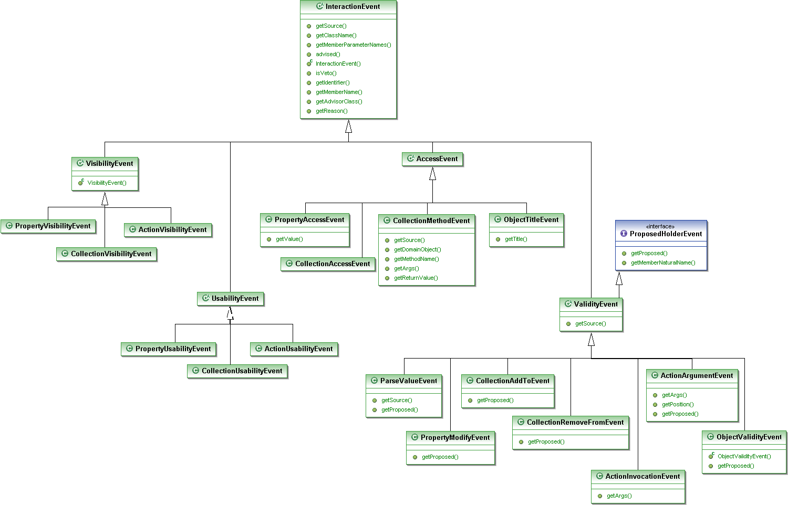

Events
======

> The InteractionEvent hierarchy.

Although not supported by the default programming model, the applib
nevertheless defines an event hierarchy that characterizes all of the
different types of interactions that can occur. This is used by the
wrapper programming model, and is exploited by the JUnit viewer.

The following UML class diagram shows the hierarchy of events:

