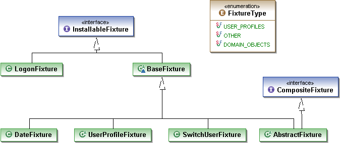

Fixtures and SwitchUser
=======================

> Using fixtures to setup the system, generally for testing purposes.

Fixtures are used to setup the framework into a known state. This is
predominantly done for testing, and in particular when running with the
in-memory object store. However, fixtures can also be used to specify
the user that has "logged on", and to set the clock.

Whether a fixture has any effect will depend on several factors:

-   the first is the DeploymentType; specifying the logged on user will
    only be honoured if running in exploration mode (or more precisely,
    where DeploymentType\#isExploring() returns true);

-   the second is the object store; most persistent object stores will
    either ignore fixtures, or only allow them to be installed once or
    if run with an (object store-specific) flag set

How to register fixtures
------------------------

All domain services (which includes repositories and factories) should be registered in the *isis.properties* configuration file, under the `isis.fixtures.prefix` and `isis.fixtures` keys.

For example:

    isis.fixtures.prefix= org.apache.isis.support.prototype.fixture
    isis.fixtures= ClaimsFixture,LogOnAsCliveFixture

It is also possible to specify fixtures from the command line, using the
--fixture flag.

How to write custom fixtures
----------------------------

The applib defines several interfaces and classes for writing fixtures.
The following UML diagram shows their relationships:

### InstallableFixture and FixtureType

The `InstallableFixture` interface defines the general contract between a
fixture and the framework: the `FixtureType`, and an `install()` method.

The `FixtureType` is used to characterize whether the fixture:

-   if `FixtureType.DOMAIN_OBJECTS` (the default), then the fixture will
    be installed only so long as the configured object store does not
    indicate that fixtures have already been installed

-   if `FixtureType.USER_PROFILES`, then the fixture will be installed
    only so long as the configured profile store does not indicate that
    fixtures have already been installed

-   if `FixtureType.OTHER`, then the fixture will always be installed.
    This usually refers to setting the clock or user.

### BaseFixture and AbstractFixture

The `BaseFixture` class is not API, but is responsible for instantiating `FixtureClock`. This is an implementation of `Clock` singleton, which <!--(as
described in ?)-->, is used by the rest of the *Isis* framework delegates
to in order to obtain the current time. The `FixtureClock`'s purpose is to
allow the current date/time to be set by other fixtures.

The `AbstractFixture` class (inheriting from `BaseFixture`) is an
general-purpose adapter for writing fixtures. It implements
`CompositeFixture` interface, meaning that hierarchies of fixtures can be
created following the composite design pattern. It also provides a
number of convenience methods:

-   the `setDate(...)` and `setTime(...)` method allow the date/time to be set.

    This is done using by obtaining the `FixtureClock` (from `BaseFixture`).
    There are also some convenience methods to move the date/time either earlier or later.

-   the `switchUser(...)` method allow the logged-on user to be changed

    This changes the user logged-on while the fixtures are being installed. This is to facilitate tests that have complex setup requirements, eg verifying workflow between different user roles.

An alternative to using `setDate(...)`/`setTime(...)` is to use `DateFixture`, and an alternative to using `switchUser(...)` is to use `SwitchUserFixture`.
Which you use is largely a matter of personal preference.

### DateFixture

The `DateFixture` provides an alternative to `AbstractFixture`, just allowing the current date/time to be set.

The main difference is one of style; `DateFixture` can be used in a declarative way, whereas `AbstractFixture` is more imperative. For example:

    public class DateIs13Jan2007Fixture extends DateFixture {
        public DateIs13Jan2007Fixture() {
            super(2007,1,13);
        }
    }

A fixture in this style could then be used within a composite fixture hierarchy.

### SwitchUserFixture

The `SwitchUserFixture` provides an alternative to `AbstractFixture`, just allowing the current user to be switched.

The main difference is one of style; `SwitchUserFixture` can be used in a declarative way, whereas `AbstractFixture` is more imperative.

For example:

    public class SwitchToFrankSupervisorFixture extends SwitchUserFixture {
        public SwitchToFrankSupervisorFixture() {
            super("frank", "user", "supervisor");
        }
    }

A fixture in this style could then be used within a composite fixture hierarchy.

> **Warning**
>
> Do be aware of when you call `switchUser()` in a `Fixture` 
> as it causes the current transaction to be ended and a 
> new one started (for the new user). If you share a 
> reference between the two you will get an exception.
>
> For example:
>
>     Account account = accounts.createAccount(
>         "ACME", "Peter Planner", "pplanner@acme.com");
>     Participant peterPlanner = account.getAdmin();
>             
>     switchUser("pplanner@acme.com", new String[0]);
>
>     Work work = plan1.createWork();
>     BcpPlan plan = (BcpPlan) work.getTarget();
>     plan.getOwner().modifyLeader(peterPlanner);
>
> This will fail because `peterPlanner` reference is no longer valid after the switch user.
>
> The solution is to retrieve the object again so it is part of the
> second transaction. In this example we can change to code to this:
>
>     accounts.createAccount("ACME", "Peter Planner", "pplanner@acme.com");
>             
>     switchUser("pplanner@acme.com", new String[0]);
>
>     Account account = uniqueMatch(Account.class, "0 ACME");
>     Participant peterPlanner = account.getAdmin();
>
>     Work work = plan1.createWork();
>     BcpPlan plan = (BcpPlan) work.getTarget();
>     plan.getOwner().modifyLeader(peterPlanner);

### LogonFixture

Unlike the very similar `SwitchUserFixture`, this fixture does not affect the currently logged on user while the fixtures are being installed.
Instead, it is used to specify the user to logon as once all the fixtures have been installed.

If more than one `LogonFixture` is specified, the last one encountered is used.

### UserProfileFixture

The `UserProfileFixture` is used to populate the configured profile store <!--[^1]--> with user profiles <!--(the concept of which is described in ?)-->.

To create a user profile for a specific user, inherit from
`UserProfileFixture`, use the inherited `newUserProfile()` to create a profile and use the inherited `saveForUser(...)` method to save that profile.

It is also possible to create a 'template' perspective using the `saveAsDefault(...)` method. This is used as the basis for any new perspectives that are automatically created, eg for users who are logging in and for whom there is no perspective in existence.

For example:

    public class PerspectivesFixture extends UserProfileFixture {
      @Override
      protected void installProfiles() {
        Profile profile = newUserProfile();
        Perspective perspective = profile.newPerspective("ECS");
        perspective.addToServices(LocationFactory.class);
        perspective.addToServices(CustomerRepository.class);
        perspective.addToServices(PaymentMethodFactory.class);
            
        saveAsDefault(profile);
      }
    }

With that set up, when a new user now logs in they will see three service icons on the screen for locations, customers and payment methods. In the *dnd viewer* the user will be able to add and remove services from their perspective. See the DnD Viewer documentation for further details.

Any fixtures, if specified, are only ever loaded once; the fixture installer checks with `UserProfileSevice.isInitialized()` to see if the fixture is already installed. This allows fixtures to be used for seeding a persisting profile store, and then be ignored thereafter.

