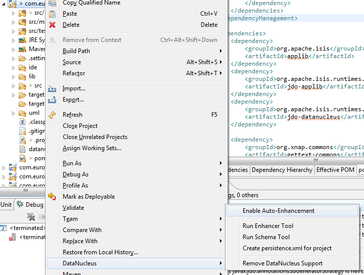

Title: Using JDO/DataNucleus with Eclipse

> See also:
> 
> * this page describing [how to use JDO/DataNucleus with Maven](./datanucleus-and-maven.html).  
> * this screencast describing [how to import an application into Eclipse](../../../intro/tutorials/screencasts.html)
> 

By leveraging the JDO/Datanucleus ORM, Isis' JDO objectstore is very powerful. However, with such power comes a little bit of complexity to the development environment: all domain objects must be enhanced through the [JDO enhancer](http://db.apache.org/jdo/enhancement.html).  So the enhancer must, in one way or another, be integrated into your development environment.

If working in Eclipse, then JDO enhancement is done by installing [DataNucleus' plugin](http://www.datanucleus.org/plugins/ide.eclipse.html).  This hooks the bytecode enhancement of your domain objects into Eclipse's normal incremental compilation.

This plugin needs to be configured for each of your domain projects.  Often, there will only be one such domain project in your workspace (though there could be many).  Details on are in the section below.

Over and above this, there are two distinct sets of problems you may encounter:

* if running on Windows, then there's a good chance you'll hit the [maximum path length limit](http://msdn.microsoft.com/en-us/library/aa365247%28VS.85%29.aspx#maxpath). Fortunately, the workaround is straight-forward: configure a `persistence.xml` file.  (This workaround is also required if [developing in Maven](./datanucleus-and-maven.html)).

* you may also find that the DataNucleus plugin within Eclipse can get confused.  We have a process that usually works.

To the detail...

## Configuring a domain project with the DataNucleus enhancer

> note:
> Make sure you are in the 'Java' Perspective, not the 'Java EE' Perspective.  

In Eclipse, for the *domain object model* project, first add DataNucleus support:

 

Then turn on Auto-Enhancement:
 

### Update the classpath

DataNucleus' enhancer uses the domain object model's own classpath to reference DataNucleus JARs.  So, even though your domain objects are unlikely to depend on DataNucleus, these references must still be present.

Add the following to your `pom.xml`:

<pre>
&lt;dependencies&gt;
    &lt;dependency&gt;
        &lt;groupId&gt;org.apache.isis.core&lt;/groupId&gt;
        &lt;artifactId&gt;isis-core-applib&lt;/artifactId&gt;
    &lt;/dependency&gt;

    &lt;dependency&gt;
        &lt;groupId&gt;org.apache.isis.objectstore&lt;/groupId&gt;
        &lt;artifactId&gt;isis-objectstore-jdo-applib&lt;/artifactId&gt;
    &lt;/dependency&gt;

    &lt;!-- DataNucleus (horrid, but needed to run the enhancer)--&gt;
    &lt;dependency&gt;
        &lt;groupId&gt;javax.jdo&lt;/groupId&gt;
        &lt;artifactId&gt;jdo-api&lt;/artifactId&gt;
    &lt;/dependency&gt;
    &lt;dependency&gt;
        &lt;groupId&gt;org.datanucleus&lt;/groupId&gt;
        &lt;artifactId&gt;datanucleus-core&lt;/artifactId&gt;
    &lt;/dependency&gt;
    &lt;dependency&gt;
        &lt;groupId&gt;org.datanucleus&lt;/groupId&gt;
        &lt;artifactId&gt;datanucleus-enhancer&lt;/artifactId&gt;
        &lt;exclusions&gt;
            &lt;exclusion&gt;
                &lt;groupId&gt;org.ow2.asm&lt;/groupId&gt;
                &lt;artifactId&gt;asm&lt;/artifactId&gt;
            &lt;/exclusion&gt;
        &lt;/exclusions&gt;
    &lt;/dependency&gt;
    &lt;dependency&gt;
        &lt;groupId&gt;org.datanucleus&lt;/groupId&gt;
        &lt;artifactId&gt;datanucleus-api-jdo&lt;/artifactId&gt;
        &lt;/dependency&gt;
&lt;/dependencies&gt;
</pre>

Then, tell DataNucleus to use the project classpath:

When the enhancer runs, it will print out to the console:

## Workaround for path limits (the DN plugin to use the persistence.xml)

As noted above, if running on Windows then the DataNucleus plugin is very likely to hit the Windows path limit.

To fix this, we configure the enhancer to read from the `persistence.xml` file.  (This fix is also required if [working with Maven](./datanucleus-and-maven.html)).

As a prerequisite, first make sure that your domain object has a `persistence.xml` file.  The details of how to do this can be found [here](./persistence_xml.html).

Then specify the `persistence-unit` in the project properties:
>

### Other domain projects.

There is nothing to prevent you having multiple domain projects.  You might want to do such that each domain project corresponds to a [DDD module](http://www.methodsandtools.com/archive/archive.php?id=97p2), thus guaranteeing that there are no cyclic dependencies between your modules.

If you do this, make sure that each project has its own `persistence.xml` file.

And, remember also to configure Eclipse's DataNucleus plugin for these other domain projects.

### JDO Applib domain projects.

The JDO objectstore also defines some of its own persistable domain entities, these being used in its implementation of the [Publishing Service](./publishing-service-jdo.html) and the [Settings Services](./settings-services-jdo.html).   These persistable domain entities are defined in the JDO applib, and must be enhanced.

If just using released versions of Isis, then there is nothing to be done.

However, if building Isis from source code and in Eclipse, and if you plan to use either of these services, then you must also configure Eclipse's DataNucleus plugin.

As noted in the [page describing persistence.xml](./persistence_xml.html), the `persistence-unit` name is: `jdo-applib`.  You should therefore configure the enhance the DataNucleus enhancer for the `isis-objectstore-jdo-applib` project, and configure the plugin as shown below:
>
 

## Workaround: If the enhancer fails

On occasion it appears that Eclipse can attempt to run two instances of the DataNucleus enhancer.  This is probably due to multiple Eclipse builders being defined; we've noticed multiple entries in the Eclipse's `Debug` view:

At any rate, you'll know you've encountered this error if you see the following in the console:

The best solution is to remove DataNucleus support and then to re-add it:

If you consistently hit problems, then the final recourse is to disable the automatic enhancement and to remember to manually enhance your domain object model before each run.  Not ideal, we know.  Please feel free to contribute a better solution :-)
