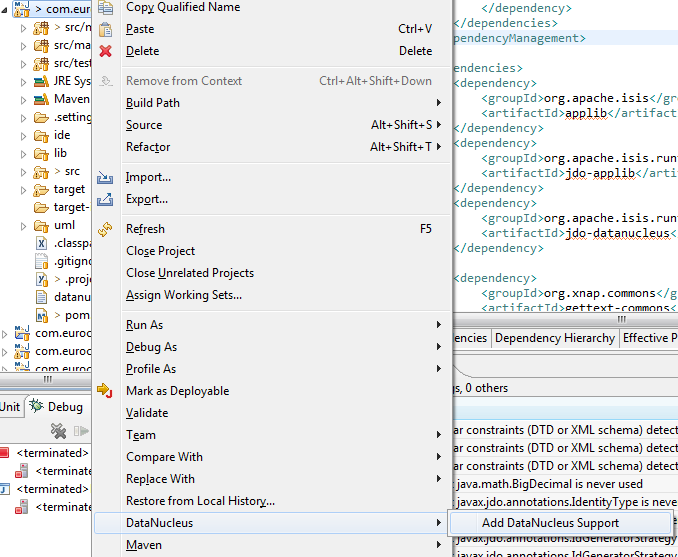

Title: Using JDO in Maven and Eclipse

By leveraging the JDO/Datanucleus ORM, Isis' JDO objectstore is very powerful. However, with such power comes a little bit of complexity to the development environment: all domain objects must be enhanced through the [JDO enhancer](http://db.apache.org/jdo/enhancement.html).  So the enhancer must, in one way or another, be integrated into your development environment.

If working from the Maven command line, JDO enhancement is done using the `maven-datanucleus-plugin`.

If working in Eclipse, then JDO enhancement is done by installing [DataNucleus' plugin](http://www.datanucleus.org/products/datanucleus/guides/eclipse/index.html#preferences_enhancer).  This hooks the bytecode enhancement of your domain objects into Eclipse's normal incremental compilation.

There are two distinct sets of problems you may encounter:

* if you are running on Windows (either in Maven or Eclipse), then there's a good chance you'll hit the [maximum path length limit](http://msdn.microsoft.com/en-us/library/aa365247%28VS.85%29.aspx#maxpath). Fortunately, there is a workaround.

* if you are developing in Eclipse and a new version of DataNucleus is released to Maven central repo, then this can cause classpath issues.  Again, there is a workaround.

In other words:

<table>
<tr><th>&nbsp;</th><th>Maven</th><th>Eclipse</th></tr>
<tr><td><b>Unix</b></td><td>use workaround when new DN version</td><td>no known issues</td></tr>
<tr><td><b>Windows</b></td><td>use workaround for path limit use workaround when new DN versions</td> </td><td>use workaround for path limits</tr>
</table>

In addition, Eclipse's enhancer needs some special care over the classpath.

## For Eclipse: configuring the enhancer

for the domain object model project, first add DataNucleus support:

Then turn on Auto-Enhancement:

### For Eclipse: classpath considerations

Update domain object model's classpath to reference DataNucleus JARs:

And tell DataNucleus to use the project classpath:

When the enhancer runs, it will print out to the console:

## Workaround for path limits: using `persistence.xml`

### Create `persistence.xml`

in `src/main/java/META-INF` of the domain project:

### For Eclipse: Windows &gt; Preferences

## Workaround for DN versions: using a profile

Every so often there will be a new release of DataNucleus plugins to the Maven central repo.  For better or for worse, the Maven DataNucleus plugin defines a range dependency: it will always use the latest version of the DN modules available.

The Eclipse DataNucleus plugin on the other hand is configured to use the project classpath, and so it will remain compatible with the version referenced by Isis' own JDO objectstore.

Unfortunately, if the enhancer is run referencing two different versions of the `org.datanucleus:dataducleus-core` jar, then it will fail.

The fix is to use a Maven profile:

This says that when *not* run within Eclipse (the ${m2e.version} property is *not* set), then to use the latest version of the DataNucleus dependency can be referenced.  You can maintain the &lt;version&gt; to keep track with the latest-n-greatest available in the Maven repo.

## For Eclipse: If the enhancer fails

On occasion it appears that Eclipse can attempt to run two instances of the DataNucleus enhancer.  This is probably due to multiple Eclipse builders being defined; we've noticed multiple entries in the Eclipse's `Debug` view:

At any rate, you'll know you've encountered this error if you see the following in the console:

The best solution is to remove DataNucleus support and then to re-add it:

