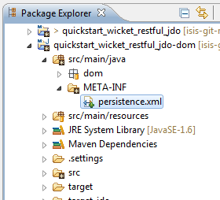

Title: Configuring the persistence.xml file

[//]: # (content copied to _user-guide_getting-started_datanucleus-enhancer)

> See also:
>
> * [how to use JDO/DataNucleus with Maven](./datanucleus-and-maven.html).  
> * [how to use JDO/DataNucleus with Eclipse](./datanucleus-and-eclipse.html).  

By leveraging the JDO/Datanucleus ORM, Isis' JDO objectstore is very powerful. However, with such power comes a little bit of complexity to the development environment: all domain objects must be enhanced through the [JDO enhancer](http://db.apache.org/jdo/enhancement.html).  So the enhancer must, in one way or another, be integrated into your development environment.

Whether working with [Maven](datanucleus-and-maven.html) or with [Eclipse](datanucleus-and-eclipse.html) and on the Windows, there's a good chance you'll hit the [maximum path length limit](http://msdn.microsoft.com/en-us/library/aa365247%28VS.85%29.aspx#maxpath). The workaround is straight-forward: configure a `persistence.xml` file.

## Create persistence.xml for the domain project

In `src/main/java/META-INF` of the domain project:

Specify a suitable value for the `<persistence-unit>`:

<pre>
&lt;?xml version=&quot;1.0&quot; encoding=&quot;UTF-8&quot; ?&gt;
&lt;persistence xmlns=&quot;http://java.sun.com/xml/ns/persistence&quot;
    xmlns:xsi=&quot;http://www.w3.org/2001/XMLSchema-instance&quot;
    xsi:schemaLocation=&quot;http://java.sun.com/xml/ns/persistence http://java.sun.com/xml/ns/persistence/persistence_1_0.xsd&quot; version=&quot;1.0&quot;&gt;

    &lt;persistence-unit name=&quot;simpleapp&quot;&gt;
    &lt;/persistence-unit&gt;
&lt;/persistence&gt;
</pre>

The rest of the file can be left alone; Isis will automatically register all entities with DataNucleus.

If you are using Eclipse, note that will also need to configure Eclipse's DataNucleus plugin; details can be found [here](./datanucleus-and-eclipse.html).

## Other domain projects.

There is nothing to prevent you having multiple domain projects.  You might want to do such that each domain project corresponds to a [DDD module](http://www.methodsandtools.com/archive/archive.php?id=97p2), thus guaranteeing that there are no cyclic dependencies between your modules.

If you do this, make sure that each project has its own `persistence.xml` file.

And, if you are using Eclipse, remember also to configure Eclipse's DataNucleus plugin for these other domain projects; details can be found [here](./datanucleus-and-eclipse.html).

