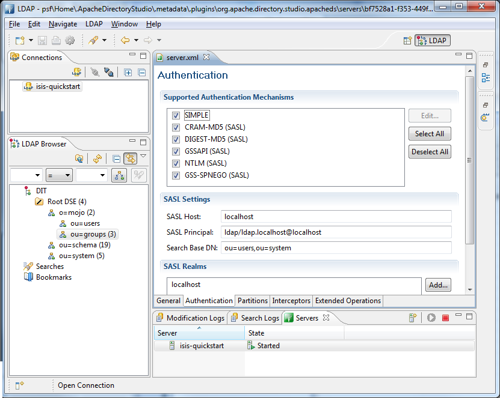
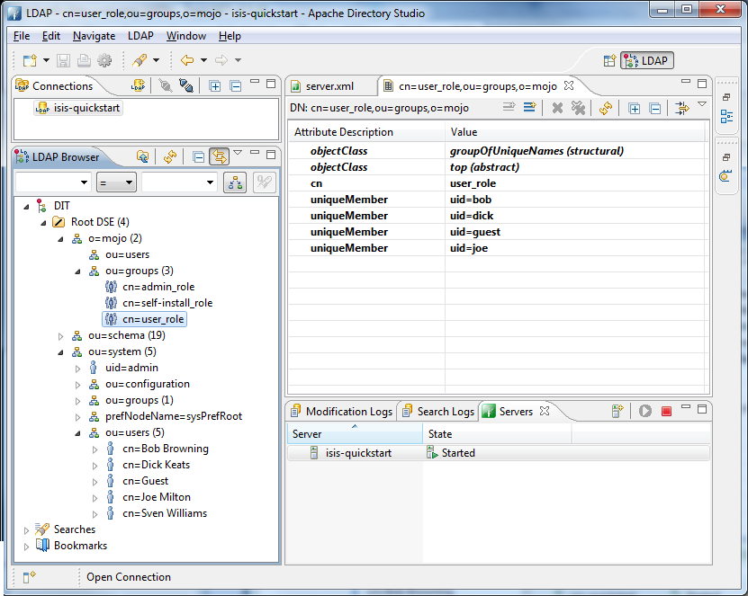

Title: Using Shiro with an LDAP Server

Isis ships with an implementation of [Apache Shiro](http://shiro.apache.org)'s `Realm` class that allows user authentication and authorization to be performed against an LDAP server.

The configuration required in the `WEB-INF/shiro.ini` file is:

<pre>
contextFactory = org.apache.isis.security.shiro.IsisLdapContextFactory
contextFactory.url = ldap://localhost:10389
contextFactory.authenticationMechanism = CRAM-MD5
contextFactory.systemAuthenticationMechanism = simple
contextFactory.systemUsername = uid=admin,ou=system
contextFactory.systemPassword = secret

ldapRealm = org.apache.isis.security.shiro.IsisLdapRealm
ldapRealm.contextFactory = $contextFactory

ldapRealm.searchBase = ou=groups,o=mojo
ldapRealm.groupObjectClass = groupOfUniqueNames
ldapRealm.uniqueMemberAttribute = uniqueMember
ldapRealm.uniqueMemberAttributeValueTemplate = uid={0}

# optional mapping from physical groups to logical application roles
ldapRealm.rolesByGroup = \
    LDN_USERS: user_role,\
    NYK_USERS: user_role,\
    HKG_USERS: user_role,\
    GLOBAL_ADMIN: admin_role,\
    DEMOS: self-install_role

ldapRealm.permissionsByRole=\
   user_role = *:ToDoItemsJdo:*:*,\
               *:ToDoItem:*:*; \
   self-install_role = *:ToDoItemsFixturesService:install:* ; \
   admin_role = *

securityManager.realms = $ldapRealm
</pre>

where:

* user accounts are searched under `ou=system`
  * users have, at minimum, a `uid` attribute and a password
  * SASL (CRAM-MD5) authentication is used for this authentication
  * the users credentials are used to verify their user/password
* groups are searched under `ou=groups,o=mojo` (where `mojo` is the company name)
  * each group has an LDAP objectClass of `groupOfUniqueNames`
  * each group has a vector attribute of `uniqueMember`
  * each value of `uniqueMember` is in the form `uid=xxx`, with `xxx` being the uid of the user
  * the group membership is looked up using the specified system user
* groups looked up from LDAP can be mapped to logical roles
  * if no group-to-role mapping is provided, then the group names are used as role names with no translation

The above configuration has been tested against [ApacheDS](http://directory.apache.org/apacheds/), v1.5.7.  This can be administered using [Apache Directory Studio](http://directory.apache.org/studio/), v1.5.3.

### Active DS LDAP Configuration

The screenshot below shows the ApacheDS using Apache Directory Studio.  The setup here was initially base on [this tutorial](http://krams915.blogspot.co.uk/2011/01/ldap-apache-directory-studio-basic.html).  However, user accounts have been moved to a separate node.

#### Configure Mojo partition and nodes under Root

Create a partition in order to hold the mojo node (holding the groups)

Create the `ou=groups,o=mojo` hierarchy

Configure SASL authentication.  This means that the checking of user/password is done implicitly by virtue of Isis connecting to LDAP using these credentials.

In order for SASL to work, it seems to be necessary to put users under `o=system`.  (This is why the setup is slightly different than the tutorial mentioned above).

Configure the users into the groups.

