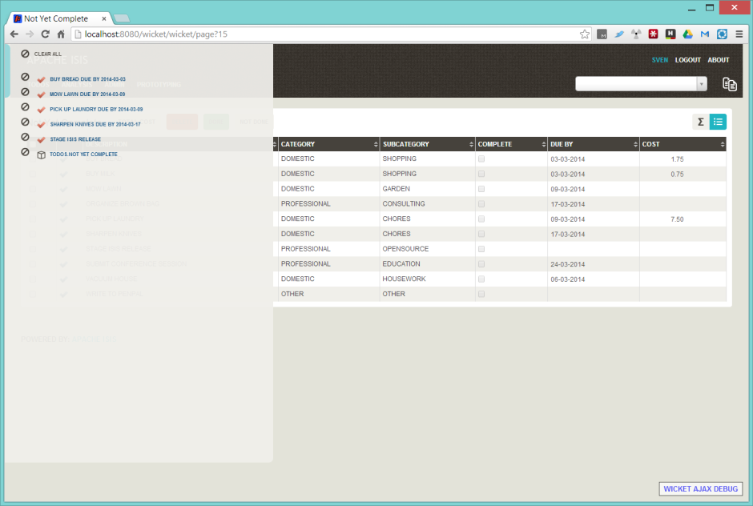
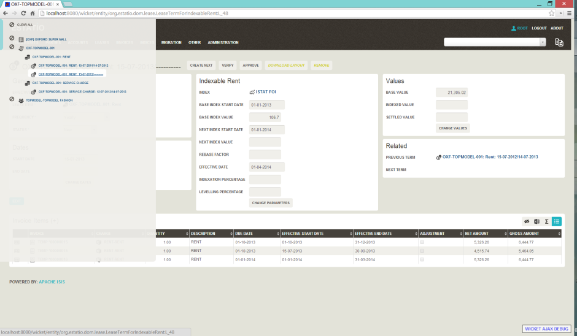

Title: Bookmarks

The Wicket viewer supports the bookmarking of both domain objects and [safe](../../../reference/recognized-annotations/ActionSemantics.html) (query-only) actions.  

Domain objects, if bookmarkable, can be nested.

Bookmarking is automatic; whenever a bookmarkable object/action is visited, then a bookmark is created.  To avoid the number of bookmarks from indefinitely growing, bookmarks that have not been followed after a whle are automatically removed (an MRU/LRU algorithm).  The number of bookmarks to preserve can be configured.

##Screenshots

#### Simple List

The following screenshot, taken from example todo app (generated by the [quickstart archetype](../../../intro/getting-started/quickstart-archetype.html)) shows how the bookmarks are listed in a sliding panel.

(screenshot of v1.4.0)

Note how the list contains both domain objects and an action ("not yet complete").

#### Nested bookmarks

The following screenshot, taken from the [Estatio](https://github.com/estatio/estatio) application, shows a variety of different bookmarked objects.  

Some - like Property, Lease and Party - are root nodes.  However, LeaseItem is bookmarkable as a child of Lease, and LeaseTerm is bookmarkable only as a child of LeaseItem.  This parent/child relationship is reflected in the layout.

##Domain Code

To indicate a class is bookmarkable, use the [@Bookmarkable](../../../reference/recognized-annotations/Bookmarkable.html] annotation:

    @Bookmarkable
    public class Lease { ... }

To indicate a class is bookmarkable but only as a child of some parent bookmark, specify the bookmark policy:

    @Bookmarkable(BookmarkPolicy.AS_CHILD)
    public class LeaseItem { ... }
    
To indicate that a safe (query only) action is bookmarkable, again use the `@Bookmarkable` annotation:

    public class ToDoItem ... {
        ...
        @Bookmarkable
        @ActionSemantics(Of.SAFE)
        public List<ToDoItem> notYetComplete() { ... }
        ...
    }

##User Experience

The sliding panel appears whenever the mouse pointer hovers over the thin blue tab (to the left of the top header region).

Alternatively, `alt+[` will toggle open/close the panel; it can also be closed using `Esc` key.

####Related functionality

The [recent pages](./recent-pages.html) also lists recently visited pages, selected from a drop-down.

##Configuration

By default, the bookmarked pages panel will show a maximum of 15 'root' pages.  This can be overridden using a property (in `isis.properties`), for example:

    isis.viewer.wicket.bookmarkedPages.maxSize=20

