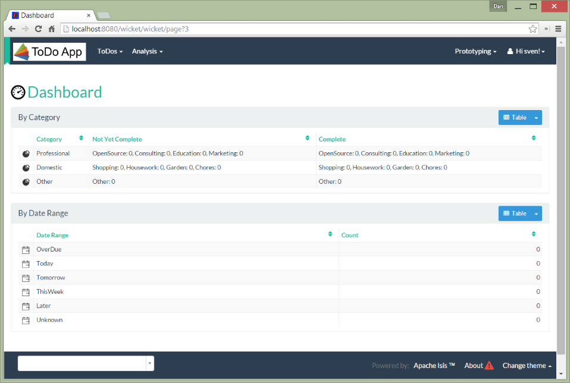

Title: Brand Logo (1.8.0)

By default the Wicket viewer will display the application name top-left in the header menu.  This can be changed to
display a png logo instead.

##Screenshots

The screenshot below shows the Isis addons example [todoapp](https://github.com/isisaddons/isis-app-todoapp/) (not ASF) with a 'brand logo' image in its header:

A custom brand logo (typically larger) can also be specified for the signin page:

##Configuration

In the application-specific subclass of `IsisWicketApplication`, bind:

* a string with name "brandLogoHeader" to the URL of a header image.  A size of 160x40 works well.
* a string with name "brandLogoSignin" to the URL of a image for the sign-in page.  A size of 400x100 works well.

For example:

    @Override
    protected Module newIsisWicketModule() {
        final Module isisDefaults = super.newIsisWicketModule();

        final Module overrides = new AbstractModule() {
            @Override
            protected void configure() {
                ...
                bind(String.class).annotatedWith(Names.named("brandLogoHeader")).toInstance("/images/todoapp-logo-header.png");
                bind(String.class).annotatedWith(Names.named("brandLogoSignin")).toInstance("/images/todoapp-logo-signin.png");
                ...
            }
        };

        return Modules.override(isisDefaults).with(overrides);
    }

If the logo is hosted locally, add to the relevant directory (eg `src/main/webapp/images`).  It is also valid for the
URL to be absolute.

You may also wish to tweak the `css/application.css`.  For example, a logo with height 40px works well with the following:

    .navbar-brand img {
        margin-top: -5px;
        margin-left: 5px;
    }

