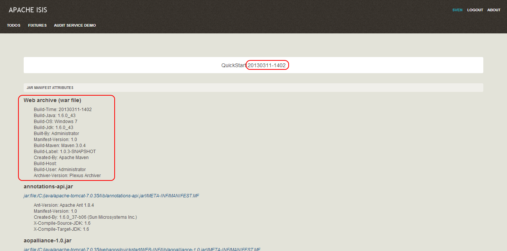

Title: Configuring the About page

Isis' Wicket viewer has an About page that, by default, will provide a dump of the JARs that make up the webapp.  This page will also show the manifest attributes of the WAR archive itself, if there are any.  One of these attributes may also be used as the application version number.

### Screenshot

Here's what the About page looks like with this configuration added:

</img>

Note that the `Build-Time` attribute has been used as the version number.  The Wicket viewer is hard-coded to search for specific attributes and use as the application version.  In order, it searches for:

* `Implementation-Version`
* `Build-Time`

If none of these are found, then no version is displayed.

### Configuration

*Note: the configuration described here will also be part of the quickstart_wicket_restful_jdo archetype (1.0.3+).*

#### Adding attributes to the WAR's manifest 

Add the following to the webapp's `pom.xml` (under `<build><plugins>`):

<pre>
&lt;plugin&gt;
    &lt;groupId&gt;org.codehaus.mojo&lt;/groupId&gt;
    &lt;artifactId&gt;build-helper-maven-plugin&lt;/artifactId&gt;
    &lt;version&gt;1.5&lt;/version&gt;
      &lt;executions&gt;
        &lt;execution&gt;
          &lt;phase&gt;validate&lt;/phase&gt;
          &lt;goals&gt;
            &lt;goal&gt;maven-version&lt;/goal&gt;
          &lt;/goals&gt;
        &lt;/execution&gt;
      &lt;/executions&gt;
&lt;/plugin&gt;

&lt;plugin&gt;
    &lt;artifactId&gt;maven-war-plugin&lt;/artifactId&gt;
    &lt;configuration&gt;
        &lt;archive&gt;
            &lt;manifest&gt;
                &lt;addDefaultImplementationEntries&gt;true&lt;/addDefaultImplementationEntries&gt;
            &lt;/manifest&gt;
            &lt;manifestEntries&gt;
                &lt;Build-Time&gt;${maven.build.timestamp}&lt;/Build-Time&gt;
                &lt;Build-Number&gt;${buildNumber}&lt;/Build-Number&gt;
                &lt;Build-Host&gt;${agent.name}&lt;/Build-Host&gt;
                &lt;Build-User&gt;${user.name}&lt;/Build-User&gt;
                &lt;Build-Maven&gt;Maven ${maven.version}&lt;/Build-Maven&gt;
                &lt;Build-Java&gt;${java.version}&lt;/Build-Java&gt;
                &lt;Build-OS&gt;${os.name}&lt;/Build-OS&gt;
                &lt;Build-Label&gt;${project.version}&lt;/Build-Label&gt;
            &lt;/manifestEntries&gt;
        &lt;/archive&gt;
    &lt;/configuration&gt;
    &lt;executions&gt;
        &lt;execution&gt;
            &lt;phase&gt;package&lt;/phase&gt;
            &lt;goals&gt;
                &lt;goal&gt;war&lt;/goal&gt;
            &lt;/goals&gt;
            &lt;configuration&gt;
                &lt;classifier&gt;${env}&lt;/classifier&gt;
            &lt;/configuration&gt;
        &lt;/execution&gt;
    &lt;/executions&gt;
&lt;/plugin&gt;
</pre>

If you then build the webapp from the Maven command line (`mvn clean package`), then the WAR should contain a `META-INF/MANIFEST.MF` with those various attribute entries.

#### Exporting the attributes into the app

The manifest attributes are provided to the rest of the application by way of the Wicket viewer's integration with Google Guice.

In your subclass of `IsisWicketApplication`, there is a method `newIsisWicketModule()`.  In this method you need to bind an `InputStream` that will read the manifest attributes.  This is all boilerplate so you can just copy-n-paste:

<pre>
@Override
protected Module newIsisWicketModule() {

    ...

    final Module quickstartOverrides = new AbstractModule() {
        @Override
        protected void configure() {
            ...
            bind(InputStream.class)
                .annotatedWith(Names.named("metaInfManifest"))
                .toProvider(Providers.of(
                    getServletContext().getResourceAsStream("/META-INF/MANIFEST.MF")));
        }
    };

    ...

}
</pre>

And with that you should be good to go!
