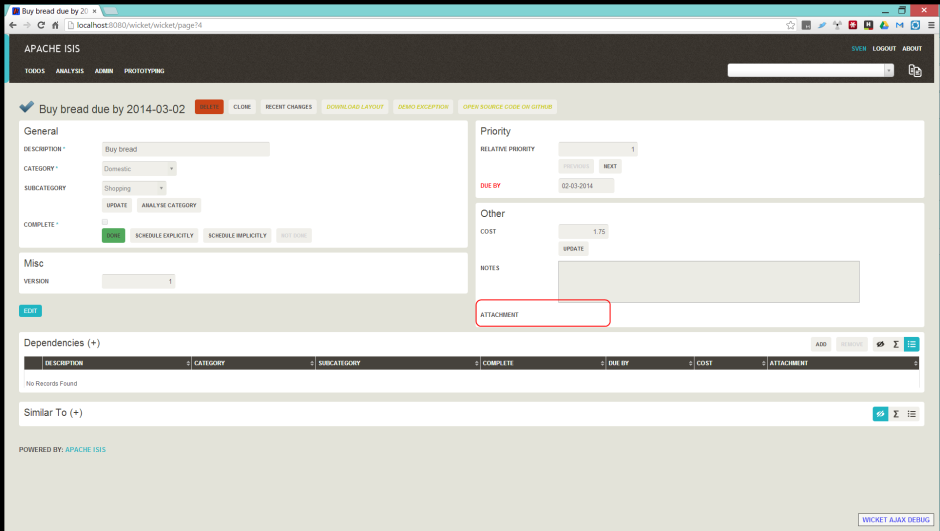
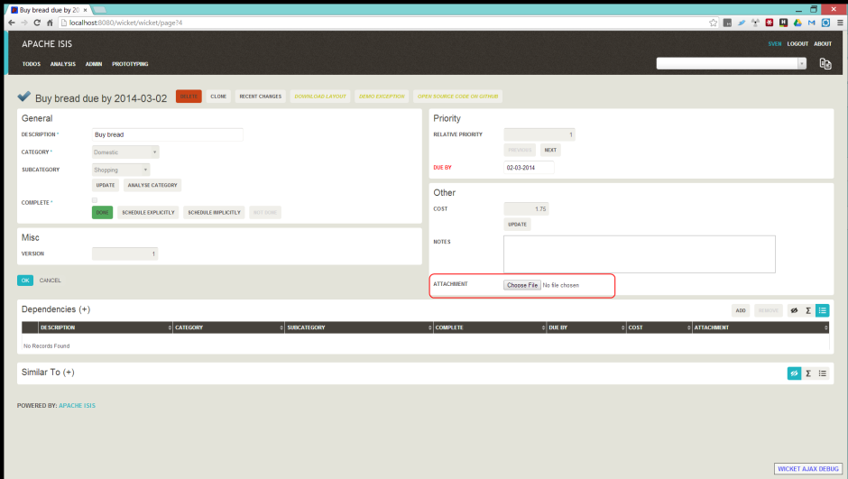

Title: File upload/download

The Isis application library provides the [Blob](../../../reference/value-types.html) type (binary large objects) and 
[Clob](../../../reference/value-types.html) type (character large object), each of which also includes metadata about the data (specifically the filename and mime type).

A class can define a property using either of these types, for example:

    private Blob attachment;

    @javax.jdo.annotations.Persistent(defaultFetchGroup="false")
    @javax.jdo.annotations.Column(allowsNull="true")
    public Blob getAttachment() {
        return attachment;
    }

    public void setAttachment(final Blob attachment) {
        this.attachment = attachment;
    }

The `Blob` and `Clob` types can also be used as parameters to actions.
    
##Screenshots

The following screenshots are taken from the todo app generated by the [quickstart archetype](../../../intro/getting-started/quickstart-archetype.html)

> nb: this is 1.4.0-snapshot version; the functionality also exists in a slightly different form in previous released version (1.3.1)

`Blob` field rendered as attachment (with no data):

Hit edit; 'choose file' button appears:

Choose file using the regular browser window:

Chosen file is indicated:

Back in view mode (ie once hit OK) if the `Blob` is an image, then it is shown:

#### `Blob` can be downloaded:

#### Back in edit mode, can choose a different file or clear (assuming property is not mandatory):

