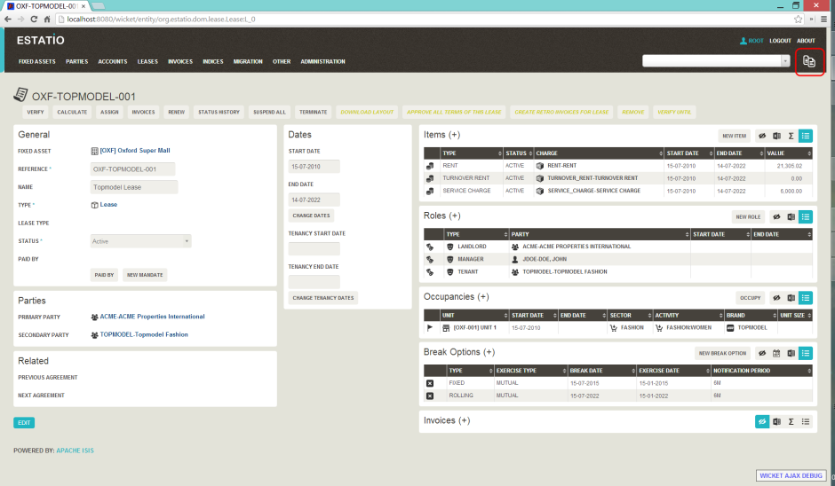
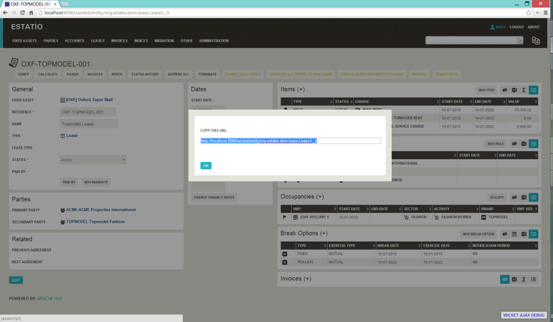
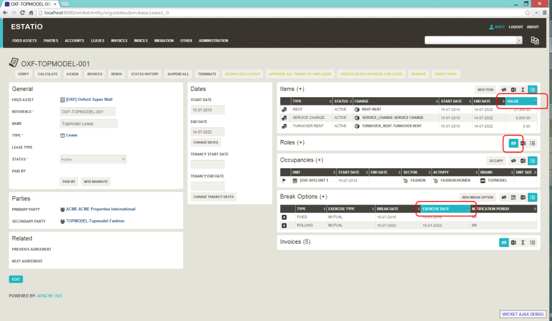
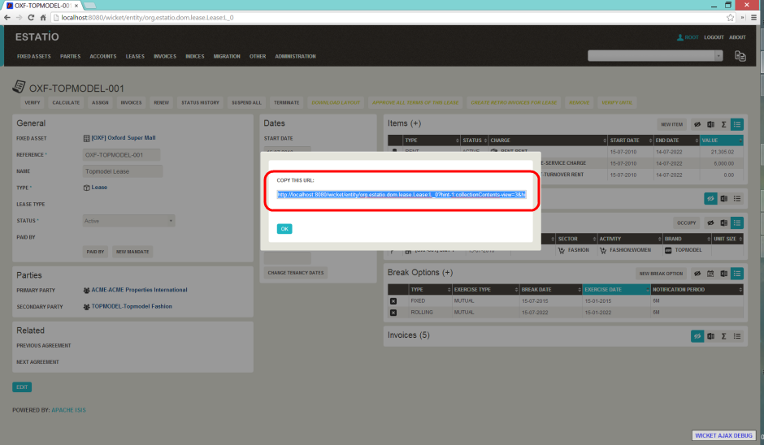
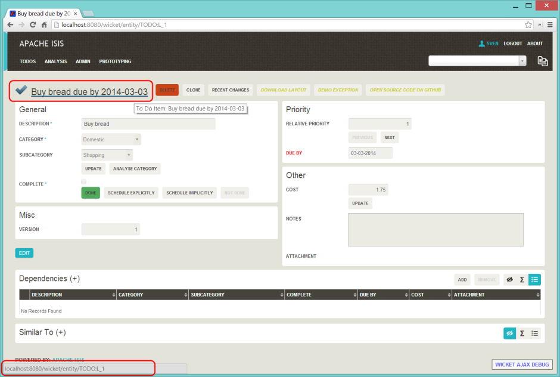

Title: Copy URL and Hints

While the user can often copy the URL of a domain object directly from the browser's address bar, the Wicket viewer also allows the URL of domain objects to be easily copied from a dialog. 

More interestingly, this URL can also contain hints capturing any sorting or page numbering, or hiding/viewing of collections.  End-users can therefore share these URLs as a form of deep linking into a particular view on a domain object. 

The copy URL and hinting is automatic.

##Screenshots

> taken from 1.4.0-snapshot.

#### Copy URL

The following screenshot, taken from the [Estatio](https://github.com/estatio/estatio) application, shows the copy URL button (top right):

Clicking on this button brings up a dialog with the URL preselected:

The URL in this case is something like:

<pre>
http://localhost:8080/wicket/entity/org.estatio.dom.lease.Lease:L_0
</pre>

The user can copy the link (eg `ctrl+C`) into the clipboard, then hit `OK` or `Esc` to dismiss the dialog.

#### Hints

Using the viewer the user can hide/show collection tables, can sort the tables by header columns:

Also, if the collection spans multiple pages, then the individual page can be selected.

Once the view has been customised, the URL shown in the copy URL dialog is in an extended form:

The URL in this case is something like:

<pre>
http://localhost:8080/wicket/entity/org.estatio.dom.lease.Lease:L_0?hint-1:collectionContents-view=3&hint-1:collectionContents:collectionContents-3:table-DESCENDING=value&hint-1:collectionContents:collectionContents-3:table-pageNumber=0&hint-2:collectionContents-view=0&hint-2:collectionContents:collectionContents-2:table-pageNumber=0&hint-3:collectionContents-view=2&hint-3:collectionContents:collectionContents-2:table-pageNumber=0&hint-4:collectionContents-view=3&hint-4:collectionContents:collectionContents-3:table-ASCENDING=exerciseDate&hint-4:collectionContents:collectionContents-3:table-pageNumber=0&hint-5:collectionContents-view=0&hint-5:collectionContents:collectionContents-3:table-pageNumber=0
</pre>

#### Copy URL from title
    
When the user invokes an action on the object, the URL (necessarily) changes to indicate that the action was invoked.  This URL is specific to the user's session and cannot be shared with others.
    
A quick way for the user to grab a shareable URL is simply by clicking on the object's title:

##User Experience

The copy URL dialog is typically obtained by clicking on the icon.

Alternatively, `alt+]` will also open the dialog.  It can be closed with either `OK` or the `Esc` key.

