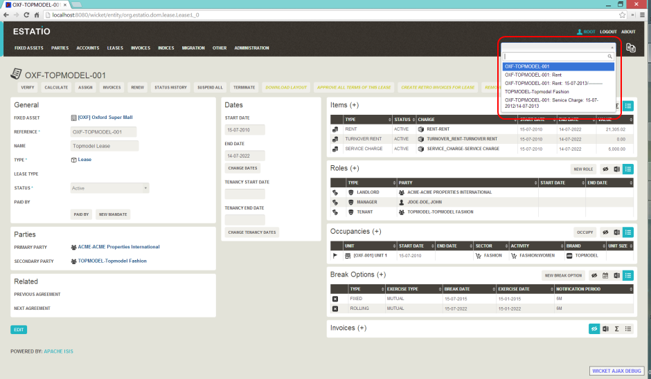

Title: Recent Pages

[//]: # (content copied to _user-guide_xxx)

The Wicket viewer provides a recent pages drop-down that acts as a breadcrumb trail.  Using it, the user can quickly open a recently accessed domain object.

##Screenshots

The following screenshot, taken from the [Estatio](https://github.com/estatio/estatio) application, shows the recent pages drop-down after a number of pages have been accessed.  

(screenshot of v1.4.0)

##Domain Code

The recent pages drop-down is automatically populated; no changes need to be made to the domain classes.

##User Experience

Selecting the domain object from the list causes the viewer to automatically navigate to the page for the selected object.

####Related functionality

The [bookmarks](./bookmarks.html) (sliding panel) also provides links to recently visited objects, but only those explicitly marked as `@Bookmarkable`.  In contrast to the recent pages drop-down, the bookmarks panel also nests related objects together hierarchically.

##Configuration

The number of objects is hard-coded as 10; it cannot currently be configured.

