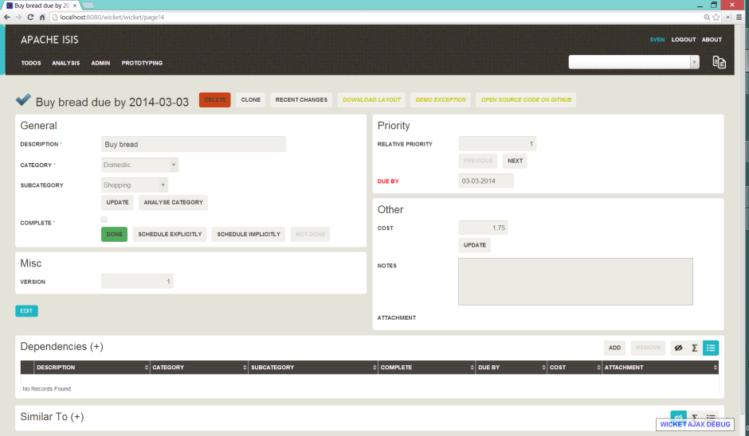
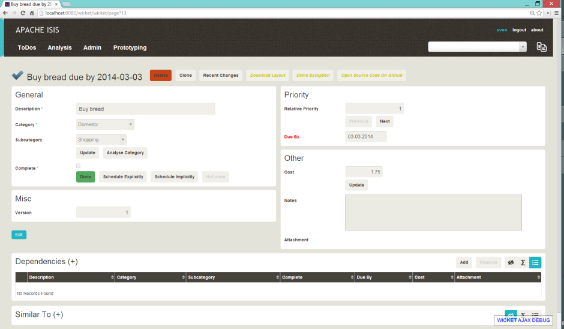

Title: Upper vs Regular Case

The default CSS styling for the Wicket viewer uses upper-case (`text-transform: uppercase`) for its look-n-feel.  If required, this can be disabled through a viewer setting.

##Screenshots

> taken from 1.4.0-snapshot.

#### Upper case

The following screenshot, taken from the example todo app (as generated by the [quickstart archetype](../../../intro/getting-started/quickstart-archetype.html)) shows the default upper case styling:

#### Regular case

Alternatively, the upper case styling can be disabled::

##Configuration

To disable upper case styling, use:

    isis.viewer.wicket.regularCase=true

Typically this should be added to the `viewer_wicket.properties` file (in `WEB-INF`), though you can add to `isis.properties` if you wish.

