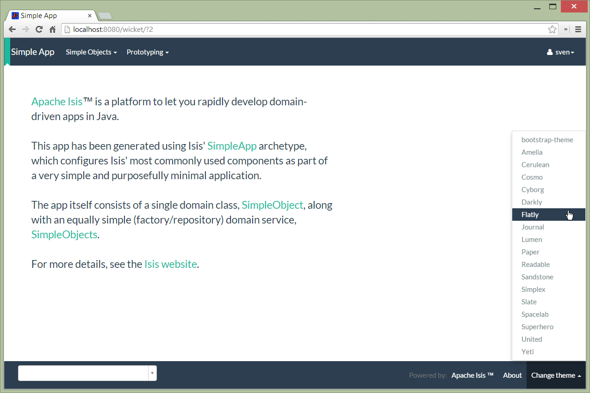

Title: Showing a Theme Chooser (1.8.0-SNAPSHOT)

The Isis Wicket viewer uses [Bootstrap](http://getbootstrap.com/) styles and components (courtesy of the 
[Wicket Bootstrap](https://github.com/l0rdn1kk0n/wicket-bootstrap) integration).

Unless [specified otherwise](specifying-a-default-theme.html), the viewer uses the default bootstrap theme.  However, 
the viewer can be configured to allow the end-user to switch theme to another theme, in particular one of those 
provided by [bootswatch.com](http://bootswatch.com).

This is done using the following configuration property (in `WEB-INF/viewer_wicket.properties`):

    isis.viewer.wicket.themes.showChooser=true

Example 1:

Example 2:

    
It is also possible to restrict the themes shown to some subset of those in bootswatch.  This is done using a further
property:

    isis.viewer.wicket.themes.enabled=bootstrap-theme,Cosmo,Flatly,Darkly,Sandstone,United

where the value is the list of themes (from [bootswatch.com](http://bootswatch.com)) to be made available.

You can also write and install a custom themes (eg to fit your company's look-n-feel/interface guidelines); see
[here](writing-a-custom-theme.html) for further details.