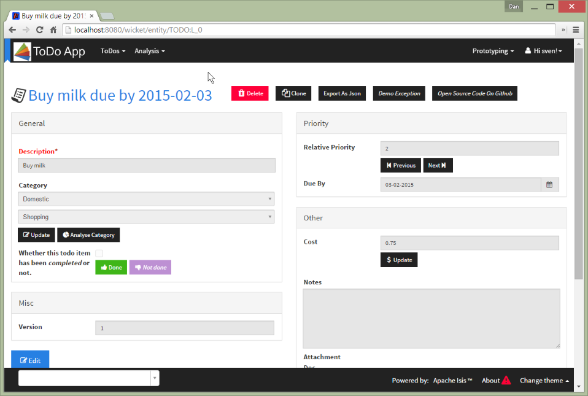

Title: Suppressing Header and Footer (Embedded View) (1.8.0)

[//]: # (content copied to _user-guide_wicket-viewer_request-parameters)

The Wicket viewer provides some support such that an Isis application can be
embedded within a host webapp, for example within an iframe.  

Currently this support consists simply of being able to suppress the header and/or footer.

##Screenshots

For example, the regular view is:

With the header and footer both suppressed only the main content is shown:

It is also possible to suppress just the header, or just the footer.

##Configuration

The header and footer are suppressed NOT by changing isis.properties, but INSTEAD
by specifying appropriate request parameters.

To suppress the header, add the following as a request parameter:

    isis.no.header

and to suppress the header, add the following as a request parameter:

    isis.no.footer

For example, 

    http://localhost:8080/wicket/entity/TODO:L_0?isis.no.header&isis.no.footer

