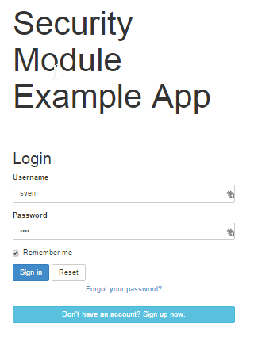

Title: Suppressing Password Reset (1.8.0)

[//]: # (content copied to _user-guide_xxx)

If [user registration](./user-registration.html) has been configured, then the Wicket viewer allows the user to
sign-up a new account and to reset their password from the login page.

The 'password reset' link can be suppressed, if required, by setting a configuration flag.

##Screenshots

With 'password reset' not suppressed (the default):

and with the link suppressed:

##Configuration

To suppress the 'password reset' link, add the following configuration flag:

    isis.viewer.wicket.suppressPasswordReset=true

Typically this should be added to the `viewer_wicket.properties` file (in `WEB-INF`), though you can add to `isis.properties` if you wish.

##See also

The [sign up link](./suppressing-sign-up.html) can be suppressed in a similar manner.

