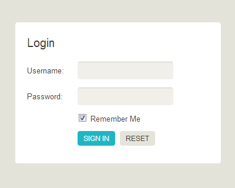

Title: Suppressing Remember Me

The 'remember me' checkbox on the login page can be suppressed, if required, by setting a configuration flag.

##Screenshots

With 'remember me' flag (the default):

and without:

##Configuration

To suppress the 'remember me' checkbox, add the following configuration flag:

    isis.viewer.wicket.suppressRememberMe=true

Typically this should be added to the `viewer_wicket.properties` file (in `WEB-INF`), though you can add to `isis.properties` if you wish.

