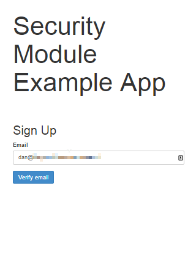

Title: User Registration (1.8.0-SNAPSHOT)

The Wicket viewer provides the ability for users to sign-up by providing a valid email address:

* from the login page the user can instead follow a link to take them to a sign-up page, where they enter their email address.
* a verification email is sent using this service; the email includes a link back to the running application.
* the user then completes the registration process by choosing a user name and password.
* the Wicket viewer then creates an account for them and logs them in.

In a similar way, if the user has forgotten their password then they can request a reset link to be sent to their email, again by providing their email address.

To support this the framework requires three services to be registered and configured:

* the [user registration service](./../../../reference/services/user-registration-service.html) provides an API to create the user account
* the [email notification service](./../../../reference/services/email-notification-service.html) provides an API for to send the verification emails
* the [email service](./../../../reference/services/email-service.html) that is used by the email notification service to actually send the email.

The Isis core framework provides a default implementation of both the email notification service and the email service, but there is *no* default implementation of the user registration service as it will depend on how security has been configured.  However, if your application uses the [Isis addons security module](https://github.com/isisaddons/isis-module-security) then an implementation is provided by that module; just add to the classpath.

##Screenshots

The user is presented with a login page:

Navigate to the sign up page.  Complete the page, and verify:

Back to the login page:

Email arrives, with link:

Follow the link, complete the page:

Automatically logged in:

##Configuration

There are two prerequisites:

* register an implementation of the [user registration service](./../../../reference/services/user-registration-service.html) (eg by using the [Isis addons security module](https://github.com/isisaddons/isis-module-security))
* configure the [email service](./../../../reference/services/email-service.html)

The latter is required if you are using the default email notification service and email service.  If you are using your own alternative implementation of the email notification service then it may be omitted (and configure your own alternative implementation as required).

It is also possible to suppress the sign-up page link and/or the password reset page, see [here](suppressing-sign-up.html) and [here](suppressing-password-reset.html).