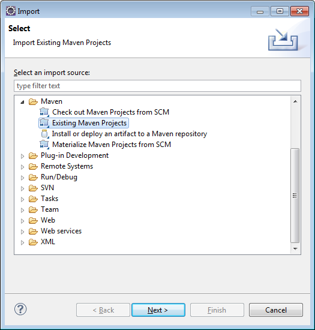
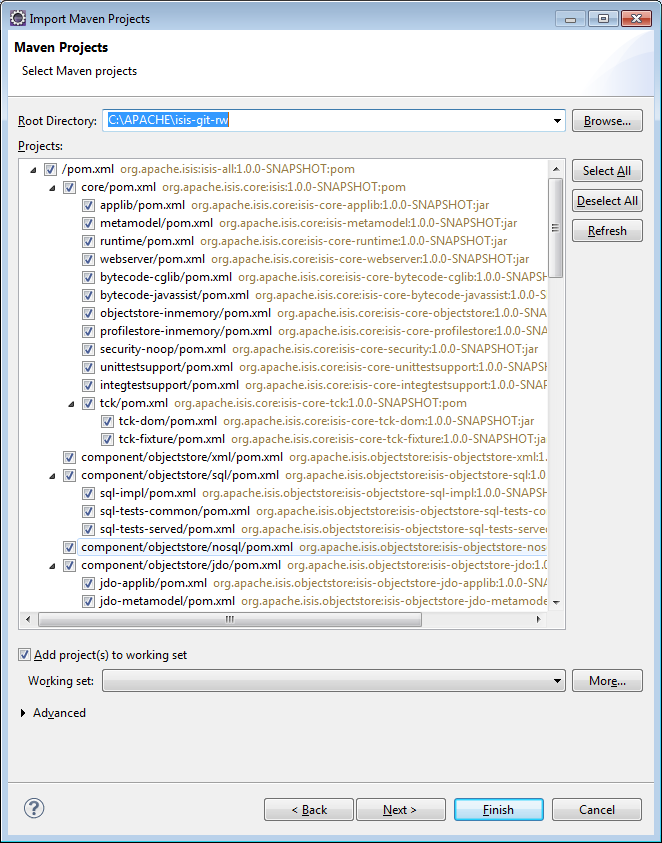
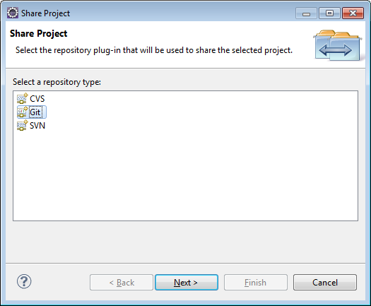
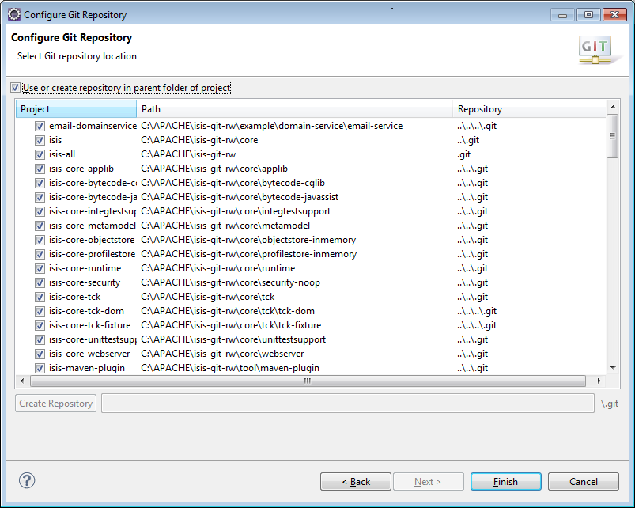
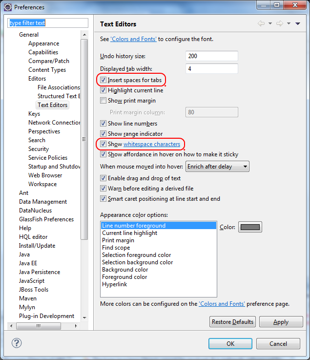
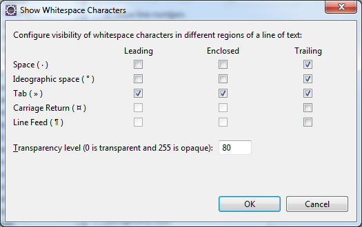

Title: Development Environment

## Git

The Isis source code lives in a git repo.

### Installation

The easiest place to get hold of command-line git is probably the [github download page](http://git-scm.com/downloads).

On Windows, this also installs the rather good mSysGit Unix shell.  We recommend that you enable git for both the mSysgit and the Windows command prompt:

</img>

Once git is installed, the two main command line tools to note are:

- `git` command line tool
- `gitk` for viewing the commit history

If using Windows, note that github also have a dedicated [Windows client](https://help.github.com/articles/set-up-git).  With a little [hacking around](http://haacked.com/archive/2012/05/30/using-github-for-windows-with-non-github-repositories.aspx), it can also be made to work with non-github repositories.

If using Mac, you might also want to check out Atlassian's [Sourcetree](http://www.atlassian.com/software/sourcetree/overview).

#### Cloning the Isis repo 

First, clone the Isis repo.

If you are a **committer**, then clone from the Apache read/write repo:

<pre>
git clone https://git-wip-us.apache.org/repos/asf/isis.git
</pre>

If you are **not a committer**, please see the [contributing](contributing.html) page for details on which repo to clone from.

#### Configuring Git

Next up is to configure your user name and password; see also [Apache's git](https://git-wip-us.apache.org/) docs:

<pre>
git config user.name "<i>My Name Here</i>"
git config user.email <i>myusername@apache.org</i>
</pre>

Next, configure the `core.autocrlf` so that line endings are normalized to LF (Unix style) in the rep; again see [Apache's git](https://git-wip-us.apache.org/) page: 

- on Windows, use:
<pre>git config core.autocrlf auto   
</pre>

- on Mac/Linux, use:
<pre>
git config core.autocrlf input
</pre>

The Windows setting means that files are converted back to CRLF on checkout; the Mac/Linux setting means that the file is left as LF on checkout.

We also recommend setting `core.safecrlf`, which aims to ensure that any line ending conversion is repeatable.  Do this on all platforms:

<pre>
git config core.safecrlf true
</pre>

Note that these settings are supplemented in the repo by the `.gitattributes` file and that explicitly specifies line handling treatment for most of the common file types that we have.

Next, we recommend you setup this a refspec so that you can distinguish remote tags from local ones.  To do that, locate the `[remote "origin"]` section in your `.git/config` and add the third entry shown below:

<pre>
[remote "origin"]
    url = ... whatever ...
    fetch = ... whatever ...
    fetch = +refs/tags/*:refs/tags/origin/*
</pre>

This will ensure that a `git fetch` or `git pull` places any remote tags under `origin/xxx.  For example, the `isis-1.0.0` tag on the origin will appear under `origin/isis-1.0.0`.

One final configuration that we recommend is for `git pull` to perform a rebase by default, rather than a merge.  This results in a linear log history.  If you want to explicitly have branches in the history, then you can always create a topic branch, discussed below:
<pre>
git config branch.autosetuprebase always
</pre>

If you don't use git outside of Apache, you can add the `--global` flag so that the above settings apply for all repos managed by git on your PC.

### Getting help

Three commands of git that in particular worth knowing:

<pre>git help <i>command</i></pre>

   will open the man page in your web browser

<pre>git gui</pre>

   will open up a basic GUI client to staging changes and making commits

<pre>gitk --all</pre>

   will open the commit history for all branches.  In particular, you should be able to see the local `master`, which branch you are working on (the `HEAD`), and also the last known position of the `master` branch from the central repo, called `origin/master`.

For further reading, see:

- [git config man page](http://www.kernel.org/pub/software/scm/git/docs/git-config.html)
- [.gitattributes man page](http://www.kernel.org/pub/software/scm/git/docs/gitattributes.html)
- [.gitattributes git-scm.com docs](http://git-scm.com/docs/gitattributes)

## Installing Maven

Install Maven 3.0.x, downloadable [here](http://maven.apache.org/download.html).

Set `MAVEN_OPTS` environment variable:

<pre>
MAVEN_OPTS=-Xms512m -Xmx1024m -XX:MaxPermSize=128m
</pre>

## Installing and Configuring Eclipse

You can use any IDE to work with Isis, but most of the Isis committers tend to use Eclipse.

Make sure you are using a version of Eclipse that includes both the `m2e` feature (Maven integration) and the `eGit` feature (Git integration).  Both 3.8 (2011) and 4.2 (2012) have these features bundled as part of the Java and JEE editions; or you can always install using `Help > Install New Software`.

### Importing Projects

Next thing to do is to import the Isis projects into your workspace.  This is done using `File > Import >Project`:

</img>

On the next page, specify the root directory where you cloned the Isis repo.  Eclipse will recursively find all the projects that make up Isis:

</img>

Hit `Finish`; Eclipse should automatically build the entire codebase.

### Sharing Projects

> In the Juno release and later, this is now done automatically.

The next thing to do is to configure eGit so that you can use git commands within Eclipse.  This is done by selecting all the projects in the `Package Explorer`, then right clicking `Team > Share Project`:

</img>

On the next page, choose the `Use or create repository in parent folder of project` checkbox:

</img>

Hit `Finish` and you are done.

### Coding Conventions

Isis provides a number of Eclipse templates to help ensure that code is formatted according to our standards:

- `Windows > Preferences > Java > Code Style > Code Templates` 
 - Import [Apache-code-style-template.xml](resources/Apache-code-style-template.xml)
- `Windows > Preferences > Java > Code Style > Formatter` 
  - Import [Apache-code-style-formatting.xml](resources/Apache-code-style-formatting.xml)
- `Windows > Preferences > Java > Code Style > Organize Imports` 
  - Import [isis.importorder](resources/isis.importorder)
- `Windows > Preferences > Java > Code Style > Clean Up` 
  - Import [Apache-Isis-code-style-cleanup.xml](resources/Apache-Isis-code-style-cleanup.xml)
  - (this performs both code formatting and organizing imports)

In addition, you will probably want to import the Java editor templates, as described in the [getting started](../getting-started/editor-templates.html) section.

<!--
TODO: to add from the original incubator website [here](http://incubator.apache.org/isis "Apache Isis (incubator website)").

In addition:

- checkstyle, as per sec.Checkstyle
- PMD, as per sec.PMD
- findbugs, as per sec.FindBugs
-->

### Whitespace

It's a good idea to configure Eclipse's editors so that they highlight any accidental use of tabs instead of spaces, using:

* `Windows > Preferences > General > Editor > Text Editors`
* and then fine-tune the `whitespace characters`:

</img>

</img>

## Setting up DataNucleus enhancer

If you are either contributing to the JDO Objectstore, or even if you simply intend to use the latest-n-greatest version and build from source, then you should also configure the DataNucleus plugin for Eclipse.  This does the job of bytecode-enhancing your domain objects.

See [this page](../components/objectstores/jdo/datanucleus-and-eclipse.html) for details on how to setup the plugin.

You will also see that the page describes how to configure the `isis-objectstore-jdo-applib` domain project with the DataNucleus enhancer.

If you fail to do this, then the JDO ObjectStore's implementation of the [Publishing Service](../components/objectstores/jdo/publishing-service-jdo.html) and the [Settings Services](../components/objectstores/jdo/settings-services-jdo.html) will throw runtime exceptions.

## What's Next

Now you've set up your development environment the next thing to do is to [build Isis](building-isis.html) from the command line.

