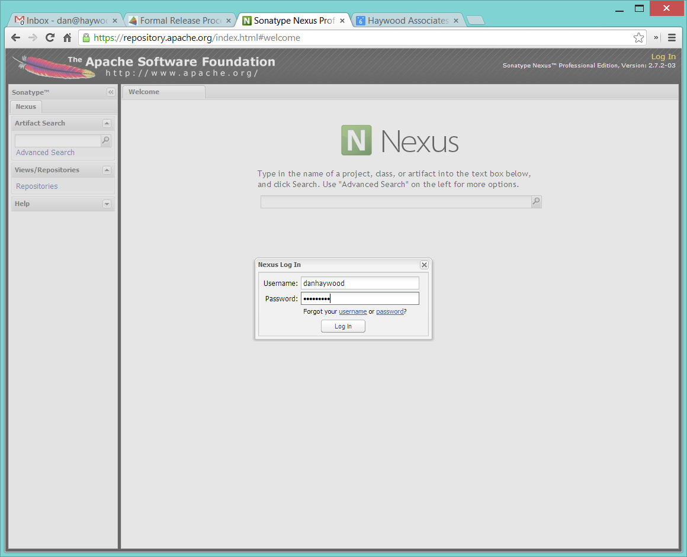
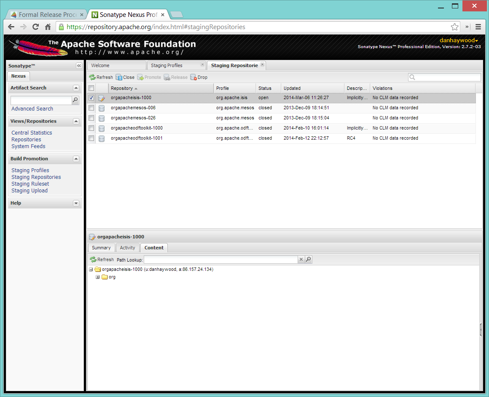

Title: Formal Release Process

This page details the process for formalling releasing Isis modules.  

If you've done this before and just want the bare essentials, see this [one-pager](release-process-one-pager.html).  (There is also an experimental [script](resources/release.sh) for automating the latter part of the process).

See also the [release checklist](release-checklist.html) for keeping track of where you are while releasing (possibly multiple) components.

## Intro

Apache Isis consists of a number of separately releasable modules.  Relative to the root of the [source code repo](https://git-wip-us.apache.org/repos/asf/isis/repo?p=isis.git;a=tree), these are:

- `core`
- `component/objectstore/jdo`
- `component/security/file`
- `component/security/shiro`
- `component/viewer/restfulobjects`
- `component/viewer/wicket`
- `component/example/archetypes/quickstart_wicket_restful_jdo`
- `component/example/archetypes/simple_wicket_restful_jdo`

Other components, not yet released (but not mothballed yet either) are:

- `component/objectstore/nosql`
- `component/objectstore/xml`
- `component/profilestore/xml`
- `component/progmodel/groovy`
- `component/viewer/dnd`
- `component/viewer/scimpi`

All the non-core components depend on the `core`, and use the `core`'s parent `pom.xml` as their parent pom.

##Process Prerequisites

Before releasing `core`, ensure there is consensus on the [dev mailing list](../support.html) that this is the right time for a release.  The discussion should include confirming the version number to be used, and to confirm content.

For non-`core` components, ensure that there is at least awareness on the dev mailing list that a release is to be cut.  In particular, indicate the version of `core` that the component release will depend upon, and the version number to be used for the component's release.

Once agreed, the formal release can begin.  The steps are:

- create a branch locally in which to prepare the release
- use `mvn release:prepare` to generate the signed artifacts and create a tag in the source code control system
- use `mvn release:perform` to upload the signed artifacts to the Apache staging repository
- vote on the staged artifacts (in particular, the signed source release ZIP from which the remaining artifacts are derivable)
- on a successful vote:
  - promote the staged artifacts
  - distribute the source zip
  - merge in the branch back to into master
- on a failed vote:
  - drop the staging repository
  - delete the branch and tag
  - fix the problems and go round round the loop again.

Before any of this can happen, there are a number of prerequisites, in terms of (a) the codebase itself, (b) the community process, and (c) the committer acting as release manager and performing the release.

### Set up local environment

#### Public/private key

The most important configuration you require is to set up public/private key pair.   This is used by the `maven-release-plugin` to sign the code artifacts.  See the page on [key generation](key-generation.html) for more details.

In order to prepare the release, you'll (need to) have a `~/.gnupg` directory with the relevant files (`gpg.conf`, `pubring.gpg`, `secring.gpg` etc), and have `gpg` on your operating system PATH.

> If on Windows, the equivalent directory is `c:\users\xxx\appdata\roaming\gnupg`.  For `gpg`, use either [cygwin.com](http://cygwin.com) or [gpg4win.org](http://www.gpg4win.org).  Note also that the mSysGit version of `gpg` (as provided by GitHub's bash client) is not compatible with that provided by cygwin; move it to one side and check that `gpg.exe` being used is that from gpg4win.

#### Maven `settings.xml`

During the release process the `maven-deploy-plugin` uploads the generated artifacts to a staging repo on the [Apache repository manager](http://repository.apache.org).  This requires your Apache LDAP credentials to be specified in your `~/.m2/settings.xml` file:

    <settings>
      <servers>
        <server>
          <id>apache.releases.https</id>
          <username>xxxxxxx</username>
          <password>yyyyyyy</password>
        </server>
        ...
      </servers>
      ...
    </settings>

where `xxxxxxx` and `yyyyyyy` are your Apache LDAP username and password.   For more information, see these [ASF docs](http://www.apache.org/dev/publishing-maven-artifacts.html#dev-env).

> It is also possible to configure to use `.ssh` secure keys, and thereby avoid hardcoding your Apache LDAP password into your `.m2/settings.xml` file. A description of how to do this can be found, for example, [here](http://bval.apache.org/release-setup.html).
}

#### Pull down code to release

Set the HEAD of your local git repo to the commit to be released.  In many cases this will be the tip of the origin's `master` branch:

<pre>
git checkout master
git pull --ff-only
</pre>

Then, determine/confirm the version number of the module being released.  This should be in line with our [semantic versioning policy](versioning-policy.html).

Next, create a release branch in your local Git repo, using the version number determined and as per [these standards](release-branch-and-tag-names.html).  For example, to prepare release candidate #1 for a release 1.2.3 of `core`, use:

<pre>
git checkout -b prepare/isis-1.2.3-RC1
</pre>

All release preparation is done locally; if we are successful, this branch will be pushed back to master.

Finally, make sure you have a JIRA ticket open against which to perform all commits.

## Code Prerequisites

{note
Unless otherwise stated, you should assume that all remaining steps should be performed in the base directory of the module being released.
}

Before making any formal release, there are a number of prerequisites that should always be checked.

### Update the version number

The version number of the parent pom should reflect the branch name that you are now on (with a `-SNAPSHOT` suffix).  In many cases this will have been done already during earlier development; but confirm that it has been updated.  If it has not, make the change.

For example, if releasing `core` version `1.2.3`, the POM should read:

    <groupId>org.apache.isis.core</groupId>
    <artifactId>isis</artifactId>
    <version>1.2.3-SNAPSHOT</version>

### Update parent (Isis Core)

If releasing Isis Core, check (via <a href="http://search.maven.org/#search%7Cga%7C1%7Cg%3A%22org.apache%22%20a%3A%22apache%22" target="_blank">http://search.maven.org</a>) whether there is a newer version of the Apache parent `org.apache:apache`.

If there is, update the `<version>` in the `<parent>` element in the parent POM to match the newer version:

    <parent>
        <groupId>org.apache</groupId>
        <artifactId>apache</artifactId>
        <version>NN</version>
        <relativePath />
    </parent>

where `NN` is the updated version number.

### Update parent (non core components)

If releasing a non-core component, then check and if necessary update the `<version>` in the `<parent>` element in the parent POM to match the released (non-SNAPSHOT) version of `org.apache.isis.core:isis`:

    <parent>
        <groupId>org.apache.isis.core</groupId>
        <artifactId>isis</artifactId>
        <version>1.2.3</version>
        <relativePath />
    </parent>

> This obviously requires that the core has been released previously.  If you also releasing core at the same time as the component, then you will need to go through the release process for core first, then come back round to release the component.

Also, if there is a tck test module with `oa.isis.core:isis-core-tck` as its parent, then make sure that it the parent is also updated to the non-`SNAPSHOT` version.  *However*, the tck module's dependency on the component (typically a property) should remain as `SNAPSHOT`; it will be updated automatically when the `mvn release:prepare` is performed.

### Check no SNAPSHOT dependencies

There should be no snapshot dependencies; the only mention of `SNAPSHOT` should be for the Isis modules about to be released.  

It's probably easiest to load up each `pom.xml` and inspect manually:

    vi `/bin/find . -name pom.xml | grep -v target`

... and search for `SNAPSHOT`.

> Obviously, don't update Isis' `SNAPSHOT` references; these get updated by the `mvn release:prepare` command we run later.

### Update plugin versions

The `maven-versions-plugin` should be used to determine if there are newer versions of any of the plugins used to build Isis.  Since this goes off to the internet, it may take a minute or two to run:

<pre>
mvn versions:display-plugin-updates > /tmp/foo
cat /tmp/foo
</pre>

Review the generated output and make updates as you see fit.  (However, if updating, please check by searching for known issues with newer versions).

### Update dependency versions

The `maven-versions-plugin` should be used to determine if there are newer versions of any of Isis' dependencies.  Since this goes off to the internet, it may take a minute or two to run:

<pre>
mvn versions:display-dependency-updates > /tmp/foo
grep "\->" /tmp/foo | /bin/sort -u
</pre>

Update any of the dependencies that are out-of-date.  That said, do note that some dependencies may show up with a new dependency, when in fact the dependency is for an old, badly named version.  Also, there may be new dependencies that you do not wish to move to, eg release candidates or milestones.

For example, here is a report showing both of these cases:
<pre>
[INFO]   asm:asm ..................................... 3.3.1 -> 20041228.180559
[INFO]   commons-httpclient:commons-httpclient .......... 3.1 -> 3.1-jbossorg-1
[INFO]   commons-logging:commons-logging ......... 1.1.1 -> 99.0-does-not-exist
[INFO]   dom4j:dom4j ................................. 1.6.1 -> 20040902.021138
[INFO]   org.datanucleus:datanucleus-api-jdo ................ 3.1.2 -> 3.2.0-m1
[INFO]   org.datanucleus:datanucleus-core ................... 3.1.2 -> 3.2.0-m1
[INFO]   org.datanucleus:datanucleus-jodatime ............... 3.1.1 -> 3.2.0-m1
[INFO]   org.datanucleus:datanucleus-rdbms .................. 3.1.2 -> 3.2.0-m1
[INFO]   org.easymock:easymock ................................... 2.5.2 -> 3.1
[INFO]   org.jboss.resteasy:resteasy-jaxrs ............. 2.3.1.GA -> 3.0-beta-1
</pre>
For these artifacts you will need to search [Maven central repo](http://search.maven.org) directly yourself to confirm there are no newer dependencies not shown in this list.

### Code cleanup / formatting

Make sure that all source code has been cleaned up and formatted according to the Apache Isis and ASF conventions.  Use [this](resources/Apache-code-style-formatting.xml) Eclipse template and [this](resources/isis.importorder) import order.

### License header notices (RAT tool)

The Apache Release Audit Tool `RAT` (from the [Apache Creadur](http://creadur.apache.org) project) checks for missing license header files.  The parent `pom.xml` of each releasable module specifies the RAT Maven plugin, with a number of custom exclusions.

To run the RAT tool, use:

    mvn org.apache.rat:apache-rat-plugin:check -D rat.numUnapprovedLicenses=50 -o

where `rat.numUnapprovedLicenses` property is set to a high figure, temporarily overriding the default value of 0.  This will allow the command to run over all submodules, rather than failing after the first one. 

> Do *not* use `mvn rat:check`; depending on your local Maven configuratoin this may bring down the obsolete `mvn-rat-plugin` from the Codehaus repo.

All being well the command should complete.  For each failing submodule, it will have written out a `target\rat.txt`; missing license notes are indicated using the key `!???`.  You can collate these together using something like:

    for a in `/bin/find . -name rat.txt -print`; do grep '!???' $a; done

Investigate and fix any reported violations, typically by either:

- adding genuinely missing license headers from Java (or other) source files, or
- updating the `<excludes>` element for the `apache-rat-plugin` plugin to ignore test files, log files and any other non-source code files
  - also look to remove any stale `<exclude>` entries

To add missing headers, you can if you wish use the groovy script `addmissinglicenses.groovy` (in the `scripts` directory) to automatically insert missing headers for certain file types.  The actual files checked are those with extensions specified in the line `def fileEndings = [".java", ".htm"]`:

Run this in dry run mode first  (shown here relative to the `core` module):
<pre>
groovy ../scripts/addmissinglicenses.groovy
</pre>

When happy, perform the updates by specifying the `-x` (execute) flag:
<pre>
groovy addmissinglicenses.groovy -x
</pre>

Once you've fixed all issues, confirm once more that `apache-rat-plugin` no longer reports any license violations, this time leaving the `rat.numUnapprovedLicenses` property to its default, 0:

<pre>
mvn org.apache.rat:apache-rat-plugin:check -D rat.numUnapprovedLicenses=0 -o
for a in `find . -name rat.txt -print`; do grep '!???' $a; done
</pre>

### Missing License Check

Although Apache Isis has no dependencies on artifacts with incompatible licenses, the POMs for some of these dependencies (in the Maven central repo) do not necessarily contain the required license information.  Without appropriate additional configuration, this would result in the generated `DEPENDENCIES` file and generated Maven site indicating dependencies as having "unknown" licenses.

Fortunately, Maven allows the missing information to be provided by configuring the `maven-remote-resources-plugin`.  This is stored in the `src/main/appended-resources/supplemental-models.xml` file, relative to the root of each releasable module.

To capture the missing license information, use:

<pre>
mvn license:download-licenses
</pre>

This Maven plugin creates a `license.xml` file in the `target/generated-resources` directory of each module.

Then, run the following script (shown here relative to the `core` module).

<pre>
groovy ../scripts/checkmissinglicenses.groovy
</pre>

This searches for all `licenses.xml` files, and compares them against the contents of the `supplemental-models.xml` file.   For example, the output could be something like:

<pre>
licenses to add to supplemental-models.xml:

[org.slf4j, slf4j-api, 1.5.7]
[org.codehaus.groovy, groovy-all, 1.7.2]

licenses to remove from supplemental-models.xml (are spurious):

[org.slf4j, slf4j-api, 1.5.2]
</pre>

If any missing entries are listed or are spurious, then update `supplemental-models.xml` and try again.

> Ignore any missing license warnings for the TCK modules; this is a result of the TCK modules for the viewers (eg `isis-viewer-bdd-concordion-tck`) depending on the TCK dom, fixtures etc.

## Sanity check

Before you cut the release, perform one last sanity check on the codebase.

### Sanity check for `core`

First, check that there are *NO SNAPSHOT* dependencies in any of the `pom.xml` of the modules of the core.

Next, delete all Isis artifacts from your local Maven repo:

    rm -rf ~/.m2/repository/org/apache/isis

Next, check that `core` builds independently, using the `-o` offline flag:

    mvn clean install -o

Confirm that the versions of the Isis artifacts now cached in your local repository are correct.

### Sanity check for non-`core` components

You should already have changed the parent POM of the releasable module to reference a released version of `org.apache.isis.core:isis`.  Now, also check that there are remaining *NO SNAPSHOT* dependencies in any of the `pom.xml` of the modules of the component.

Next, delete all Isis artifacts from your local Maven repo:

    rm -rf ~/.m2/repository/org/apache/isis

Next, build the component, though without the offline flag. Maven should pull down the component's dependencies from the Maven central repo, including the non-spshot of Isis core:

    mvn clean install

Confirm that the versions of the Isis artifacts now cached in your local repository are correct (both those pulled down from Maven central repo, as well as those of the component built locally).  The versions of `core` should not be a SNAPSHOT.

## Commit changes

Before going any further, remember to commit any changes from the preceding steps:

    git commit -am "ISIS-nnn: updates to pom.xml etc for release"

## Preparing a Release (`mvn release:prepare`)

Most of the work is done using the `mvn release:prepare` goal.  Since this makes a lot of changes, we run it first in "dry run" mode; only if that works do we run the goal for real.

### Dry-run

Run the dry-run as follows:

    mvn release:prepare -P apache-release -D dryRun=true \
        -DreleaseVersion=1.2.3 \
        -Dtag=isis-1.2.3 \
        -DdevelopmentVersion=1.2.4-SNAPSHOT

where:

* `releaseVersion` just strip off the `-SNAPSHOT` suffix:
* `tag` should follow our [standard](release-branch-and-tag-names.html) (concatenation of the `artifactId` and the version entered above *without a `-RCn` suffix*)
* `developmentVersion` should increment as required, and have `-SNAPSHOT` appended.

This is not quite fully automated; you may be prompted for the gpg passphrase.   (Experiments in using `--batch-mode -Dgpg.passphrase="..."` to fully automate this didn't work; for more info, see [here](http://maven.apache.org/plugins/maven-gpg-plugin/sign-mojo.html) (maven release plugin docs) and [here](http://maven.apache.org/maven-release/maven-release-plugin/examples/non-interactive-release.html) (maven gpg plugin docs).

Or, if you want to be prompted for the versions, you can omit the properties, eg:

    mvn release:prepare -P apache-release -D dryRun=true

Some modules might have additional profiles to be activated.  For example, the (now mothballed) SQL ObjectStore required `-P apache-release,integration-tests` so that its integration tests are also run.

This should generate something like:

<pre>
$ mvn release:prepare -P apache-release -D dryRun=true
[INFO] Scanning for projects...
[INFO] ------------------------------------------------------------------------
[INFO] Reactor Build Order:
[INFO]
[INFO] Apache Isis Core
[INFO] Isis Core AppLib
[INFO] Isis Core Unit Test Support
[INFO] Isis Core MetaModel
[INFO] Isis Core Runtime
[INFO] Isis Core WebServer
[INFO] Isis Core CgLib Bytecode
[INFO] Isis Core Javassist Bytecode
[INFO] Isis Core (In-Memory) ObjectStore
[INFO] Isis Core (In-memory) ProfileStore
[INFO] Isis Core (Bypass) Security
[INFO] Isis Core TCK App
[INFO] Isis Core TCK DOM
[INFO] Isis Core Integration Testing Support
[INFO] Isis Core TCK Fixtures
[INFO]
[INFO] ------------------------------------------------------------------------
[INFO] Building Apache Isis Core 1.2.3-SNAPSHOT
[INFO] ------------------------------------------------------------------------
[INFO]
[INFO] --- maven-release-plugin:2.3.2:prepare (default-cli) @ isis ---
[INFO] Resuming release from phase 'map-release-versions'
What is the release version for "Apache Isis Core"? (org.apache.isis.core:isis)
1.2.3: :
</pre>

If you didn't provide the `releaseVersion`, `tag` and `developmentVersion` tags, then you'll be prompted for them.  You can generally accept the defaults that Maven offers.

Assuming this completes successfully, re-run the command, but without the `dryRun` flag and specifying `resume=false` (to ignore the generated `release.properties` file that gets generated as a side-effect of using `git`).  You can also set the `skipTests` flag since they would have been run during the previous dry run:

    mvn release:prepare -P apache-release -D resume=false -DskipTests=true
            -DreleaseVersion=1.2.3 \
            -Dtag=isis-1.2.3 \
            -DdevelopmentVersion=1.2.4-SNAPSHOT

> If any issues here, then explicitly delete the generated `release.properties` file first.

### Post-prepare sanity check

You should end up with artifacts in your local repo with the new version `1.2.3`. There are then a couple of sanity checks that you can perform:

* unzip the source-release ZIP and check it builds

  For example, if building core, then the ZIP file will be called `isis-1.2.3-source-release.zip` and should reside in `~/.m2/repository/org/apache/isis/core/isis/1.2.3` directory.

  Unzip in a new directory, and build.

* Inspect the `DEPENDENCIES` file.

  This file should be in the root of the extracted ZIP. In particular, check that there are no category-x dependencies.

<!--
TODO: for archetype projects
* Use the locally built quickstart archetype to generate the application, and make sure that the generated application runs ok.

mvn archetype:generate  \
    -D groupId=com.mycompany \
    -D artifactId=myapp \
    -D archetypeCatalog=local \
    -D archetypeGroupId=org.apache.isis \
    -D archetypeArtifactId=quickstart-archetype \
    -D archetypeVersion=0.x.x-incubating
Check that the generated app's artifacts point to the correct version of Isis (specifically: without a -SNAPSHOT suffix), and runs as expected.
-->

If you find problems and the release was performed on a branch, then just delete the branch and start over.

## Upload Release for Voting

Once the release has been built locally, it should be uploaded for voting. This is done by deploying the Maven artifacts to a staging directory (this includes the source release ZIP file which will be voted upon).

The Apache staging repository runs on Nexus server, hosted at [repository.apache.org](https://repository.apache.org). The process of uploading will create a staging repository that is associated with the host (IP address) performing the release. Once the repository is staged, the newly created staging repository is "closed" in order to make it available to others.

Before you start, make sure you've defined the staging repo in your local `~/.m2/settings.xml` file (see earlier on this page).

### Perform the Release

If running on *nix, then the command to stage the release is:

    mvn release:perform -P apache-release

but if using mSysGit on windows, specify a different working directory:

    mvn release:perform -P apache-release \
        -DworkingDirectory=/c/tmp/$ISISART-$ISISREL/checkout

You may (again) be prompted for gpg passphrase.

The command starts off by checking out the codebase from the tag (hence different working directory under Windows to avoid 260 char path limit).  It then builds the artifacts, then uploads them to the Apache staging repository:

<pre>
...
[INFO] --- maven-release-plugin:2.3.2:perform (default-cli) @ isis ---
[INFO] Performing a LOCAL checkout from scm:git:file:///C:\APACHE\isis-git-rw\co
re
[INFO] Checking out the project to perform the release ...
[INFO] Executing: cmd.exe /X /C "git clone --branch isis-1.2.3 file:///C:\APACHE\isis-git-rw\core C:\APACHE\isis-git-rw\core\target\checkout"
[INFO] Working directory: C:\APACHE\isis-git-rw\core\target
[INFO] Performing a LOCAL checkout from scm:git:file:///C:\APACHE\isis-git-rw
[INFO] Checking out the project to perform the release ...
[INFO] Executing: cmd.exe /X /C "git clone --branch isis-1.2.3 file:///C:\APACHE\isis-git-rw C:\APACHE\isis-git-rw\core\target\checkout"
[INFO] Working directory: C:\APACHE\isis-git-rw\core\target
[INFO] Executing: cmd.exe /X /C "git ls-remote file:///C:\APACHE\isis-git-rw"
[INFO] Working directory: C:\Users\ADMINI~1\AppData\Local\Temp
[INFO] Executing: cmd.exe /X /C "git fetch file:///C:\APACHE\isis-git-rw"
[INFO] Working directory: C:\APACHE\isis-git-rw\core\target\checkout
[INFO] Executing: cmd.exe /X /C "git checkout isis-1.2.3"
[INFO] Working directory: C:\APACHE\isis-git-rw\core\target\checkout
[INFO] Executing: cmd.exe /X /C "git ls-files"
[INFO] Working directory: C:\APACHE\isis-git-rw\core\target\checkout
[INFO] Invoking perform goals in directory C:\APACHE\isis-git-rw\core\target\checkout\core
[INFO] Executing goals 'deploy'...
...
</pre>

All being well this command will complete successfully.  Given that it is uploading code artifacts, it could take a while to complete. 

### Check the Repository

If the `mvn release:perform` has worked then it will have put release artifacts into a newly created staging repository .

Log onto [repository.apache.org](http://repository.apache.org) (using your ASF LDAP account):

And then check that the release has been staged (select `staging repositories` from left-hand side):

If nothing appears in a staging repo you should stop here and work out why.

Assuming that the repo has been populated, make a note of its repo id; this is needed for the voting thread. In the screenshot above the id is `org.apache.isis-008`.

### Close the Repository

After checking that the staging repository contains the artifacts that you expect you should close the staging repository. This will make it available so that people can check the release.

Press the Close button and complete the dialog:

Nexus should start the process of closing the repository.

All being well, the close should (eventually) complete successfully (keep hitting refresh):

The Nexus repository manager will also email you with confirmation of a successful close.

If Nexus has problems with the key signature, however, then the close will be aborted:

Use `gpg --keyserver hkp://pgp.mit.edu --recv-keys nnnnnnnn` to confirm that the key is available.

> Unfortunately, Nexus does not seem to allow subkeys to be used for signing. See [Key Generation](key-generation.html) for more details.

### Push changes

Finally, push both the branch and the tag created locally to the central origin server.  For the tag, we append an `-RCn` suffix until the vote succeeds.  

To push the branch, for example:

    git checkout prepare/isis-1.2.3-RC1
    git push -u origin prepare/isis-1.2.3-RC1

To push the tag, with the `-RCn` suffix, for example:

    git push origin refs/tags/isis-1.2.3:refs/tags/isis-1.2.3-RC1
    git fetch

The remote tag isn't visible locally (eg via `gitk --all`), but can be seen [online](https://git-wip-us.apache.org/repos/asf/isis/repo?p=isis.git;a=summary).

## Voting

Once the artifacts have been uploaded, you can call a vote.

In all cases, votes last for 72 hours and require a +3 (binding) vote from members.

### Start voting thread on dev@isis.apache.org

The following boilerplate is for a release of the Apache Isis Core.  Adapt as required:

Use the following subject:
<pre>
[VOTE] Apache Isis Core release 1.4.0 and related components
</pre>

And use the following body:

<pre>
I've cut a release for Apache Isis Core and related components:
* Core 1.4.0
* JDO Object Store 1.4.0
* Wicket Viewer 1.4.0
* Restful Objects Viewer 2.2.0
* Shiro Security 1.4.0
* File Security 1.4.0
* Quickstart Archetype 1.4.0
* Simple Archetype 1.4.0

The artifacts have been uploaded to staging repository on repository.apache.org:

* https://repository.apache.org/service/local/repositories/orgapacheisis-1000/content/org/apache/isis/core/isis/1.4.0/isis-1.4.0-source-release.zip
* https://repository.apache.org/service/local/repositories/orgapacheisis-1001/content/org/apache/isis/objectstore/isis-objectstore-jdo/1.4.0/isis-objectstore-jdo-1.4.0-source-release.zip
* https://repository.apache.org/service/local/repositories/orgapacheisis-1002/content/org/apache/isis/viewer/isis-viewer-wicket/1.4.0/isis-viewer-wicket-1.4.0-source-release.zip
* https://repository.apache.org/service/local/repositories/orgapacheisis-1005/content/org/apache/isis/viewer/isis-viewer-restfulobjects/2.2.0/isis-viewer-restfulobjects-2.2.0-source-release.zip
* https://repository.apache.org/service/local/repositories/orgapacheisis-1003/content/org/apache/isis/security/isis-security-shiro/1.4.0/isis-security-shiro-1.4.0-source-release.zip
* https://repository.apache.org/service/local/repositories/orgapacheisis-1004/content/org/apache/isis/security/isis-security-file/1.4.0/isis-security-file-1.4.0-source-release.zip
* https://repository.apache.org/service/local/repositories/orgapacheisis-1006/content/org/apache/isis/archetype/quickstart_wicket_restful_jdo-archetype/1.4.0/quickstart_wicket_restful_jdo-archetype-1.4.0-source-release.zip
* https://repository.apache.org/service/local/repositories/orgapacheisis-1007/content/org/apache/isis/archetype/simple_wicket_restful_jdo-archetype/1.4.0/simple_wicket_restful_jdo-archetype-1.4.0-source-release.zip

For each zip there is a corresponding signature file (append .asc to the zip's url).

In the source code repo the code has been tagged as isis-1.4.0-RC1.

Our website contains some suggestions of how to verify the release, see http://isis.apache.org/contributors/verifying-releases.html.  There is also a script you can use, http://isis.apache.org/contributors/verifying-releases-script.html.

Please verify the release and cast your vote.  The vote will be open for a minimum of 72 hours.

[ ] +1
[ ]  0
[ ] -1
</pre>

The value `orgapacheisis-nnn` is the repository id provided by Nexus earlier.

The procedure for other committers to verify the release can be found [here](verifying-releases.html).

## After the vote

Once the vote has completed, post the results to the isis-dev mailing list.

For example, use the following subject for a vote on Isis Core:

<pre>
[RESULT] [VOTE] Apache Isis Core release 1.2.3
</pre>

using the body (alter last line as appropriate):

<pre>
The vote has completed with the following result :

  +1 (binding): <i>list of names</i>
  +1 (non binding): <i>list of names</i>

  -1 (binding): <i>list of names</i>
  -1 (non binding): <i>list of names</i>

The vote is (UN)SUCCESSFUL.
</pre>

### For a successful vote

If the vote has been successful, then replace the `-RCn` tag with another without the qualifier.

You can do this using the `scripts/promoterctag.sh` script; for example:

    sh scripts/promoterctag isis-1.2.3 RC1

Or, if you like to execute the steps in that script by hand:

* add the new remote tag, for example:

<pre>
  git push origin refs/tags/isis-1.2.3:refs/tags/isis-1.2.3
  git fetch
</pre>

* delete the `-RCn` remote tag, for example:

<pre>
  git push origin --delete refs/tags/isis-1.2.3-RC1
  git fetch
</pre>

* delete the `-RCn` local tag, for example:

<pre>
  git tag -d isis-1.2.3-RC1
  git fetch
</pre>

Then, continue onto the next section for the steps to promote and announce the release.

### For an unsuccessful vote

If the vote has been unsuccessful, then:

* delete the remote branch, for example:

<pre>
  git push origin --delete prepare/isis-1.2.3-RC1
</pre>

* delete your local branch, for example:

<pre>
  git branch -D prepare/isis-1.2.3-RC1
</pre>

* delete the remote origin server's tag, for example:

<pre>
  git push origin --delete refs/tags/isis-1.2.3-RC1
</pre>

* delete the tag that was created locally, for example:

<pre>
  git tag -d isis-1.2.3
</pre>

* drop the staging repository in [Nexus](http://repository.apache.org)

Address the problems identified in the vote, and go again.

## Promoting Release to Distribution

### Release Binaries to Maven Central Repo

From the Nexus pages, select the staging repository and select 'release' from the top menu.

This moves the release artifacts into an Apache releases repository; from there they will be automatically moved to the Maven repository.

### Release Source Zip

As described in the [Apache documentation](http://www.apache.org/dev/release-publishing.html#distribution_dist), each Apache TLP has a `release/TLP-name` directory in the distribution Subversion repository at [https://dist.apache.org/repos/dist](https://dist.apache.org/repos/dist). Once a release vote passes, the release manager should `svn add` the artifacts (plus signature and hash files) into this location.   The release is then automatically pushed to [http://www.apache.org/dist/](http://www.apache.org/dist/) by `svnpubsub`.  Only the most recent release of each supported release line should be contained here, old versions should be deleted.

Each project is responsible for the structure of its directory. The directory structure of Isis reflects the directory structure in our git source code repo:

<pre>
isis/
  core/
  component/
    objectstore/
      jdo/
      nosql/
      xml/
    profilestore/
      xml/
    progmodel/
      groovy/
    security/
      file/
      shiro/
    viewer/
      dnd/
      restfulobjects/
      scimpi/
      wicket/
  example/
    archetype/
      quickstart_jdo_restful_wicket/
      simple_jdo_restful_wicket/
  site-skin/
  tool/
    maven-isis-plugin/
</pre>

If necessary, checkout this directory structure:

    svn co https://dist.apache.org/repos/dist/release/isis isis-dist

Next, add the new release into the appropriate directory, and delete any previous release.  You can use [the upd.sh script](upd_sh) to help; this downloads the artefacts from the Nexus release repository, adds the artefacts to subsversion and deletes the previous version.

At the end, commit the changes:

    svn commit -m "publishing isis source releases to dist.apache.org"

## Update JIRA and generate Release notes

### Close All JIRA tickets for the release

Close all JIRA tickets for the release, or moved to future releases if not yet addressed.  Any tickets that were partially implemented should be closed, and new tickets created for the functionality on the ticket not yet implemented.

### Generate Release Notes in JIRA

Use JIRA to [generate release notes](http://confluence.atlassian.com/display/JIRA/Creating+Release+Notes):

</img>

If any of the tickets closed are tasks/subtasks, then please edit the contents of the file to associate them back together again.

### Mark the JIRA versions as released

In JIRA, go to the administration section for the Isis project and update the versions as released.

### Update ISIS website

Update the Isis CMS website:

* Using the JIRA-generated release notes as a guide, update the relevant section of the CMS site.

  Typically this be will a new page in the core section or for one of the components. Make a note of the URL of this new page (for use in the mailing list announcement).

  For example, a new release of Isis Core would have a release notes page `http://isis.apache.org/core/release-notes-1.2.3.html`

* Do a search for `x.y.0-SNAPSHOT` and replace with `x.y.0`

* Update the version number on the [quickstart archetype](../intro/getting-started/quickstart-archetype.html) and the [simple archetype](../intro/getting-started/simple-archetype.html) pages.
  
* For core (if released) and for each released component's about page, update the link to the latest release notes providing details of the contents of the release.

* Update the version listed on the [documentation page](../documentation.html).

* The [release matrix](../release-matrix.html) indicates the dependencies between components.  Update this as required.

In addition:

* Update the [download page](../download.html) with a link to the source release zip file (under [https://dist.apache.org/repos/dist/release/isis](https://dist.apache.org/repos/dist/release/isis))

* The [DOAP RDF](../doap_isis.rdf) file (which provides a machine-parseable description of the project) should also be updated with details of the new release.  Validate using the [W3C RDF Validator](http://www.w3.org/RDF/Validator/) service.

  For more information on DOAP files, see these [Apache policy docs](http://projects.apache.org/doap.html).

<!--
### Update CMS site with generated Maven site

TODO: some sort of process required here...
-->

## Announce the release

Announce the release to dev@isis.apache.org mailing list.

For example, for a release of Apache Isis Core, use the following subject:

<pre>
[ANN] Apache Isis version 1.2.3 Released
</pre>

And use the following body (summarizing the main points as required):

<pre>
The Isis team is pleased to announce the release of:
- Apache Isis Core version 1.x.0
- Wicket Viewer 1.x.0
- Restful Objects Viewer 2.x.0
- JDO Object Store 1.x.0
- Shiro Security 1.x.0
- File Security 1.x.0
- Simple Archetype 1.x.0
- Quickstart Archetype 1.x.0

New features in this release include:
- ...

Full release notes are available at [1,2,3,4,5,6,7,8] on the Isis website.

You can access this release directly from the Maven central repo [9], 
or download the release and build it from source [10].

Enjoy!

-The Isis team

[1] http://isis.apache.org/core/release-notes/isis-1.3.0.html
[2] http://isis.apache.org/components/viewers/wicket/release-notes/isis-viewer-wicket-1.3.0.html
[3] http://isis.apache.org/components/viewers/restfulobjects/release-notes/isis-viewer-restfulobjects-2.1.0.html
[4] http://isis.apache.org/components/objectstores/jdo/release-notes/isis-objectstore-jdo-1.3.0.html
[5] http://isis.apache.org/components/security/shiro/release-notes/isis-security-shiro-1.3.0.html
[6] http://isis.apache.org/components/security/file/release-notes/isis-security-file-1.0.1.html
[7] http://isis.apache.org/getting-started/release-notes/quickstart_wrj-archetype-1.3.0.html
[8] http://isis.apache.org/getting-started/release-notes/simple_wrj-archetype-1.3.0.html
[9] http://search.maven.org
[10] http://isis.apache.org/download.html
</pre>

### Blog post

Finally, [log onto](https://blogs.apache.org/roller-ui/login.rol) the [Apache blog](http://blogs.apache.org/isis/) and create a new post.  Copy-n-paste the above mailing list announcement should suffice.

## Prepare for next iteration

### Merge changes from branch back into `master` branch

Because we release from a branch, the changes made in the branch (changes to `pom.xml` made by the `maven-release-plugin`, or any manual edits) should be merged back from the release branch back into the `master` branch:

    git checkout master                               # update master with latest
    git pull
    git merge prepare/isis-1.2.3-RC1                  # merge branch onto master
    git branch -d prepare/isis-1.2.3-RC1              # branch no longer needed
    git push origin --delete prepare/isis-1.2.3-RC1   # remote branch no longer needed

If the core was updated, then you'll most likely need to update other POMs to the new `-SNAPSHOT`.
 
Next, do a sanity check that everything builds ok:

    rm -rf ~/.m2/repository/org/apache/isis
    mvn clean install

... and run up an Isis application.

### Update `STATUS` file

The trunk holds a [STATUS](https://git-wip-us.apache.org/repos/asf/isis/repo?p=isis.git;a=blob_plain;f=STATUS;hb=HEAD) file which is a brief summary of the current status of the project.  Update this file with details of the release.

### Push changes

Finally, push the changes up to origin:

    git fetch    # check no new commits on origin/master
    git push

