Title: Screenshots

The following screenshots show the Wicket and Restful Objects viewers running a simple 'todo app', as generated by the [quickstart archetype](quickstart-archetype.html).

<table>
  <tr><td span=2><h3>Wicket Viewer</h3></td></tr>
  <tr>
    <td>Welcome Page  <i>The archetype's welcome page describes how the application is configured, and the most significant files</i></td>
    <td>
      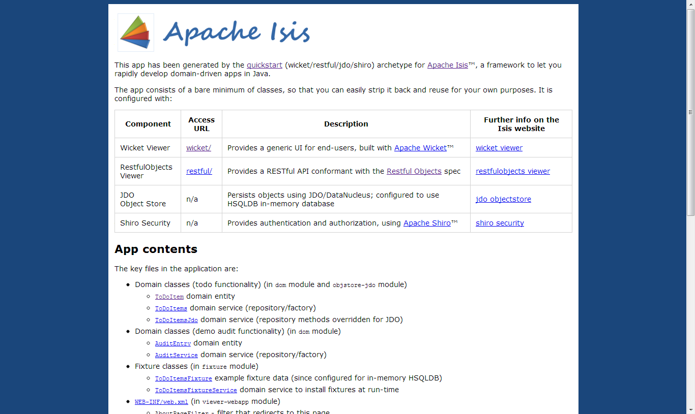</img>
    </td>
  </tr>
  <tr>
    <td>Wicket Home Page  <i>The Wicket viewer displays a home page with welcome text (easily changed for your own app).  The default text links to the main <tt>ToDoItem</tt> domain class over on <a href="https://github.com/apache/isis/blob/master/example/application/quickstart_wicket_restful_jdo/dom/src/main/java/dom/todo/ToDoItem.java">github</a>.</i></td>
    <td>
      </img>
    </td>
  </tr>
  <tr>
    <td>Domain class source code  <i>Most of the functionality of the quickstart app is inferred from the <tt>ToDoItem</tt> class.</i></td>
    <td>
      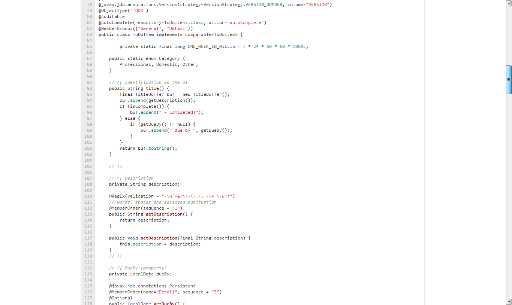</img>
    </td>
  </tr>
  <tr>
    <td>Install Fixtures  <i>The quickstart app is configured to run using the JDO objectstore, but with an in-memory database.  The <tt>Fixtures</tt> domain service allows the administrator (user: sven, password: pass) to install sample data.</i></td>
    <td>
      </img>
    </td>
  </tr>
  <tr>
    <td>Fixtures Installed  <i>Invoking an action that returns a scalar value, such as the information message, is displayed on the page.</i></td>
    <td>
      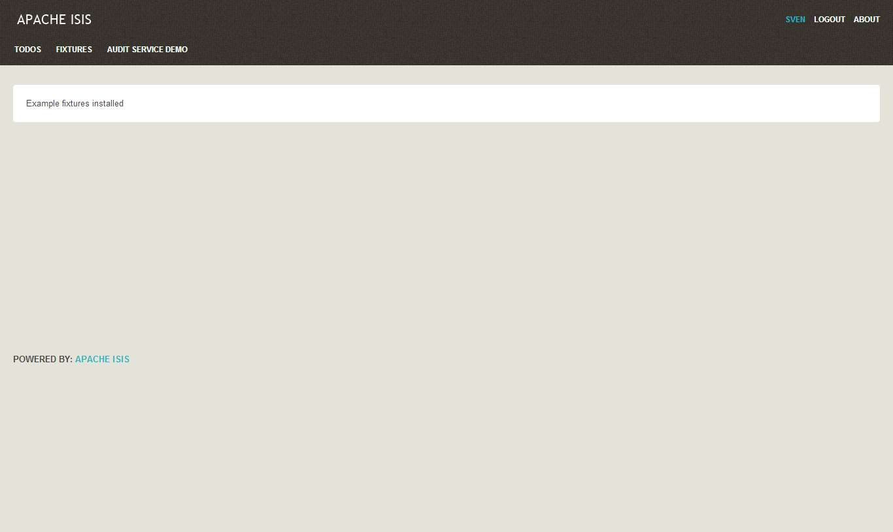</img>
    </td>
  </tr>
  <tr>
    <td>Query using a domain service  <i>Domain services more usually act as both repositories and factories.  In this case the <tt>ToDoItems</tt> domain service can be used to lookup existing <tt>ToDoItem</tt>s, or to create new ones.</i></td>
    <td>
      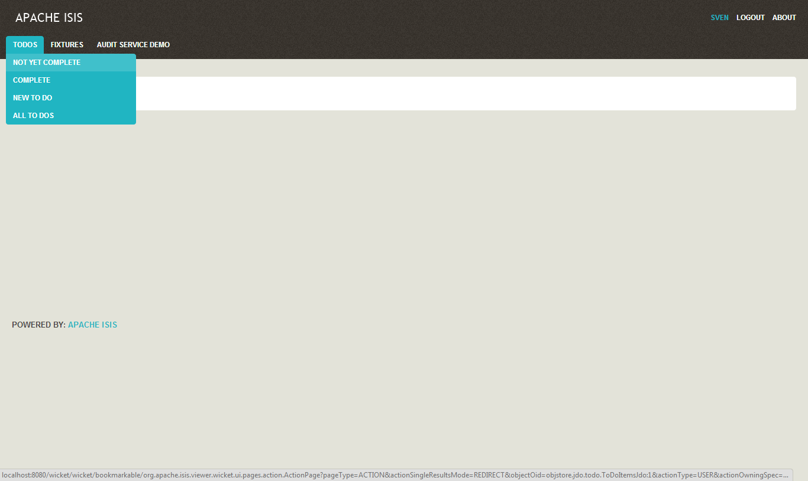</img>
    </td>
  </tr>
  <tr>
    <td>Results shown in table  <i>Actions that return collections of entities are shown in a table.  In this case the action has returned a list of <tt>ToDoItem</tt>s.  Not every property of the entity need be shown.</i></td>
    <td>
      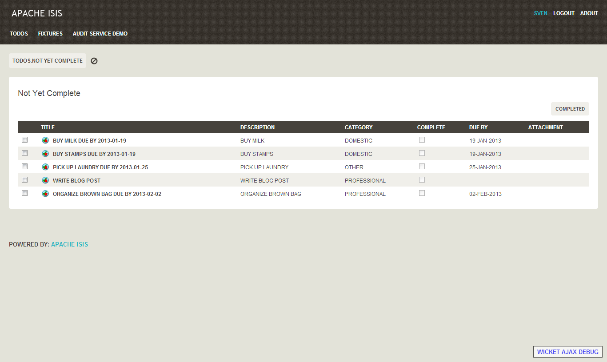</img>
    </td>
  </tr>
  <tr>
    <td>Follow Link  <i>Navigation to an entity's detailed page is by following the hyperlink.  This navigation is consistent throughout the UI.</i></td>
    <td>
      </img>
    </td>
  </tr>
  <tr>
    <td>Bulk collections  <i>Bulk actions can be invoked on all selected elements.  Bulk actions are indicated using <tt>@Bulk</tt> annotation:</i><pre>
public class ToDoItem {
    ...
    @Bulk
    public void complete() {
        setComplete(true);
    }
    ...
}
</pre></td>
    <td>
      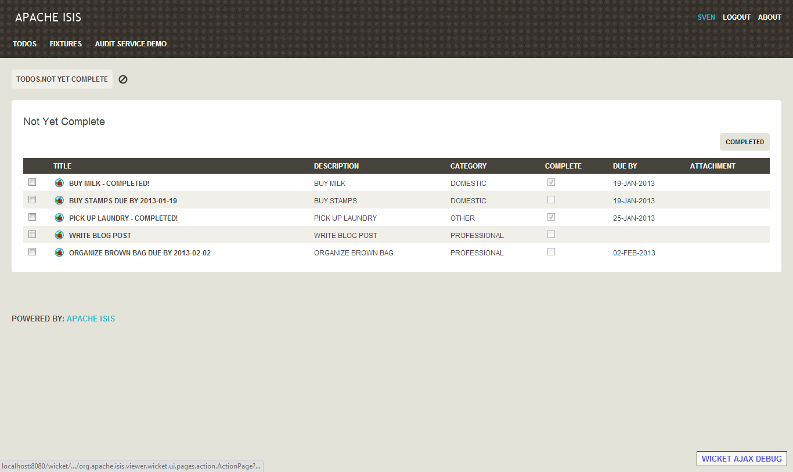</img>
    </td>
  </tr>
  <tr>
    <td>xx  <i>yy</i></td>
    <td>
      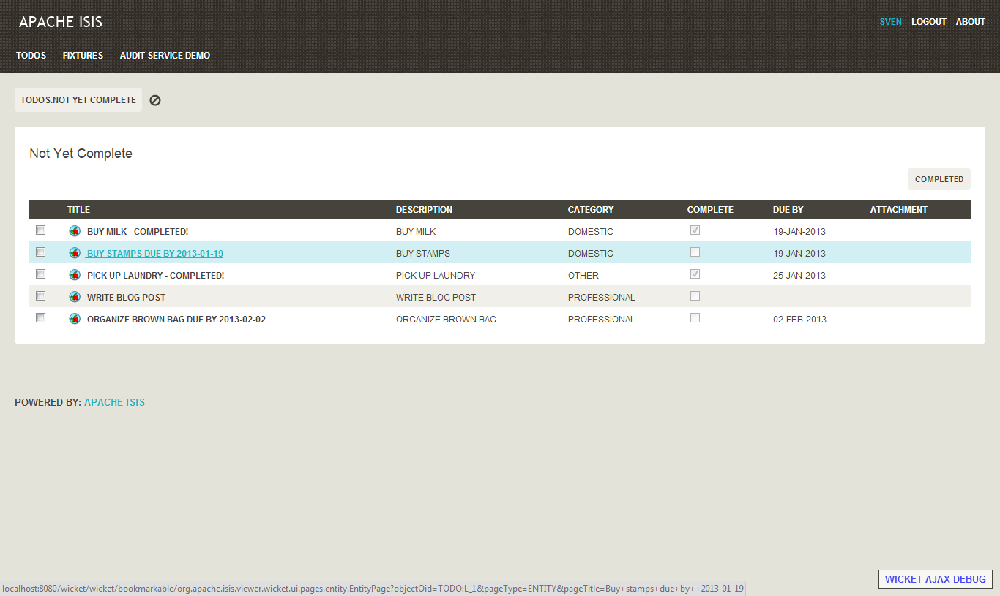</img>
    </td>
  </tr>
  <tr>
    <td>xx  <i>yy</i></td>
    <td>
      </img>
    </td>
  </tr>
  <tr>
    <td>xx  <i>yy</i></td>
    <td>
      </img>
    </td>
  </tr>
  <tr>
    <td>xx  <i>yy</i></td>
    <td>
      </img>
    </td>
  </tr>
  <tr>
    <td>xx  <i>yy</i></td>
    <td>
      </img>
    </td>
  </tr>
  <tr>
    <td>xx  <i>yy</i></td>
    <td>
      </img>
    </td>
  </tr>
  <tr>
    <td>xx  <i>yy</i></td>
    <td>
      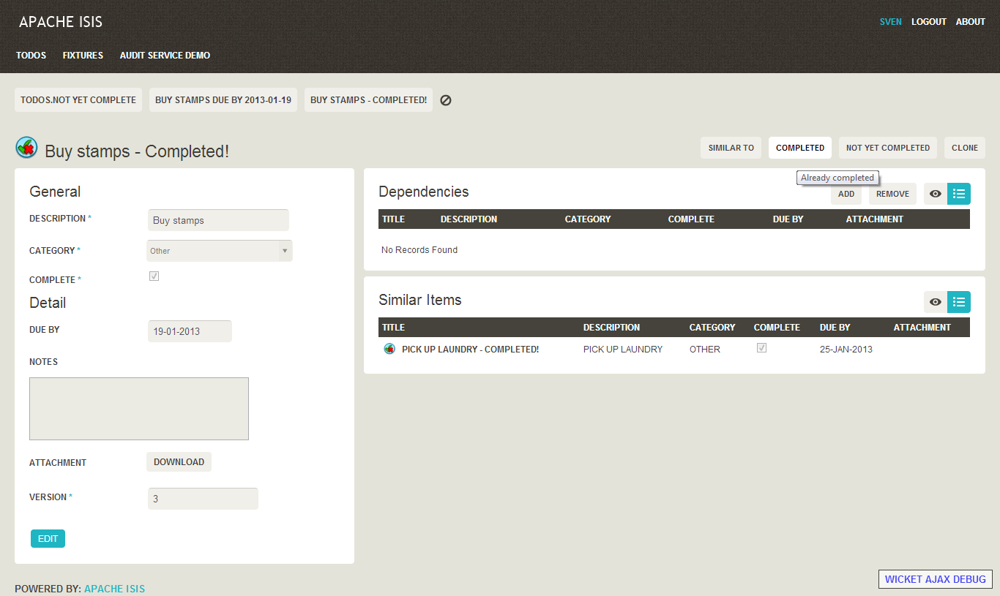</img>
    </td>
  </tr>
  <tr>
    <td>xx  <i>yy</i></td>
    <td>
      </img>
    </td>
  </tr>
  <tr>
    <td>xx  <i>yy</i></td>
    <td>
      </img>
    </td>
  </tr>
  <tr>
    <td>xx  <i>yy</i></td>
    <td>
      </img>
    </td>
  </tr>
  <tr>
    <td>xx  <i>yy</i></td>
    <td>
      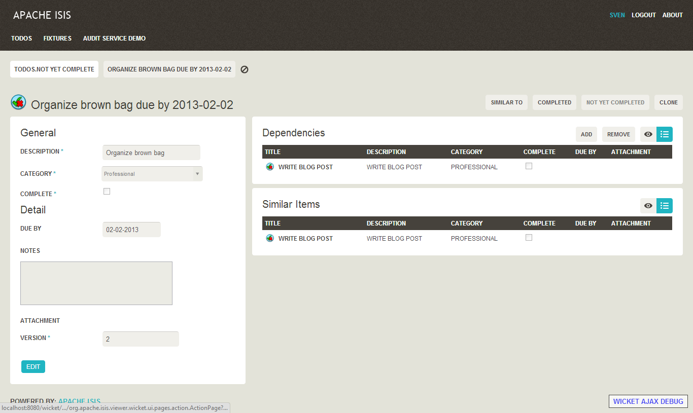</img>
    </td>
  </tr>
  <tr>
    <td>xx  <i>yy</i></td>
    <td>
      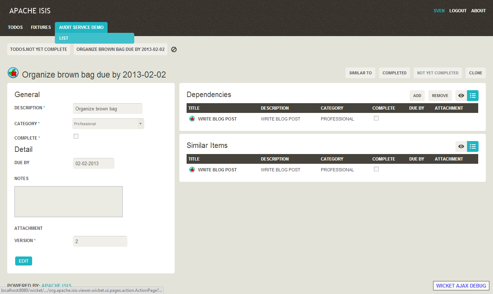</img>
    </td>
  </tr>
  <tr>
    <td>xx  <i>yy</i></td>
    <td>
      </img>
    </td>
  </tr>
  <tr>
    <td>xx  <i>yy</i></td>
    <td>
      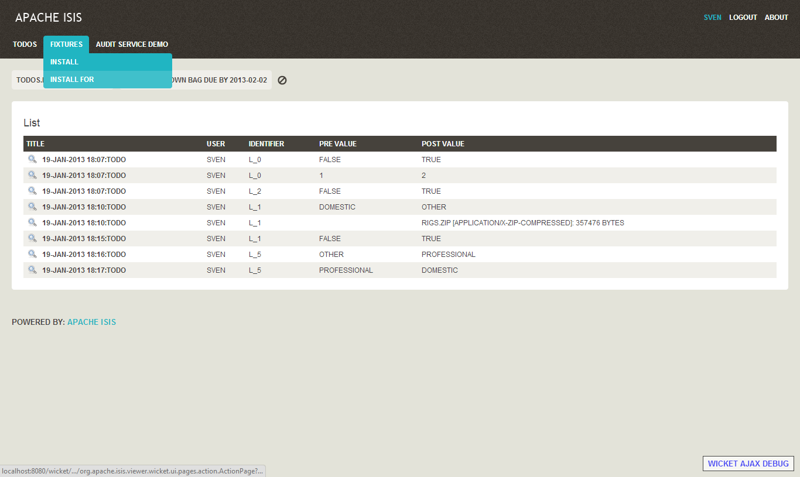</img>
    </td>
  </tr>
  <tr>
    <td>xx  <i>yy</i></td>
    <td>
      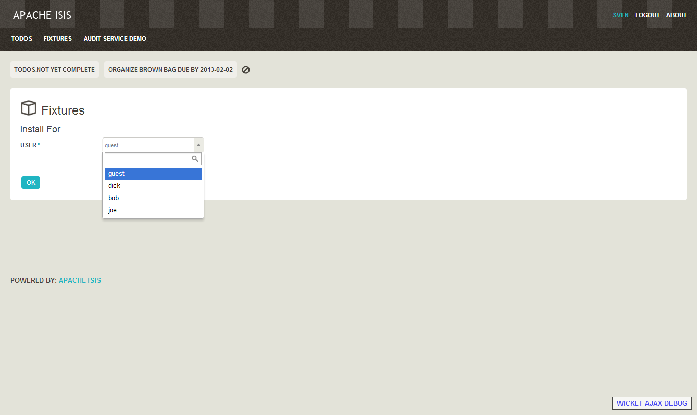</img>
    </td>
  </tr>
  <tr>
    <td>xx  <i>yy</i></td>
    <td>
      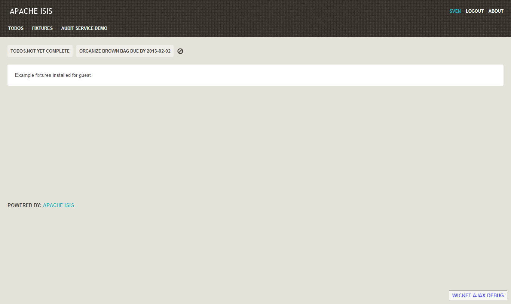</img>
    </td>
  </tr>
  <tr>
    <td>xx  <i>yy</i></td>
    <td>
      </img>
    </td>
  </tr>
  <tr>
    <td>xx  <i>yy</i></td>
    <td>
      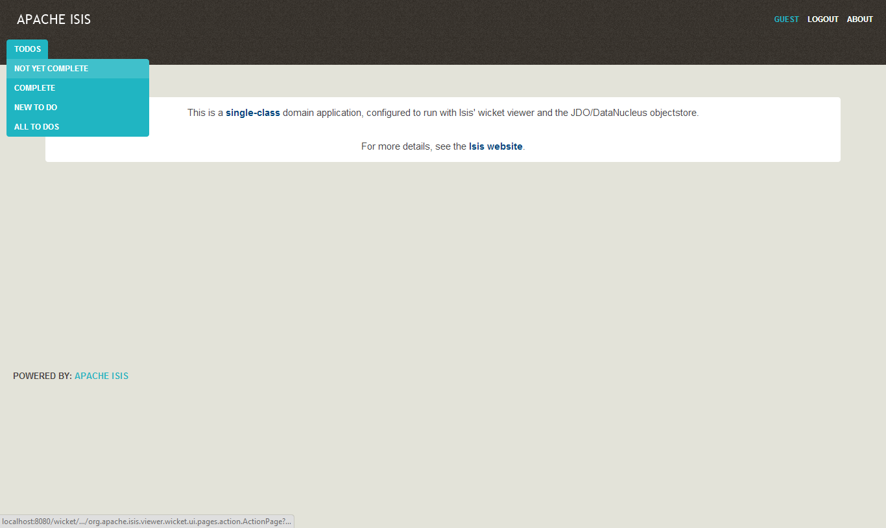</img>
    </td>
  </tr>
  <tr>
    <td>xx  <i>yy</i></td>
    <td>
      </img>
    </td>
  </tr>
  <tr><td span=2><h3>RestfulObjects Viewer</h3></td></tr>
  <tr>
    <td>xx  <i>yy</i></td>
    <td>
      </img>
    </td>
  </tr>
  <tr>
    <td>xx  <i>yy</i></td>
    <td>
      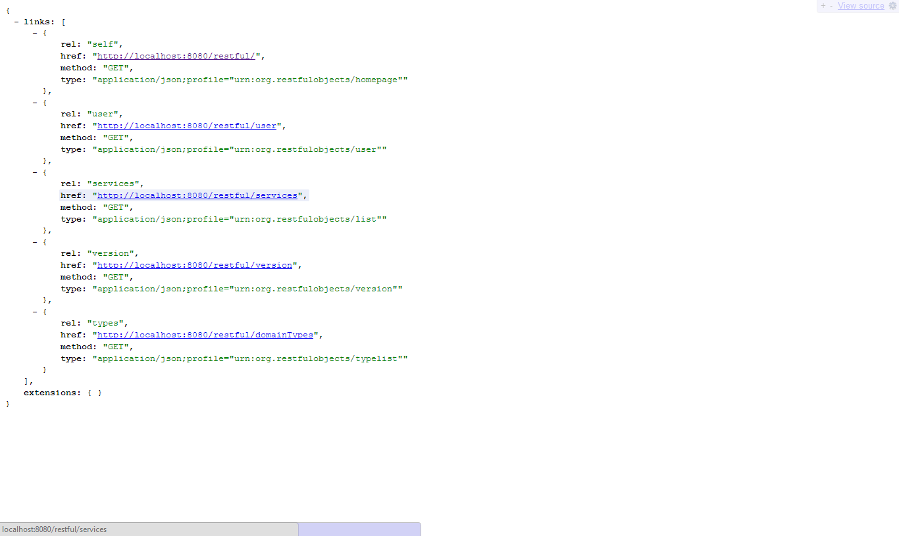</img>
    </td>
  </tr>
  <tr>
    <td>xx  <i>yy</i></td>
    <td>
      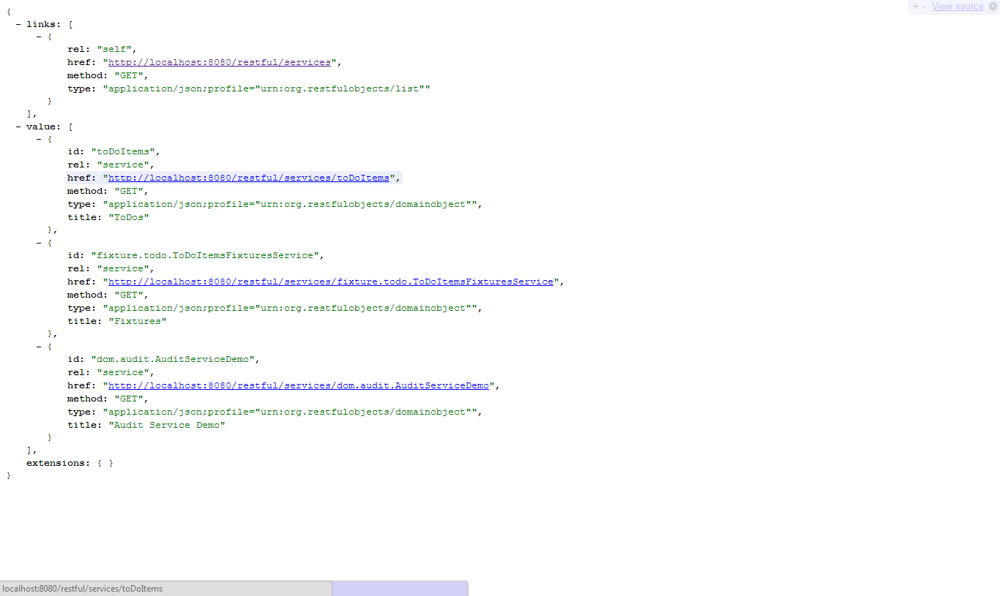</img>
    </td>
  </tr>
  <tr>
    <td>xx  <i>yy</i></td>
    <td>
      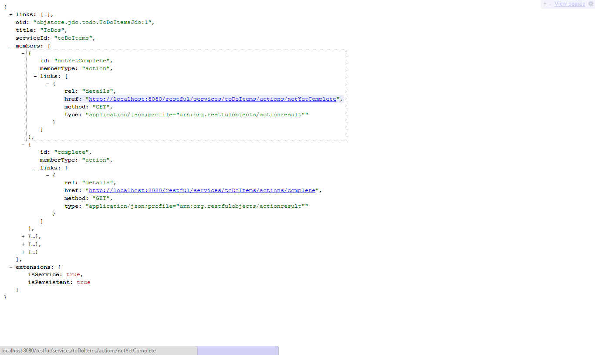</img>
    </td>
  </tr>
  <tr>
    <td>xx  <i>yy</i></td>
    <td>
      </img>
    </td>
  </tr>
  <tr>
    <td>xx  <i>yy</i></td>
    <td>
      </img>
    </td>
  </tr>
  <tr>
    <td>xx  <i>yy</i></td>
    <td>
      </img>
    </td>
  </tr>
<table>

