Title: Apache Isis

<!--
The following screenshots show the Wicket and Restful Objects viewers running a simple 'todo app', as generated by the [quickstart archetype](quickstart-archetype.html).
-->

  <!--  Carousel -->
  <!--  consult Bootstrap docs at 
        http://twitter.github.com/bootstrap/javascript.html#carousel -->
  

    

      

        </img>
      

    

        <a href="resources/screencast-01-welcome-page.png">
          </img>
        </a>
        

          
Welcome Page

          
<i>The archetype's welcome page describes how the application is configured, and the most significant files</i>

        

      

      

        <a href="resources/screencast-02-wicket-home-page.png">
          </img>
        </a>
        

          
Wicket Home Page

          
<i>The Wicket viewer displays a home page showing the domain services as menu items.  These are registered in </i><tt>WEB-INF/isis.properties</tt>  <i>The welcome text links to the main <tt>ToDoItem</tt> domain class over on <a href="https://github.com/apache/isis/blob/master/example/application/quickstart_wicket_restful_jdo/dom/src/main/java/dom/todo/ToDoItem.java">github</a>. (You can easily change this text).</i>
          

        

      

    

        <a href="#">
          </img>
        </a>
        

          
Domain class source code 

          
<i>Most of the functionality of the quickstart app is inferred from the <tt>ToDoItem</tt> class.</i>

        

    

    
<!-- .carousel-inner -->
    <!--  next and previous controls here
          href values must reference the id for this carousel -->
      <a class="carousel-control left" href="#this-carousel-id" data-slide="prev">&lsaquo;</a>
      <a class="carousel-control right" href="#this-carousel-id" data-slide="next">&rsaquo;</a>
  
<!-- .carousel -->
  <!-- end carousel -->

<table>

  
  
  <tr>
    <td>Domain class source code  <i>Most of the functionality of the quickstart app is inferred from the <tt>ToDoItem</tt> class.</i></td>
    <td>
      </img>
    </td>
  </tr>
  
  <tr>
    <td>Install Fixtures  <i>The quickstart app is configured to run using the JDO objectstore, but with an in-memory database.  The <tt>Fixtures</tt> domain service allows the administrator (user: sven, password: pass) to install sample data:</i><pre>
@Named("Fixtures")
public class ToDoItemsFixturesService {
    public String install() { ... }
    ...
    public String installFor(
        @Named("User") String user) { ... }
    ...
}}
</pre></td>
    <td>
      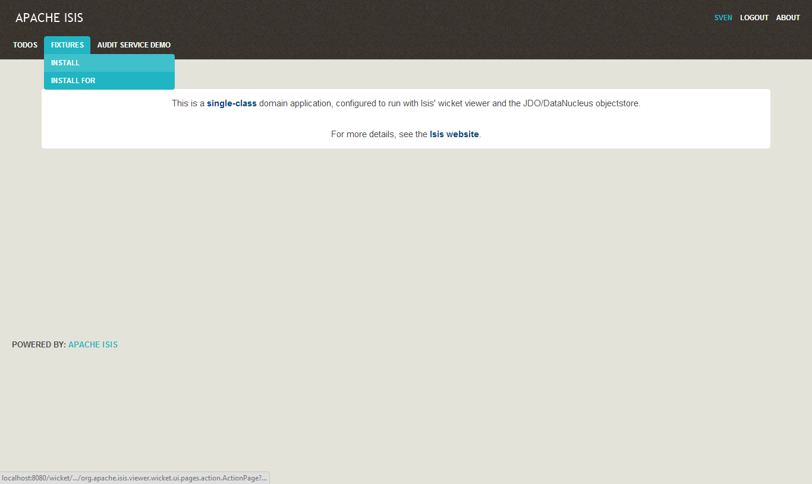</img>
    </td>
  </tr>
  <tr>
    <td>Fixtures Installed  <i>Invoking an action that returns a scalar value, such as the information message, is displayed on the page.</i></td>
    <td>
      </img>
    </td>
  </tr>
  <tr>
    <td>Query using a domain service  <i>Domain services more usually act as both repositories and factories.  In this case the <tt>ToDoItems</tt> domain service can be used to lookup existing <tt>ToDoItem</tt>s, or to create new ones:</i><pre>
@Named("ToDos")
public class ToDoItems {
    ...
    @MemberOrder(sequence = "1")
    public List<ToDoItem> notYetComplete() { ... }
    ...
    @MemberOrder(sequence = "2")
    public List<ToDoItem> complete() { ... }
    ...
    @MemberOrder(sequence = "3")
    public ToDoItem newToDo( ... ) { ... }
    ...
    @MemberOrder(sequence = "4")
    public List<ToDoItem> allToDos() { ... }
}
</pre></td>
    <td>
      </img>
    </td>
  </tr>
  <tr>
    <td>Results shown in table  <i>Actions that return collections of entities are shown in a table.  In this case the action has returned a list of <tt>ToDoItem</tt>s.  Not every property of the entity need be shown.</i></td>
    <td>
      </img>
    </td>
  </tr>
  <tr>
    <td>Bulk collections  <i>Bulk actions can be invoked on all selected elements.  Bulk actions are indicated using <tt>@Bulk</tt> annotation:</i><pre>
public class ToDoItem {
    ...
    @Bulk
    public void complete() {
        setComplete(true);
    }
    ...
}}
</pre></td>
    <td>
      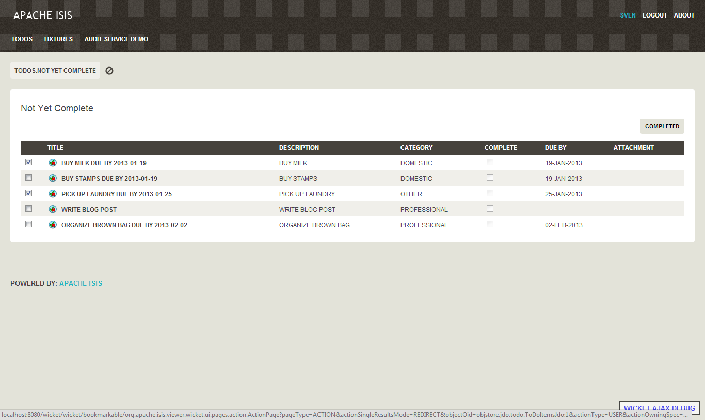</img>
    </td>
  </tr>
  <tr>
    <td>&nbsp;</td>
    <td>
      </img>
    </td>
  </tr>
  <tr>
    <td>Follow Link  <i>Navigation to an entity's detailed page is by following the hyperlink.  This navigation is consistent throughout the UI.</i></td>
    <td>
      </img>
    </td>
  </tr>
  <tr>
    <td>Entity detail pages  <i>The Wicket viewer builds the UI from the domain class's structure.  It shows an icon and title for the entity top left:</i>
    <pre>
public class ToDoItem {
    public String title() {
        final TitleBuffer buf = 
            new TitleBuffer();
        buf.append(getDescription());
        if (isComplete()) {
            buf.append(" - Completed!");
        } else {
            if (getDueBy() != null) {
                buf.append(" due by ", 
                           getDueBy());
            }
        }
        return buf.toString();
    }
    ... 
}}
</pre>
    <i>...(scalar) properties are displayed underneath:</i><pre>
    ...
    @RegEx(validation = 
      "\\w[@&:\\-\\,\\.\\+ \\w]*")
    @MemberOrder(sequence = "1")
    public String getDescription() { ... }
    public void setDescription(
            String description) { ... }
    ...
}}
</pre><i>... (vector) collections on the right:</i><pre>
    ...
    @Disabled
    @MemberOrder(sequence = "1")
    @Resolve(Type.EAGERLY)
    public List<ToDoItem> getDependencies() { ... }
    public void setDependencies(List<ToDoItem>) { ... }
    ...
}}
</pre></i> <i>... and actions are shown top right:</i><pre>
    ...
    @Named("Clone")
    @MemberOrder(sequence = "3")
    public ToDoItem duplicate() { ... }
    ...
}}
</pre></td>
    <td>
      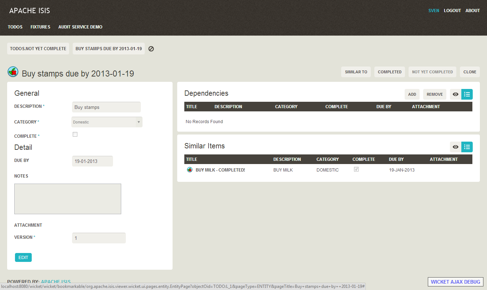</img>
    </td>
  </tr>
  <tr>
    <td>Edit entity  <i>The entity's properties can be edited through the 'Edit' button.  Some properties may not be editable:</i><pre>
public class ToDoItem {
    ...
    @Disabled
    @MemberOrder(sequence = "4")
    public boolean isComplete() { ... }
    public void setComplete(
        final boolean complete) { ... }
    ...
}}
</pre></td>
    <td>
      </img>
    </td>
  </tr>
  <tr>
    <td>Drop downs  <i>Drop downs are provided for enums (such as Category):</i><pre>
public class ToDoItem {
    public static enum Category {
        Professional, Domestic, Other;
    }
    ...
}}
</pre></td>
    <td>
      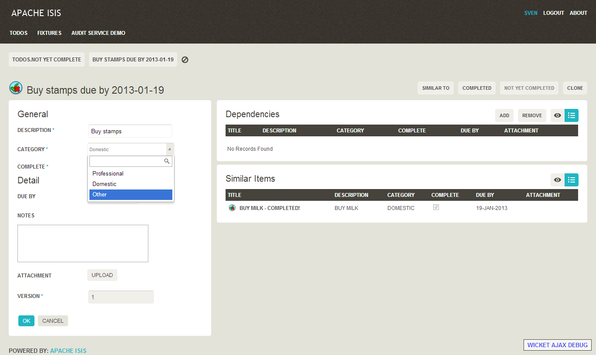</img>
    </td>
  </tr>
  <tr>
    <td>Optimistic locking  <i>Updating the entity bumps up its version number.  Behind the scenes this is done by the JDO objectstore</i><pre>
@javax.jdo.annotations.Version(
    strategy=VersionStrategy.VERSION_NUMBER, 
    column="VERSION")
...
public class ToDoItem {
    ...
    @Hidden(where=Where.ALL_TABLES)
    @Disabled
    @MemberOrder(name="Detail", 
                 sequence = "99")
    @Named("Version")
    public Long getVersionSequence() {
        if(!(this instanceof 
               PersistenceCapable)) {
            return null;
        } 
        PersistenceCapable pc = 
            (PersistenceCapable) this;
        final Long version = 
            (Long) JDOHelper.
                   getVersion(pc);
        return version;
    }
    ...
}}
</pre></td>
    <td>
      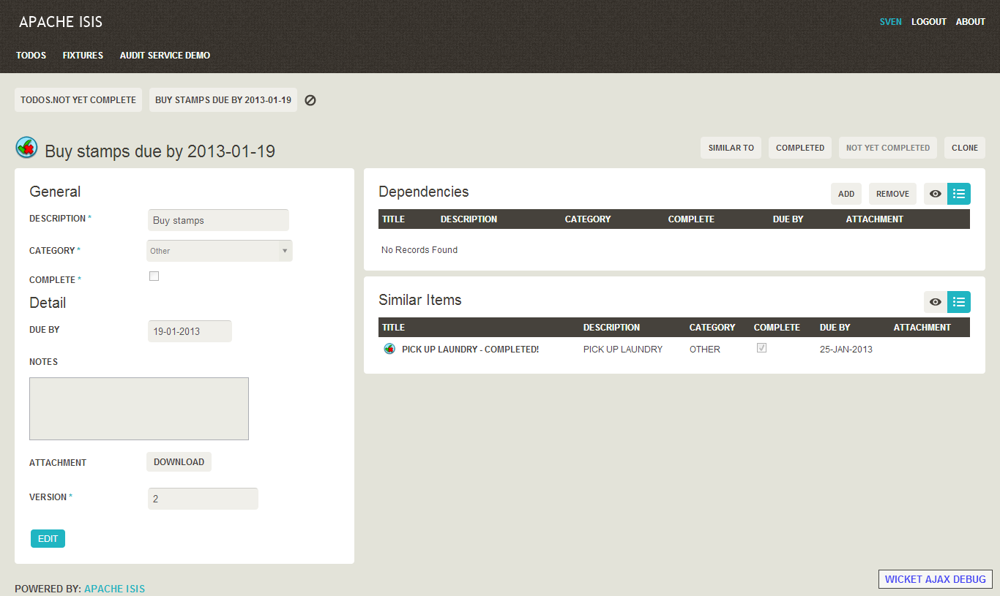</img>
    </td>
  </tr>
  <tr>
    <td>Invoking actions  <i>Actions can be invoked; there may or may not be arguments:</i><pre>
public class ToDoItem {
    ...
    public ToDoItem completed() {
        setComplete(true);
        return this;
    }
    ...
}}
</pre></td>
    <td>
      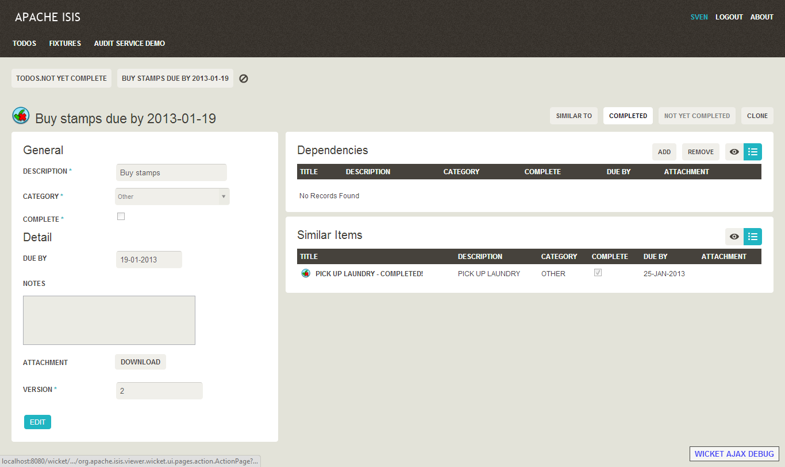</img>
    </td>
  </tr>
  <tr>
    <td>Disabling actions  <i>Actions can be disabled (as can editing properties) using supporting methods:</i><pre>
public class ToDoItem {
    ...
    public ToDoItem completed() { ... }
    public String disableCompleted() {
        return complete ? 
            "Already completed" : null;
    }
}}
</pre></td>
    <td>
      </img>
    </td>
  </tr>
  <tr>
    <td>Actions grouped  <i>Often actions relate to a particular colleciton of an entity.  The Wicket viewer renders such actions next to that collection.  For example:</i><pre>
public class ToDoItem {
    ...
    @MemberOrder(
        name="dependencies", 
        sequence = "3")
    public ToDoItem add(
        final ToDoItem toDoItem) { ... }
        getDependencies().add(toDoItem);
        return this;
    }
    ...
}}
</pre><i>There might also be validation logic:</i><pre>
public class ToDoItem {
    ...
    public String validateAdd(
           final ToDoItem toDoItem) {
        if(getDependencies().
               contains(toDoItem)) {
            return "Already a dependency";
        }
        if(toDoItem == this) {
            return "Can't set up a " + 
                   "dependency to self";
        }
        return null;
    }
    ...
}}
</pre></td>
    <td>
      </img>
    </td>
  </tr>
  <tr>
    <td>Actions can take arguments  <i>In the case of arguments (or indeed when editing properties) that are references to entities, these can be looked up using an autocomplete action on a repository:</i><pre>
@AutoComplete(repository=ToDoItems.class, action="autoComplete")
public class ToDoItem { ... }
</pre><i>and:</i>
<pre>
public class ToDoItems {
    ...
    @Hidden
    public List<ToDoItem> autoComplete(
            final String description) {
        return ... 
    }
    ...
}}
</pre>
</td>
    <td>
      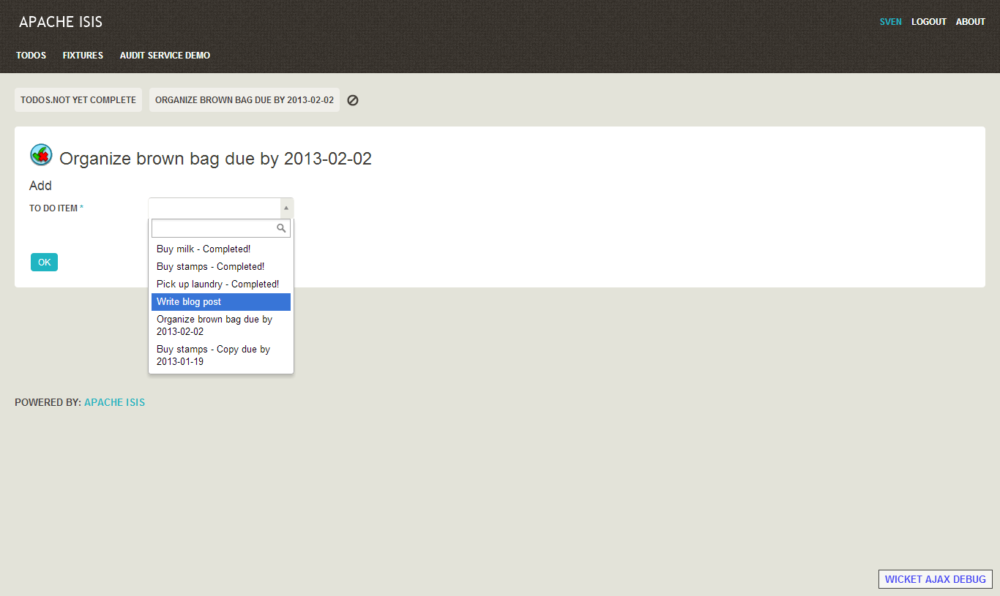</img>
    </td>
  </tr>
  <tr>
    <td>Collections (and properties) can be derived  <i>The viewer will render the state of the object, which can be persisted state or derived on the fly.  A common pattern is to delegate to an (automatically injected) domain service:</i><pre>
public class ToDoItem {
    ...
    @MemberOrder(sequence = "5")
    @NotPersisted
    @Resolve(Type.EAGERLY)
    public List<ToDoItem> getSimilarItems() {
        return toDoItems.similarTo(this);
    }
    ...
    private ToDoItems toDoItems;
    // automatically injected
    public void setToDoItems(
            final ToDoItems toDoItems) {
        this.toDoItems = toDoItems;
    }
    ...
}}
</pre></td>
    <td>
      </img>
    </td>
  </tr>
  <tr>
    <td>Breadcrumbs  <i>The Wicket viewer has breadcrumbs which can be used either to get back to a previous entity or to invoke a (query-only) action:</i>
<pre>
public class ToDoItems {
    ...
    @ActionSemantics(Of.SAFE)
    public List<ToDoItem> notYetComplete() { ... }
    ...
}}
</pre></td>
    <td>
      </img>
    </td>
  </tr>
  <tr>
    <td>Audit Service  <i>The JDO Objectstore supports an auditing service.  The quickstart app provides an example implementation of this service:</i><pre>
public class AuditServiceDemo implements AuditService {
    ...
    public void audit(
        String user, 
        long currentTimestampEpoch, 
        String objectType, String identifier, 
        String preValue, String postValue) { 
       ...
    }
}}
</pre></td>
    <td>
      </img>
    </td>
  </tr>
  <tr>
    <td>Audit Records  <i>The demo audit service simply persists an audit entry for each update.</i></td>
    <td>
      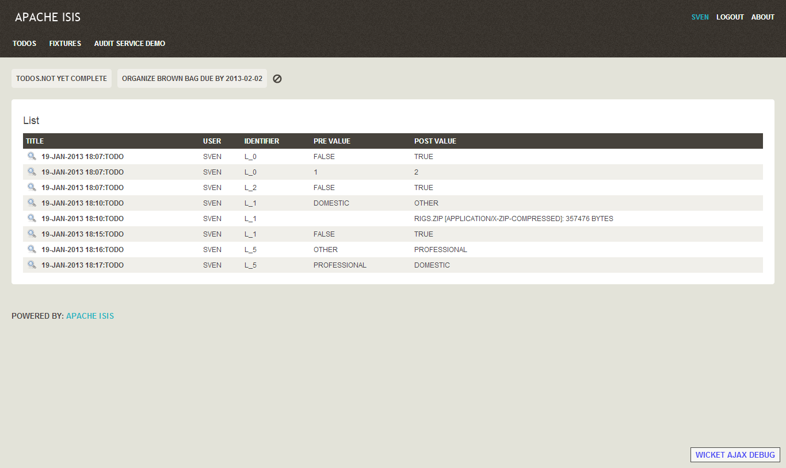</img>
    </td>
  </tr>
  <tr>
    <td>Multi-User  <i>Apache Isis is a multi-user system.  The administrator (sven/pass) has the permissions to be able to install fixtures for other users.</i></td>
    <td>
      </img>
    </td>
  </tr>
  <tr>
    <td>&nbsp;  <i>&nbsp;</i></td>
    <td>
      </img>
    </td>
  </tr>
  <tr>
    <td>&nbsp;  <i>&nbsp;</i></td>
    <td>
      </img>
    </td>
  </tr>
  <tr>
    <td>Login as user  <i>The quickstart app provides a 'guest' user that has a limited set of permissions....</i></td>
    <td>
      </img>
    </td>
  </tr>
  <tr>
    <td>Permissions  <i>... the guest user can use the 'ToDoItems' domain service, but the other services are not available.  In the case of the quickstart this is specified in </i><tt>WEB-INF/shiro.ini</tt><i> configuration file.</i></td>
    <td>
      </img>
    </td>
  </tr>
  <tr><td span=2><h3>RestfulObjects Viewer</h3></td></tr>
  <tr>
    <td>Access the RESTful API  <i>The Restful Objects viewer exposes the domain object model through a JSON-based RESTful API.  Typically access will be restricted, in this case using HTTP BASIC authentication (though this is configurable).</i></td>
    <td>
      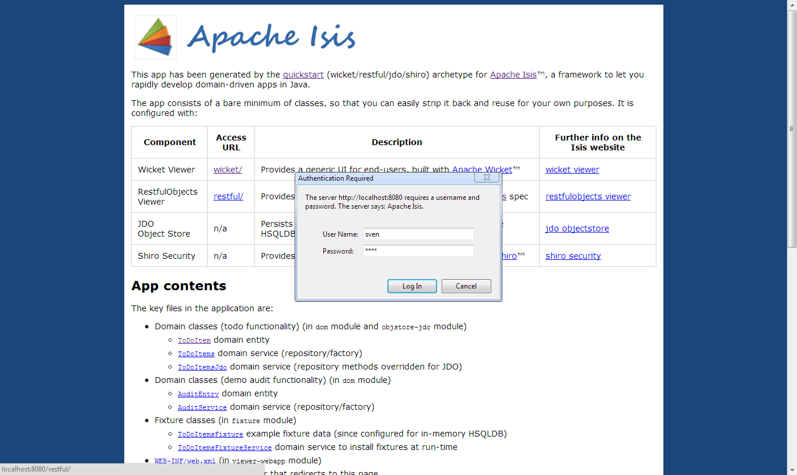</img>
    </td>
  </tr>
  <tr>
    <td>List domain services  <i>Most interactions with the RESTful API start by accessing the resource that represents the list of domain services.  However, the Restful Objects viewer also exposes templated URLs (as per the <a href="http://restfulobjects.org">Restful Objects spec</a> that it implements).</i></td>
    <td>
      </img>
    </td>
  </tr>
  <tr>
    <td>Domain service members  <i>Navigating to a particular domain service returns a representation of the members provided by that domain service.</i></td>
    <td>
      </img>
    </td>
  </tr>
  <tr>
    <td>Domain service action  <i>A detailed representation of each individual action can be accessed; this can be considered as analogous to the action parameter prompt page in the Wicket viewer.</i></td>
    <td>
      </img>
    </td>
  </tr>
  <tr>
    <td>Invoking a domain service action  <i>One of the links provided in the detailed representation is to invoke the action.  Note that the link specifies the HTTP method to use, along with the arguments (if any) to be provided.</i></td>
    <td>
      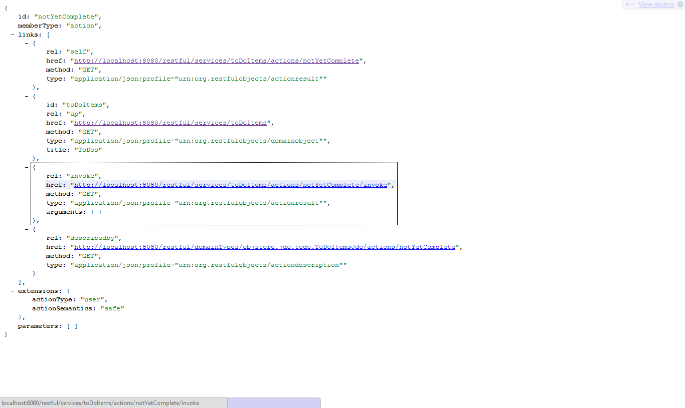</img>
    </td>
  </tr>
  <tr>
    <td>Action returning a list  <i>Invoking an action will return a scalar value, or a reference to an entity, or (as in this case) a list of references to entities.</i></td>
    <td>
      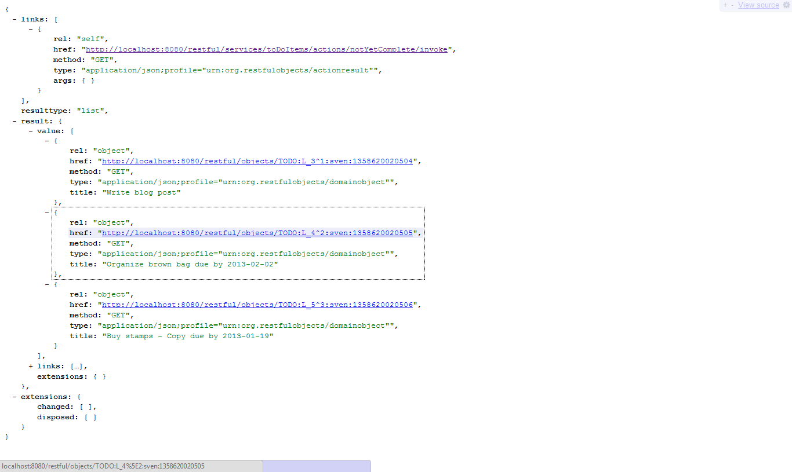</img>
    </td>
  </tr>
  <tr>
    <td>Representation of an entity  <i>The entity's representation shows the state of its (scalar) properties, links to its (vector) collections contents, and also links to invoke the entity's actions.</i></td>
    <td>
      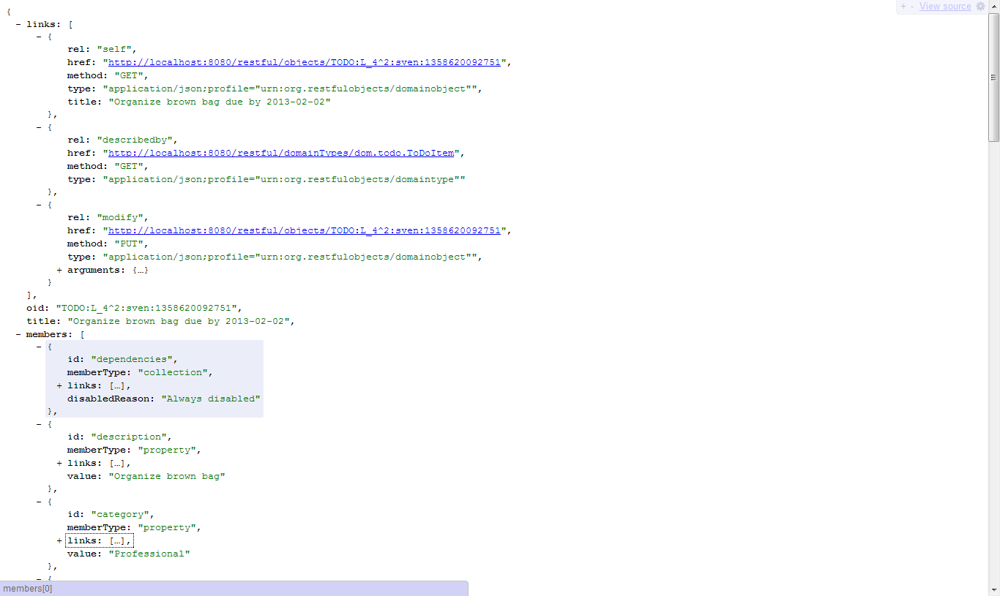</img>
    </td>
  </tr>
<table>

    <!-- Le javascript
    ================================================== -->
    <!-- Grab Google CDN's jQuery, with a protocol relative URL; fall back to local if necessary -->
    
    
    <!-- Bootstrap jQuery plugins compiled and minified -->
    
    
