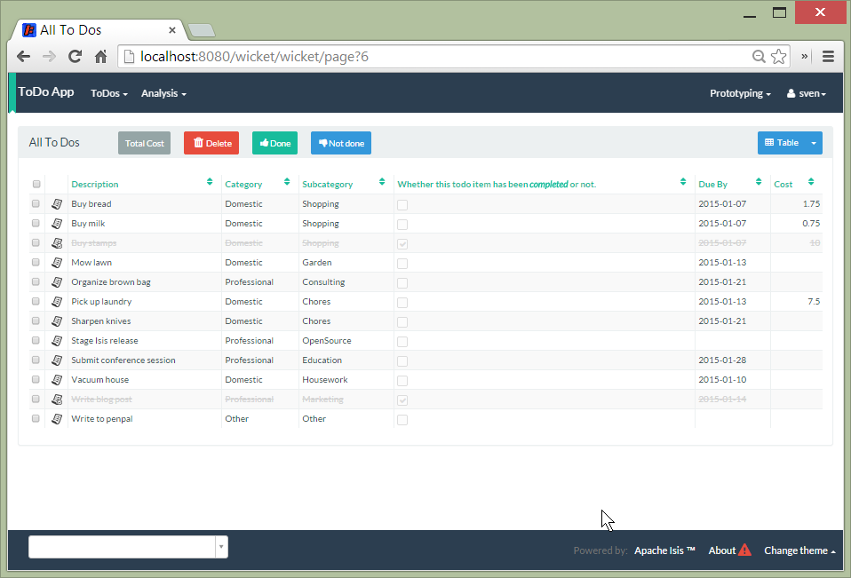

title: How to customize the styling of a domain object (1.8.0-SNAPSHOT)

The [Wicket viewer](../components/viewers/wicket/about.html) will query each object when being rendered to determine if
any instance-specific CSS class name should be used to wrap the HTML representing that domain object.

The object provides the class name by implementing the <tt>cssClass()</tt> method.  For example:

    public String cssClass() {
        return !isComplete() ? "todo" : "done";
    }

If the object provides a class name, this is used as a CSS class on a containing &lt;div&gt; if rendering the object on a page, or as
a CSS class on the containing &lt;tr&gt; if rendering the object on a table.  By customizing the `application.css` file, different styling can be provided for each object instance.

## Screenshots

The [todoapp addon](https://github.com/isisaddons/isis-app-todoapp) (not ASF) uses this technique to render completed items with a strikethrough:

This effect is accomplished with the following addition to `application.css`:

    tr.todo {
    }

    tr.done {
        text-decoration: line-through;
        color: #d3d3d3;
    }
