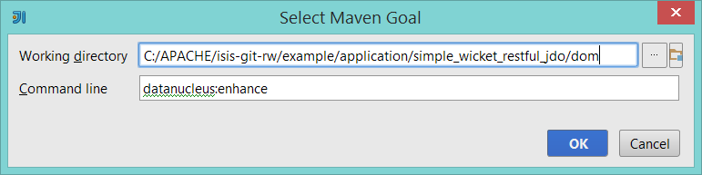

Title: Setting up the IntelliJ IDE

> See also:
> 
> * setting up [Eclipse IDE](./eclipse.html).  
> * setting up [IntelliJ and JRebel](../../../other/jrebel.html).  
> 

We highly recommend that you develop your Isis application using an IDE.  Isis is built with Maven, and all modern IDEs can import Maven projects.  One of the most popular IDEs is [IntelliJ IDEA](http://www.jetbrains.com/idea/), offering either a paid-for "Ultimate" edition or a free-to-use Community edition.  Either will do for Isis development.

If using the [JDO Objectstore](../../../components/objectstores/jdo/about.html) (the default if using the [simple](../simple-archetype.html) or [quickstart](../quickstart-archetype.html) archetypes), then the development environment must be configured such that the Java bytecode can be enhanced by a [JDO enhancer](http://db.apache.org/jdo/enhancement.html).  When working in IntelliJ, then JDO enhancement is most easily done by leveraging the Maven configuration.  We do this by executing the `mvn compile` goal in the dom project, prior to running the application.

The steps are therefore:

* import the project into IntelliJ
* setting up a run/debug configuration to run the app

## Screencasts

This screencast shows how to import an Isis app into IntelliJ, and then how to setup the run/debug configuration to run the app:

<iframe width="640" height="360" src="//www.youtube.com/embed/lwKsyTbTSnA" frameborder="0" allowfullscreen></iframe>

If you are a [JRebel](http://zeroturnaround.com/software/jrebel/) user, then do also look at [how to configure IntelliJ with JRebel](../../../other/jrebel.html#intellij).

## Importing the Code into IntelliJ

Importing the Isis as a Maven app is straightforward:

and then:

## Setting up a Run/Debug Configuration

The screenshot below shows how to setup the run/debug configuration:

That is:

* Main Class: `org.apache.isis.WebServer`
* VM options: (leave blank)
* Program arguments: `--type SERVER_PROTOTYPE --port 8080`
* Environment variables: (leave blank)
* Use classpath of module: (the `webapp` module)

See [here](../../../reference/deployment-type.html) for other deployment types (the `--type` argument).

Then - importantly - for the `Before launch` setting, first remove the default "Make" entry, and then add a new Maven goal:

to execute `mvn compile` for the `dom` modue:

  
Running `mvn compile` (rather than IntellJ's regular make) will ensure that the domain object classes are enhanced by the DataNucleus enhancer.
