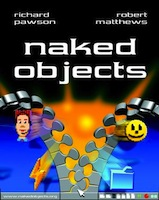
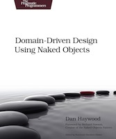

Title: Books

Although it has evolved since, the *Apache Isis* framework started out as an open source implementation of the naked objects pattern.  Indeed, the generic user interfaces provided by Isis [Wicket](../../components/viewers/wicket/about.html) viewer [Restful Objects](../../components/viewers/restfulobjects/about.html) viewer are both "just" naked objects implementations; the first serves up a default generic representation of domain objects for human interaction, the latter serving up representation intended for machine consumption rather than human beings.

If the idea of naked objects is of interest, then there are a couple of books on the topic that you might want to read.

### Naked Objects

Richard Pawson and Robert Matthews, Wiley 2002

{row

{span-one-third

{book-image

}

}

{span-two-thirds

This book describes the original ideas of Naked Objects. Although based on a very early version of the framework, it's still definitely worth a read (and beautifully produced).

Amazon quotes: (avg 5 stars)

- Brilliant argument and toolkit for information systems
- Most thoughtful and beautiful technical book I have read
- Excellent presentation of an innovative practical idea

The book is freely available online [here](http://www.nakedobjects.org/book/). Or, you can get a hardcopy of the book at [Wiley (publisher)](http://eu.wiley.com/WileyCDA/WileyTitle/productCd-0470844205.html) and [Amazon](http://www.amazon.com/Naked-Objects-Richard-Pawson/dp/0470844205).
 
}

}

### Domain Driven Design using Naked Objects

Dan Haywood, Pragmatic Bookshelf 2009

{row

{span-one-third

{book-image

}

}

{span-two-thirds

This more recent book draws the parallel between domain-driven design and Naked Objects (4.0). In the spirit of the Pragmatic Bookshelf, it's a practical, hands-on sort of book, building up a case study as it goes and encouraging you to build your own app as you go.

Amazon quotes: (avg 4.5 stars)

- Important Contribution to Domain-Driven Design
- The easy-to-learn Naked Objects Framework .. provide[s] a masterful exposition on DDD
- Clear and passionate book about a great subject
- Excellent book and a great framework

You can find the book at [Pragmatic Bookshelf (publisher)](http://www.pragprog.com/titles/dhnako/domain-driven-design-using-naked-objects) and [Amazon](http://www.amazon.com/Domain-Driven-Design-Objects-Pragmatic-Programmers/dp/1934356441).

}

}

### Restful Objects Specification

Dan Haywood

The [Restful Objects specification](http://restfulobjects.org) defines a set of RESTful resources, and corresponding JSON representations, for accessing and manipulating a domain object model.

This is a comprehensive specification, running to over 200 pages in length.  It is implemented by Isis' [Restful Objects](../../components/viewers/restfulobjects/about.html) viewer, and is also implemented by another (non-Apache) open source project, [Naked Objects MVC](http://nakedobjects.codeplex.com).

