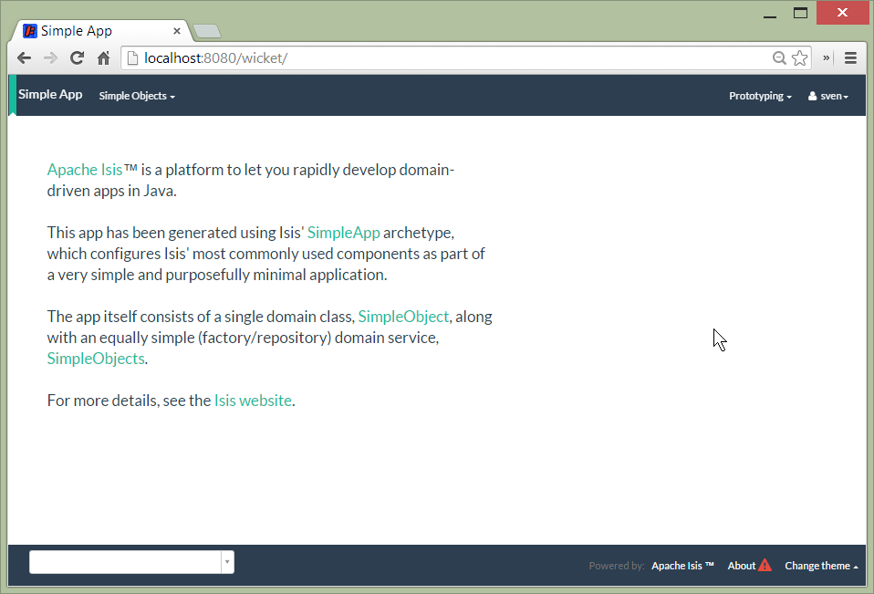
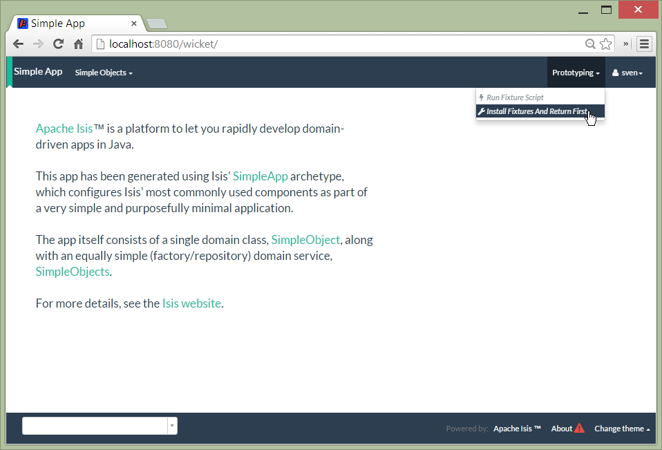
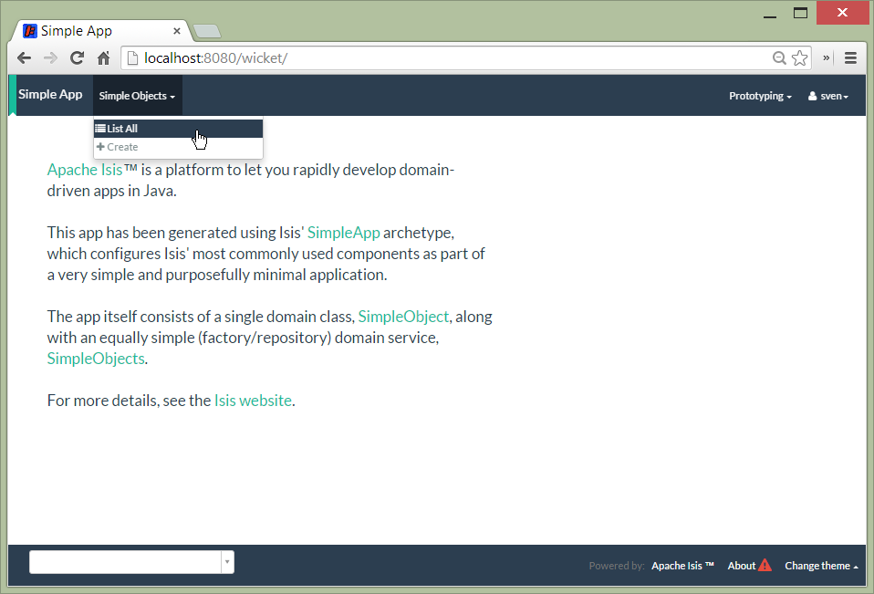
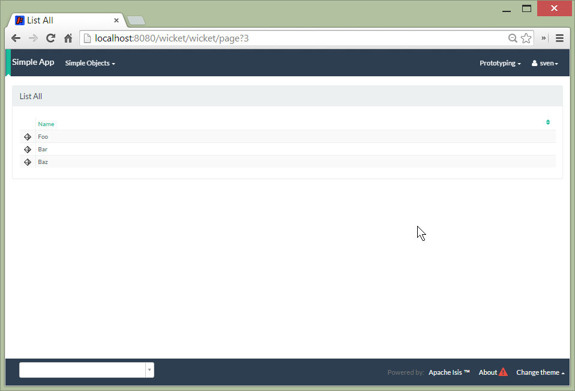
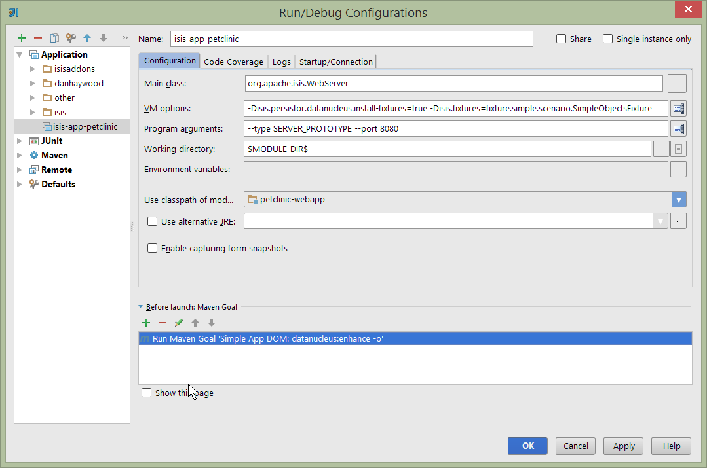

Title: Step-by-step tutorial: Petclinic

{step-by-step

{note
A step-by-step tutorial to building a petclinic application using Apache Isis.
}

This tutorial builds a simple petclinic application, consisting of just three domain classes:

</img>

The above diagram was built using [yuml.me](http://yuml.me]); the DSL that defines this diagram is:

    [Pet|-name:String{bg:green}]<-0..*[Visit|-checkIn:LocalDate;-checkout:LocalDate;-diagnosis:String|{bg:pink}]
    [Owner|-firstName:String;-lastName:String{bg:green}]<0..1-0..*>[Pet]
    [PetSpecies|-name:String{bg:blue}]<species-[Pet]

This supports the following use cases:

* register a Pet
* register an Owner
* maintain a Pet's details
* check in a Pet to visit the clinic
* enter a diagnosis
* check out a Pet to visit the clinic

    
Either follow along or check out the tags from the corresponding [github repo](https://github.com/danhaywood/isis-app-petclinic).

## Prerequisites

You'll need:

* Java 7 JDK
* [Maven](http://maven.apache.org/) 3.2.x
* an IDE, such as [Eclipse](http://www.eclipse.org/) or [IntelliJ IDEA](https://www.jetbrains.com/idea/).

## Run the archetype

{note
git checkout [249abe476797438d83faa12ff88365da2c362451](https://github.com/danhaywood/isis-app-petclinic/commit/249abe476797438d83faa12ff88365da2c362451)
}

As per the [Isis website](http://isis.apache.org/intro/getting-started/simpleapp-archetype.html), run the simpleapp archetype to build an empty Isis application.  We recommend you use the snapshot release:

    mvn archetype:generate  \
        -D archetypeGroupId=org.apache.isis.archetype \
        -D archetypeArtifactId=simpleapp-archetype \
        -D archetypeVersion=1.8.0-SNAPSHOT \
        -D groupId=com.mycompany \
        -D artifactId=petclinic \
        -D version=1.0-SNAPSHOT \
        -D archetypeRepository=http://repository-estatio.forge.cloudbees.com/snapshot/ \
        -B

This will generate the app in a `petclinic` directory.  Move the contents back:

    mv petclinic/* .
    rmdir petclinic

   
        
## Build and run

Start off by building the app from the command line:

    mvn clean install
    
Once that's built then run using:

    mvn antrun:run -P self-host

A splash screen should appear offering to start up the app.  Go ahead and start; the web browser should be opened at http://localhost:8080

Alternatively, you can run using the mvn-jetty-plugin:

    mvn jetty:run    
     
This will accomplish the same thing, though the webapp is mounted at a slightly different URL

## Using the app

Navigate to the Wicket UI (eg [http://localhost:8080/wicket](http://localhost:8080/wicket)), and login (sven/pass).

<a href="resources/petclinic/010-01-login-page.png"></img></a>

The home page should be shown:

<a href="resources/petclinic/010-02-home-page.png"></img></a>

Install the fixtures (example test data) using the `Prototyping` menu:

<a href="resources/petclinic/010-03-prototyping-menu.png"></img></a>

List all objects using the `Simple Objects` menu:

<a href="resources/petclinic/010-04-simpleobjects.png"></img></a>

To return the objects created:

<a href="resources/petclinic/010-05-simpleobject-list.png"></img></a>

Experiment some more, to:

* create a new object
* list all objects

Go back to the splash screen, and quit the app.  Note that the database runs in-memory (using HSQLDB) so any data created will be lost between runs.

   
   
## Dev environment

Set up an IDE and import the project to be able to run and debug the app

To configure the app, use these links:

* IDE:
  * configure [IntelliJ](http://isis.apache.org/intro/getting-started/ide/intellij.html), import app
  * configure [Eclipse](http://isis.apache.org/intro/getting-started/ide/eclipse.html), import app
* Set up IDE [editor templates](http://isis.apache.org/intro/resources/editor-templates.html)

Then set up a launch configuration so that you can run the app from within the IDE.  To save having to run the fixtures 
every time, specify the following system properties:

    -Disis.persistor.datanucleus.install-fixtures=true -Disis.fixtures=fixture.simple.scenario.SimpleObjectsFixture
    
For example, here's what a launch configuration in IntelliJ idea looks like:    

<a href="resources/petclinic/020-01-idea-configuration.png"></img></a>

where the "before launch" maven goal (to run the DataNucleus enhancer) is defined as:

<a href="resources/petclinic/020-02-idea-configuration.png"></img></a>

  
  
## Explore codebase

Apache Isis applications are organized into several Maven modules.  Within your IDE navigate to the various classes and correlate back to the generated UI:

* `petclinic` : parent module
* `petclinic-dom`: domain objects module
   - entity: `dom.simple.SimpleObject`
   - repository: `dom.simple.SimpleObjects`
* `petclinic-fixture`: fixtures module
   - fixture script:`fixture.simple.SimpleObjectsFixture`
* `petclinic-integtests`: integration tests module
* `petclinic-webapp`: webapp module
  * (builds the WAR file)

  
## Testing

Testing is of course massively important, and Isis makes both unit testing and (end-to-end) integration testing easy.  Building the app from the Maven command line ("mvn clean install") will run all tests, but you should also run the tests from within the IDE.

* `myapp-dom` unit tests
   - run 
   - inspect, eg
        - `SimpleObjectTest`
* `myapp-integtests` integration tests
   - run
   - inspect, eg: 
       - `integration.tests.smoke.SimpleObjectsTest`
       - `integration.specs.simple.SimpleObjectSpec_listAllAndCreate.feature`
   -  generated report, eg
        - `myapp/integtests/target/cucumber-html-report/index.html`
    - change test in IDE, re-run (in Maven)   

If you have issues with the integration tests, make sure that the domain classes have been enhanced by the DataNucleus enhancer.  (The exact mechanics depends on the IDE being used).

    
## Update POM files

{note
git checkout [68904752bc2de9ebb3c853b79236df2b3ad2c944](https://github.com/danhaywood/isis-app-petclinic/commit/68904752bc2de9ebb3c853b79236df2b3ad2c944)
}

The POM files generated by the simpleapp archetype describe the app as "SimpleApp".  Update them to say "PetClinic" instead.

## Delete the BDD specs

{note
git checkout [9046226249429b269325dfa2baccf03635841c20](https://github.com/danhaywood/isis-app-petclinic/commit/9046226249429b269325dfa2baccf03635841c20)
}

During this tutorial we're going to keep the integration tests in-sync with the code, but we're going to stop short of writing BDD/Cucumber specs.

Therefore delete the BDD feature spec and glue in the `integtest` module:

* `integration/specs/*`
* `integration/glue/*`

## Rename the app, and rename the SimpleObject entity

{note
git checkout [bee3629c0b64058f939b6dd20f226be31810fc66](https://github.com/danhaywood/isis-app-petclinic/commit/bee3629c0b64058f939b6dd20f226be31810fc66)
}

Time to start refactoring the app.  The heart of the PetClinic app is the `Pet` concept, so go through the code and refactor.  While we're at it, refactor the app itself from "SimpleApp" to "PetClinicApp".

See the git commit for more detail, but in outline, the renames required are:

* in the `dom` module's production code
    * `SimpleObject` -> `Pet` (entity)
    * `SimpleObjects` -> `Pets` (repository domain service)
    * `SimpleObject.layout.json` -> `Pet.layout.json` (layout hints for the `Pet` entity)
    * delete the `SimpleObject.png`, and add a new `Pet.png` (icon shown against all `Pet` instances).
* in the `dom` module's unit test code
    * `SimpleObjectTest` -> `PetTest` (unit tests for `Pet` entity)
    * `SimpleObjectsTest` -> `PetsTest` (unit tests for `Pets` domain service)
* in the `fixture` module:
    * `SimpleObjectsFixturesService` -> `PetClinicAppFixturesService` (rendered as the prototyping menu in the UI)
    * `SimpleObjectsTearDownService` -> `PetClinicAppTearDownService` (tear down all objects between integration tests)
    * `SimpleObjectAbstract` -> `PetAbstract` (abstract class for setting up a single pet object
        * and corresponding subclasses to set up sample data (eg `PetForFido`)
    * `SimpleObjectsFixture` -> `PetsFixture` (tear downs system and then sets up all pets)
* in the `integtest` module:
    * `SimpleAppSystemInitializer` -> `PetClinicAppSystemInitializer` (bootstraps integration tests with domain service/repositories)
    * `SimpleAppIntegTest` -> `PetClinicAppIntegTest` (base class for integration tests)
    * `SimpleObjectTest` -> `PetTest` (integration test for `Pet` entity)
    * `SimpleObjectsTest` -> `PetsTest` (integration test for `Pets` domain service)
* in the `webapp` module:
    * `SimpleApplication` -> `PetClinicApplication`
    * update `isis.properties`
    * update `web.xml`
    
To run the application will require an update to the IDE configuration, for the changed name of the fixture class:

<a href="resources/petclinic/030-01-idea-configuration-updated.png"></img></a>

Running the app should now show `Pet`s:

<a href="resources/petclinic/030-02-updated-app.png"></img></a>

## Update package names

The classes created by the simpleapp archetype are by default in the `simple` package.  Move these classes to `pets` package instead:

See the git commit for full details; it's all pretty mechanical.

{note
git checkout [55ec36e520191f5fc8fe7f5b89956814eaf13317](https://github.com/danhaywood/isis-app-petclinic/commit/55ec36e520191f5fc8fe7f5b89956814eaf13317)
}

To run the application will require a further update to the IDE configuration, for the changed package of the fixture class:

<a href="resources/petclinic/040-01-idea-configuration-updated.png"></img></a>

## Add PetSpecies (as an enum)

{note
git checkout [55c9cd28ff960220719b3dc7cb8abadace8d0829](https://github.com/danhaywood/isis-app-petclinic/commit/55c9cd28ff960220719b3dc7cb8abadace8d0829)
}

Each `Pet` is of a particular species.  Model these as an enum called `PetSpecies`:

    public enum PetSpecies {
        Cat,
        Dog,
        Budgie,
        Hamster,
        Tortoise
    }

Introduce a new property on `Pet` of this type:

    public class Pet {
        ...   
        private PetSpecies species;
        @javax.jdo.annotations.Column(allowsNull = "false")
        public PetSpecies getSpecies() { return species; }
        public void setSpecies(final PetSpecies species) { this.species = species; }
        ...
    }

Update fixtures, unit tests and integration tests.

## Icon reflects the pet species

{note
git checkout [2212765694693eb463f8fa88bab1bad154add0cb](https://github.com/danhaywood/isis-app-petclinic/commit/2212765694693eb463f8fa88bab1bad154add0cb)
}

Rather than using a single icon for a domain class, instead a different icon can be supplied for each instance.  We can therefore have different icon files for each pet, reflecting that pet's species.

    public class Pet {
        ...
        public String iconName() {
            return getSpecies().name();
        }
        ...
    }

Download corresponding icon files (`Dog.png`, `Cat.png` etc)

Running the app shows the `Pet` and its associated icon:

<a href="resources/petclinic/050-01-list-all.png"></img></a>

with the corresponding view of the `Pet`:

<a href="resources/petclinic/050-02-view-pet.png"></img></a>

<!--
## Build a domain app

The remainder of the tutorial provides guidance on building a domain application.  We'd rather you build your own app, but if you're not feeling inspired, you could have a go at building our "petclinic" app.  Here's the design:

In case you're interested, the above diagram was built using [yuml.me][http://yuml.me]; the DSL that defines this diagram is:
<pre>
[Visit|-checkIn:DateTime;-checkout:DateTime;-diagnosis:String|+checkin();+checkout();+addNote()]->[Pet|-name:String;-species:PetSpecies]
[Owner|-firstName:String;-lastName:String]<0..1-0..*>[Pet]
</pre>

## Domain entity

Most domain objects in Apache Isis applications are persistent entities.  In the simpleapp archetype the `SimpleObject` is an example.  We can start developing our app by refactoring that class:

* rename the `SimpleObject` class
  * eg rename to `Pet`
* if required, rename the `SimpleObject` class' `name` property
  * for `Pet`, can leave `name` property as is
* specify a [title](http://isis.apache.org/how-tos/how-to-01-040-How-to-specify-a-title-for-a-domain-entity.html)
* specify an [icon](http://isis.apache.org/how-tos/how-to-01-070-How-to-specify-the-icon-for-a-domain-entity.html)
* add the [@Bookmarkable](http://isis.apache.org/reference/recognized-annotations/Bookmarkable.html) annotation
  * confirm is available from bookmark panel (top-left of Wicket UI)

  

## Domain service

Domain services often act as factories or repositories to entities; more generally can be used to "bridge across" to other domains/bounded contexts.  Most are application-scoped, but they can also be request-scoped if required.

In the simpleapp archetype the `SimpleObjects` service is a factory/repository for the original `SimpleObject` entity.  For our app it therefore makes sense to refactor that class into our own first service:

* rename the `SimpleObjects` class
  * eg rename to `Pets`
* review `create` action (acting as a factory)
  - as per our [docs](http://isis.apache.org/how-tos/how-to-01-160-How-to-create-or-delete-objects-within-your-code.html)
  - rename if you wish
    - eg `newPet(...)` or `addPet(...)`
* review `listAll` action (acting as a repository)
  - as per our [docs](http://isis.apache.org/how-tos/how-to-09-040-How-to-write-a-custom-repository.html)
  - note the annotations on the corresponding domain class (originally called `SimpleObject`, though renamed by now, eg to `Pet`)
  - rename if you wish
    - eg `listPets()`
* note the `@DomainService` annotation
* optional: add an action to a return subset of objects
  - use `@Query` annotation
  - see for example the todo app, see [here](https://github.com/apache/isis/blob/b3e936c9aae28754fb46c2df52b1cb9b023f9ab8/example/application/todoapp/dom/src/main/java/dom/todo/ToDoItem.java#L93) and [here](https://github.com/apache/isis/blob/b3e936c9aae28754fb46c2df52b1cb9b023f9ab8/example/application/todoapp/dom/src/main/java/dom/todo/ToDoItems.java#L63)

  
## Fixture scripts

Fixture scripts are used to setup the app into a known state.  They are great for demo's and as a time-saver when implementing a feature, and they can also be reused in automated integration tests.  We usually also have a fixture script to zap all the (non-reference) data (or some logical subset of the data)

* rename the `SimpleObjectsTearDownFixture` class
  - and update to delete from the appropriate underlying database table(s)
  - use the injected [IsisJdoSupport](http://isis.apache.org/components/objectstores/jdo/services/isisjdosupport-service.html) domain service.
* refactor/rename the fixture script classes that create instances your entity:
  - `SimpleObjectsFixture`, which sets up a set of objects for a given scenario
  - `SimpleObjectForFoo`, `SimpleObjectForBar`, `SimpleObjectForBaz` and their superclass, `SimpleObjectAbstract`
  - note that domain services can be injected into these fixture scripts

  
## Actions

Most business functionality is implemented using actions... basically a `public` method accepting domain classes and primitives as its parameter types.  The action can return a domain entity, or a collection of entities, or a primitive/String/value, or void.  If a domain entity is returned then that object is rendered immediately; if a collection is returned then the Wicket viewer renders a table.  Such collections are sometimes called "standalone" collections.

* write an action to update the domain property (originally called `SimpleObject#name`, though renamed by now)
* use the [@Named](http://isis.apache.org/reference/recognized-annotations/Named.html) annotation to specify the name of action parameters
* use [@ActionSemantics](http://isis.apache.org/reference/recognized-annotations/ActionSemantics.html) annotation to indicate the semantics of the action (safe/query-only, idempotent or non-idempotent)
* annotate safe action as [@Bookmarkable](http://isis.apache.org/reference/recognized-annotations/Bookmarkable.html) 
  * confirm is available from bookmark panel (top-left of Wicket UI)
* optional: add an action to clone an object  

  
  
## REST API

As well as exposing the Wicket viewer, Isis also exposes a REST API (an implementation of the [Restful Objects spec](http://restfulobjects.org)).  All of the functionality of the domain object model is available through this REST API.

* add Chrome extensions
  * install [Postman](https://chrome.google.com/webstore/detail/postman-rest-client/fdmmgilgnpjigdojojpjoooidkmcomcm?hl=en)
  * install [JSON-View](https://chrome.google.com/webstore/detail/jsonview/chklaanhfefbnpoihckbnefhakgolnmc?hl=en)
* browse to Wicket viewer, install fixtures
* browse to the http://localhost:8080/restful API
* invoke the service to list all objects
  * services
  * actions
  * invoke (invoking 0-arg actions is easy; the Restful Objects spec defines how to invoke N-arg actions)

  
## Specify Action semantics

The semantics of an action (whether it is safe/query only, whether it is idempotent, whether it is neither) can be specified for each action; if not specified then Isis assumes non-idempotent.  In the Wicket viewer this matters in that only query-only actions can be bookmarked or used as contributed properties/collections.  In the RESTful viewer this matters in that it determines the HTTP verb (GET, PUT or POST) that is used to invoke the action.

* experiment changing [@ActionSemantics] on actions
  * note the HTTP methods exposed in the REST API change
  * note whether the action is bookmarkable (assuming that it has been annotated with `@Bookmarkable`, that is).

  

## Value properties

Domain entities have state: either values (primitives, strings) or references to other entities.  In this section we explore adding some value properties

* add some [value properties](http://isis.apache.org/how-tos/how-to-01-030-How-to-add-a-property-to-a-domain-entity.html); also:
  - for string properties
    - use the [@MultiLine](http://isis.apache.org/reference/recognized-annotations/MultiLine-deprecated.html) annotation to render a text area instead of a text box
    - use the [@MaxLength](http://isis.apache.org/reference/recognized-annotations/MaxLength.html) annotation to specify the maximum number of characters allowable
    - use [joda date/time](http://isis.apache.org/components/objectstores/jdo/mapping-joda-dates.html) properties
  - use [bigdecimals](http://isis.apache.org/components/objectstores/jdo/mapping-bigdecimals.html) properties
  - use [blob/clobs](http://isis.apache.org/components/objectstores/jdo/mapping-blobs.html) properties
  - specify whether [optional or mandatory](http://isis.apache.org/components/objectstores/jdo/mapping-mandatory-and-optional-properties.html)
  - enums (eg as used in the example Todo app, see [here](https://github.com/apache/isis/blob/b3e936c9aae28754fb46c2df52b1cb9b023f9ab8/example/application/todoapp/dom/src/main/java/dom/todo/ToDoItem.java#L207) and [here](https://github.com/apache/isis/blob/b3e936c9aae28754fb46c2df52b1cb9b023f9ab8/example/application/todoapp/dom/src/main/java/dom/todo/ToDoItem.java#L266)
* update the corresponding domain service for creating new instances
  - for all non-optional properties will either need to prompt for a value, or calculate some suitable default
* change the implementation of title, if need be
  - might prefer to use [@Title](http://isis.apache.org/reference/recognized-annotations/Title.html) annotation rather than the `title()` method
* [order the properties](http://isis.apache.org/how-tos/how-to-01-080-How-to-specify-the-order-in-which-properties-or-collections-are-displayed.html) using the [@MemberOrder](http://isis.apache.org/reference/recognized-annotations/MemberOrder.html) annotation and [@MemberGroupLayout](http://isis.apache.org/reference/recognized-annotations/MemberGroupLayout.html) annotation
  * see also this [static layouts](http://isis.apache.org/components/viewers/wicket/static-layouts.html) documentation
* use the [@PropertyLayout](http://isis.apache.org/reference/recognized-annotations/about.html) annotation and [@ParameterLayout](http://isis.apache.org/reference/recognized-annotations/about.html) annotation to position property/action parameter labels either to the LEFT, TOP or NONE

## Reference properties

Domain entities can also reference other domain entities.  These references may be either scalar (single-valued) or vector (multi-valued).  In this section we focus on scalar reference properties.

* add some [reference properties](http://isis.apache.org/how-tos/how-to-01-030-How-to-add-a-property-to-a-domain-entity.html)
* update the corresponding domain service
* use different techniques to obtain references (shown in drop-down list box)
  * use [@Bounded](http://isis.apache.org/reference/recognized-annotations/Bounded.html) annotation
  * use the [@AutoComplete](http://isis.apache.org/reference/recognized-annotations/AutoComplete.html) annotation
  * use a `choicesXxx()` supporting method on [property](http://isis.apache.org/how-tos/how-to-03-010-How-to-specify-a-set-of-choices-for-a-property.html) or [action param](http://isis.apache.org/how-tos/how-to-03-020-How-to-specify-a-set-of-choices-for-an-action-parameter.html)
  * use an `autoCompleteXxx()` supporting method on [property](http://isis.apache.org/how-tos/how-to-03-015-How-to-specify-an-autocomplete-for-a-property.html) or [action param](http://isis.apache.org/how-tos/how-to-03-025-How-to-specify-an-autocomplete-for-an-action-parameter.html)

  
## Usability: Defaults

Quick detour: often we want to set up defaults to go with choices.  Sensible defaults for action parameters can really improve the usability of the app.

* Add [defaults](http://isis.apache.org/how-tos/how-to-03-050-How-to-specify-default-values-for-an-action-parameter.html) for action parameters
 

 
 
## Collections  

Returning back to references, Isis also supports vector (multi-valued) references to another object instances... in other words collections.  We sometimes called these "parented" collections (to distinguish from a "standalone" collection as returned from an action)

* Ensure that all domain classes implement `java.lang.Comparable`
  * use the [ObjectContracts](http://isis.apache.org/reference/Utility.html) utility class to help implement `Comparable` (also `equals()`, `hashCode()`, `toString()`)
* Add a [one-to-many-collection](http://isis.apache.org/components/objectstores/jdo/managed-1-to-m-relationships.html) to one of the entities
  * Use `SortedSet` as the class
* Use the @Render (http://isis.apache.org/reference/recognized-annotations/Render-deprecated.html) annotation to indicate if the collection should be visible or hidden by default
* optional: Use the [@SortedBy](http://isis.apache.org/reference/recognized-annotations/SortedBy-deprecated.html) annotation to specify a different comparator than the natural ordering

## Actions and Collections

The Wicket UI doesn't allow collections to be modified (added to/removed from).  However, we can easily write actions to accomplish the same.  Moreover, these actions can provide some additional business logic.  For example: it probably shouldn't be possible to add an object twice into a collection, so it should not be presented in the list of choices/autoComplete; conversely, only those objects in the collection should be offered as choices to be removed.

* Add domain actions to add/remove from the collection
  * to create objects, [inject](http://isis.apache.org/how-tos/how-to-01-150-How-to-inject-services-into-a-domain-entity-or-other-service.html) associated domain service
    * generally we recommend using the `@Inject` annotation with either private or default visibility
  * the service itself should use [DomainObjectContainer](http://isis.apache.org/reference/DomainObjectContainer.html)
* Use the [@MemberOrder](http://isis.apache.org/reference/recognized-annotations/MemberOrder.html) annotation to associate an action with a property or with a collection
  * set the `name` attribute

  
  
## CSS UI Hints

(In 1.8.0-SNAPSHOT), CSS classes can be associated with any class member (property, collection, action).  But for actions in particular:
- the bootstrap "btn" CSS classes can be used using [@CssClass](http://isis.apache.org/reference/recognized-annotations/CssClass.html) annotation
- the [Font Awesome](http://fortawesome.github.io/Font-Awesome/icons/) icons can be used using the [@CssClassFa](http://isis.apache.org/reference/recognized-annotations/CssClassFa-deprecated.html) annotation

It's also possible to use Font Awesome icons for the [domain object icon](http://isis.apache.org/how-tos/how-to-01-070-How-to-specify-the-icon-for-a-domain-entity.html).

So:
- for some of the actions of your domain services or entities, annotate using `@CssClass` or `@CssClassFa`.

## Dynamic Layout

Up to this point we've been using annotations (`@MemberOrder`, `@MemberGroupLayout`, `@Named`, `@PropertyLayout`, `@ParameterLayout`, `@CssClass` and `@CssClassFa` and so on) for UI hints.  However, the feedback loop is not good: it requires us stopping the app, editing the code, recompiling and running again.  So instead, all these UI hints (and more) can be specified dynamically, using a corresponding `.layout.json` file.  If edited while the app is running, it will be reloaded automatically (in IntelliJ, use Run>Reload Changed Classes):

* Delete the various hint annotations and instead specify layout hints using a [.layout.json](http://isis.apache.org/components/viewers/wicket/dynamic-layouts.html) file.

## Business rules

Apache Isis excels for domains where there are complex business rules to enforce.  The UI tries not to constrain the user from navigating around freely, however the domain objects nevertheless ensure that they cannot change into an invalid state.  Such rules can be enforced either declaratively (using annotations) or imperatively (using code).  The objects can do this in one of three ways:

- visibility: preventing the user from even seeing a property/collection/action
- usability: allowing the user to view a property/collection/action but not allowing the user to change it
- validity: allowing the user to modify the property/invoke the action, but validating that the new value/action arguments are correct before hand.

Or, more pithily: "see it, use it, do it"

#### See it!

* Use the [@Hidden](http://isis.apache.org/reference/recognized-annotations/Hidden-deprecated.html) annotation to make properties/collections/actions invisible
  * the [@Programmatic](http://isis.apache.org/reference/recognized-annotations/Programmatic.html) annotation can also be used and in many cases is to be preferred; the difference is that the latter means the member is not part of the Isis metamodel.
* Use the `hideXxx()` supporting method on [properties](http://isis.apache.org/how-tos/how-to-02-010-How-to-hide-a-property.html), [collections](http://isis.apache.org/how-tos/how-to-02-020-How-to-hide-a-collection.html) and [actions](http://isis.apache.org/how-tos/how-to-02-030-How-to-hide-an-action.html) to make a property/collection/action invisible according to some imperative rule

  
#### Use it!

* Use the [@Disabled](http://isis.apache.org/reference/recognized-annotations/Disabled.html) annotation to make properties read-only/actions non-invokable ('greyed out')
* Use the `disabledXxx()` supporting method on [properties](http://isis.apache.org/how-tos/how-to-02-050-How-to-prevent-a-property-from-being-modified.html) and [actions](http://isis.apache.org/how-tos/how-to-02-070-How-to-prevent-an-action-from-being-invoked.html) to make a property/action disabled according to some imperative rule

#### Do it!

* Validate string properties or action paramters:
  - use the [@Regex](http://isis.apache.org/reference/recognized-annotations/RegEx.html) annotation to specify a pattern
  - use the [@MinLength](http://isis.apache.org/reference/recognized-annotations/MinLength.html) annotation to indicate a minimum number of characters
* Use the `validateXxx()` supporting method on [properties](http://isis.staging.apache.org/how-tos/how-to-02-100-How-to-validate-user-input-for-a-property.html) or [action parameter](http://isis.staging.apache.org/how-tos/how-to-02-120-How-to-validate-an-action-parameter-argument.html)
* optional: for any data type:
  - use the [@MustSatisfy](http://isis.apache.org/reference/recognized-annotations/MustSatisfy.html) annotation to specify an arbitrary constraint
  

  
  
## Home page

The Wicket UI will automatically invoke the "home page" action, if available.  This is a no-arg action of one of the domain services, that can return either an object (eg representing the current user) or a standalone action.

* Add the [@HomePage](http://isis.apache.org/reference/recognized-annotations/HomePage.html) annotation to one (no more) of the domain services' no-arg actions

## Clock Service

To ensure testability, there should be no dependencies on system time, for example usage of `LocalDate.now()`.  Instead the domain objects should delegate to the provided `ClockService`.

* remove any dependencies on system time (eg defaults for date/time action parameters)
  * inject [ClockService](http://isis.apache.org/reference/services/ClockService.html)
  * call `ClockService.now()` etc where required.
  

  
  
## Decoupling using Contributions

One of Isis' most powerful features is the ability for the UI to combine functionality from domain services into the representation of an entity.  The effect is similar to traits or mix-ins in other languages, however the "mixing in" is done at runtime, within the Isis metamodel.  In Isis' terminology, we say that the domain service action is contributed to the entity.

Any action of a domain service that has a domain entity type as one of its parameter types will (by default) be contributed.  If the service action takes more than one argument, or does not have safe semantics, then it will be contributed as an entity action.  If the service action has precisely one parameter type (that of the entity) and has safe semantics then it will be contributed either as a collection or as a property (dependent on whether it returns a collection of a scalar).

Why are contributions so useful?  Because the service action will match not on the entity type, but also on any of the entity's supertypes (all the way up to `java.lang.Object`).  That means that you can apply the [dependency inversion principle](http://en.wikipedia.org/wiki/Dependency_inversion_principle) to ensure that the modules of your application have acyclic dependencies; but in the UI it can still appear as if there are bidirectional dependencies between those modules.  The lack of bidirectional dependencies can help save your app degrading into a [big ball of mud](http://en.wikipedia.org/wiki/Big_ball_of_mud).

Finally, note that the layout of contributed actions/collections/properties can be specified using the `.layout.json` file (and it is highly recommended that you do so).

#### Contributed Actions

* Write a new domain service
  - by convention, called "XxxContributions"
  - annotate with `@DomainService`
* Write an action accepting >1 args:
  - one being a domain entity
  - other being a primitive or String
* For this action, add the [@NotInServiceMenu](http://isis.apache.org/reference/recognized-annotations/NotInServiceMenu.html) annotation
  * indicates service's actions should *not* be included in the main application menu bar
* should be rendered "as if" an action of the entity

  
#### Contributed Collections

* Write a new domain service (or update the one previously)
* Write a query-only action accepting exactly 1 arg (a domain entity)
  - returning a collection, list or set
* For this action:
  * add the [@NotInServiceMenu](http://isis.apache.org/reference/recognized-annotations/NotInServiceMenu.html) annotation
  * add the [@NotContributed(As.ACTION)](http://isis.apache.org/reference/recognized-annotations/NotContributed.html) annotation
* should be rendered in the UI "as if" a collection of the entity
* use `.layout.json` to position as required

#### Contributed Properties

* As for contributed collections, write a new domain service with a query-only action accepting exactly 1 arg (a domain entity); except:
  - returning a scalar value rather than a collection
* For this action, annotate as [@NotInServiceMenu](http://isis.apache.org/reference/recognized-annotations/NotInServiceMenu.html) and [@NotContributed(As.ACTION)](http://isis.apache.org/reference/recognized-annotations/NotContributed.html)
* should be rendered in the UI "as if" a property of the entity
* use `.layout.json` to position as required

## Decoupling using the Event Bus

Another way in which Apache Isis helps you keep your application nicely modularized is through its event bus.  Each action invocation, or property modification, can be used to generate a succession of events that allows subscribers to veto the interaction (the see it/use it/do it rules) or, if the action is allowed, to perform work prior to the execution of the action or after the execution of the action.

Under the covers Isis uses the [Guava event bus](https://code.google.com/p/guava-libraries/wiki/EventBusExplained) and subscribers (always domain services) subscribe by writing methods annotated with `@com.google.common.eventbus.Subscribe` annotation.

By default the events generated are `ActionInteractionEvent.Default` (for actions) and `PropertyInteractionEvent.Default` (for properties).  Subclasses of these can be specified using the [@ActionInteraction](http://isis.apache.org/reference/recognized-annotations/ActionInteraction.html) or [@PropertyInteraction](http://isis.apache.org/reference/recognized-annotations/PropertyInteraction.html).

Using the guidance in [these docs](http://isis.apache.org/reference/services/event-bus-service.html): 

* write a domain service subscriber to subscribe to events
* use the domain service to perform log events
* use the domain service to veto actions (hide/disable or validate)

* Bulk actions (and the ScratchPad)

Bulk actions are actions that can be invoked on a collection of actions, that is on collections returned by invoking an action.  Actions are specified as being bulk actions using the [@Bulk](http://isis.apache.org/reference/recognized-annotations/Bulk.html) annotation.  Note that currently (1.8.0-SNAPSHOT) only no-arg actions can be specified as bulk actions.

* Write a no-arg action for your domain entity, annotate with `@Bulk`
* Inject the [Bulk.InteractionContext](http://isis.apache.org/reference/services/bulk-interaction.html) (request-scoped) service
* Use the `Bulk.InteractionContext` service to determine whether the action was invoked in bulk or as a regular action.
  * return null if invoked as a bulk action; the Wicket viewer will go back to the original collection
  * (if return non-null, then Wicket viewer will navigate to the object of the last invocation... generally not what is required)
  
The similar [ScratchPad](http://isis.apache.org/reference/services/scratchpad.html) (request-scoped) domain service is a good way to share information between bulk action invocations:

* Inject the [ScratchPad] domain service
* for each action, store state (eg a running total)
* In the last invoked bulk action, perform some aggregate processing (eg calculate the average) and return

 

## Performance tuning (optional)

The [QueryResultsCache](http://isis.apache.org/reference/services/query-results-cache.html) (request-scoped) domain service allows arbitrary objects to be cached for the duration of a request.

This can be helpful for "naive" code which would normally make the same query within a loop.  

* optional: inject the `QueryResultsCache` service, invoke queries "through" the cache API
  * remember that the service is request-scoped, so it only really makes sense to use this service for code that invokes queries within a loop

## Extending the Wicket UI

Each element in the Wicket viewer (entity form, properties, collections, action button etc) is a component, each created by a internal API (`ComponentFactory`, described [here](http://isis.apache.org/components/viewers/wicket/customizing-the-viewer.html)).  For collections there can be multiple views, and the Wicket viewer provides a view selector drop down (top right of each collection panel).

Moreover, we can add additional views.  In this section we'll explore some of these, already provided through [Isis addons](http://www.isisaddons.org/).

### Excel download

The [Excel download add-on](https://github.com/isisaddons/isis-wicket-excel) allows the collection to be downloaded as an Excel spreadsheet (`.xlsx`).

* Use the instructions on the add-on module's README  to add in the excel download module (ie: update the POM).

### Fullcalendar2

The [Fullcalendar2 download add-on](https://github.com/isisaddons/isis-wicket-fullcalendar2) allows entities to be rendered in a full-page calendar.

* Use the instructions on the add-on module's README  to add in the fullcalendar2 module (ie: update the POM).
* on one of your entities, implement either the `CalendarEventable` interface or the (more complex) `Calendarable` interface.
* update fixture scripts to populate any new properties
* when the app is run, a collection of the entities should be shown within a calendar view

### gmap3

The [Gmap3 download add-on](https://github.com/isisaddons/isis-wicket-gmap3) allows entities that implement certain APIs to be rendered in a full-page gmap3.

* Use the instructions on the add-on module's README to add in the gmap3 module (ie: update the POM).
* on one of your entities, implement the `Locatable` interface
* update fixture scripts to populate any new properties
* when the app is run, a collection of the entities should be shown within a map view

## Add-on modules (optional)

In addition to providing Wicket viewer extensions, [Isis addons](http://www.isisaddons.org/) also has a large number of modules.  These address such cross-cutting concerns as security, command (profiling), auditing and publishing.

* (optional): follow the [security module](https://github.com/isisaddons/isis-module-security) README or [screencast](http://youtu.be/bj8735nBRR4)
* (optional): follow the [command module](https://github.com/isisaddons/isis-module-command) README or [screencast](http://youtu.be/g01tK58MxJ8)
* (optional): follow the [auditing module](https://github.com/isisaddons/isis-module-audit) README or (the same) [screencast](http://youtu.be/g01tK58MxJ8)

## View models

In most cases users can accomplish the business operations they need by invoking actions directly on domain entities.  For some high-volume or specialized uses cases, though, there may be a requirement to bring together data or functionality that spans several entities.

Also, if using Isis' REST API then the REST client may be a native application (on a smartphone or tablet, say) that is deployed by a third party.  In these cases exposing the entities directly would be inadvisable because a refactoring of the domain entity would change the REST API and probably break that REST client.

To support these use cases, Isis therefore allows you to write a [view model](http://isis.apache.org/reference/recognized-annotations/ViewModel.html), either by annotating the class with [@ViewModel](http://isis.apache.org/reference/recognized-annotations/ViewModel.html) or (for more control) by implementing the `ViewModel` interface.

* build a view model summarizing the state of the app (a "dashboard")
* write a new `@HomePage` domain service action returning this dashboard viewmodel (and remove the `@HomePage` annotation from any other domain service if present)

## Testing

Up to this point we've been introducing the features of Isis and building out our domain application, but with little regard to testing.  Time to fix that.

### Unit testing

Unit testing domain entities and domain services is easy; just use JUnit and mocking libraries to mock out interactions with domain services.

[Mockito](https://code.google.com/p/mockito/) seems to be the current favourite among Java developers for mocking libraries, but if you use JMock then you'll find we provide a `JUnitRuleMockery2` class and a number of other utility classes, documented [here](http://isis.apache.org/core/unittestsupport.html).

* write some unit tests (adapt from the unit tests in the `myapp-dom` Maven module).

### Integration testing

Although unit tests are easy to write and fast to execute, integration tests are more valuable: they test interactions of the system from the outside-in, simulating the way in which the end-users use the application.

Earlier on in the tutorial we commented out the `myapp-integtests` module.  Let's commented it back in.  In the parent `pom.xml`:

    <modules>
        <module>dom</module>
        <module>fixture</module>
        <!--
        <module>integtests</module>
        -->
        <module>webapp</module>
    </modules>

change to:

    <modules>
        <module>dom</module>
        <module>fixture</module>
        <module>integtests</module>
        <module>webapp</module>
    </modules>

There will probably be some compile issues to fix up once you've done this; comment out all code that doesn't compile.

Isis has great support for writing [integration tests](http://isis.apache.org/core/integtestsupport.html); well-written integration tests should leverage fixture scripts and use the [wrapper factory](http://isis.apache.org/reference/services/wrapper-factory.html) service.

* use the tests from the original archetype and the documentation on the website to develop integration tests for your app's functionality.

## Customising the REST API

The REST API generated by Isis conforms to the Restful Objects specification.  Isis 1.8.0-SNAPSHOT provides experimental support to allow the representations to be customized.

* as per [these docs](http://isis.apache.org/components/viewers/restfulobjects/simplified-object-representation.html), configure the Restful Objects viewer to generate a simplified object representation:

<pre>
    isis.viewer.restfulobjects.objectPropertyValuesOnly=true
</pre>

## Configuring to use an external database

If you have an external database available, then update the `pom.xml` for the classpath and update the JDBC properties in `WEB-INF\persistor.properties` to point to your database.

-->

}