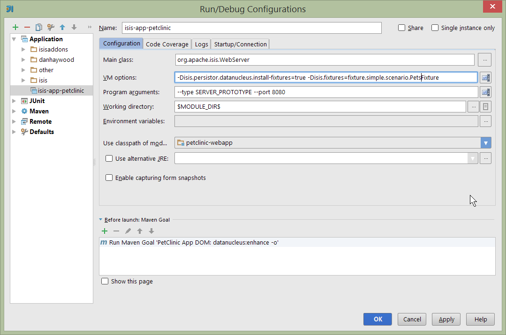
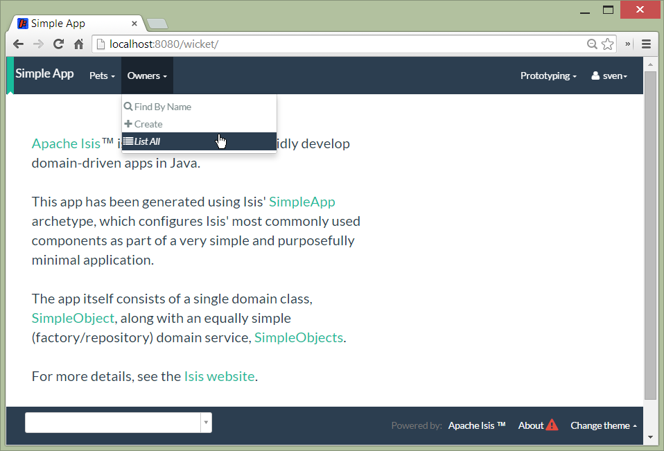
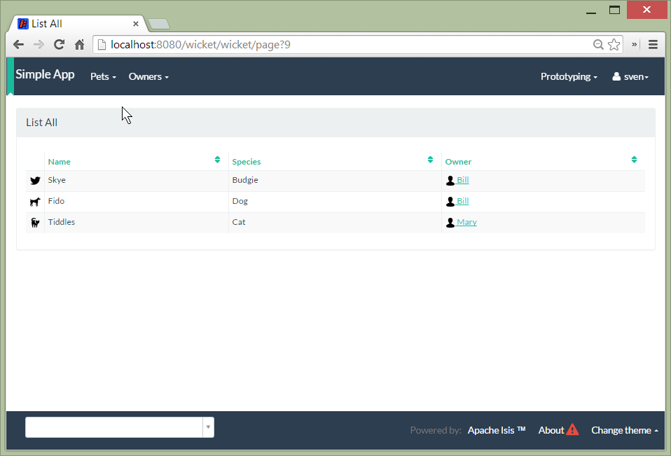
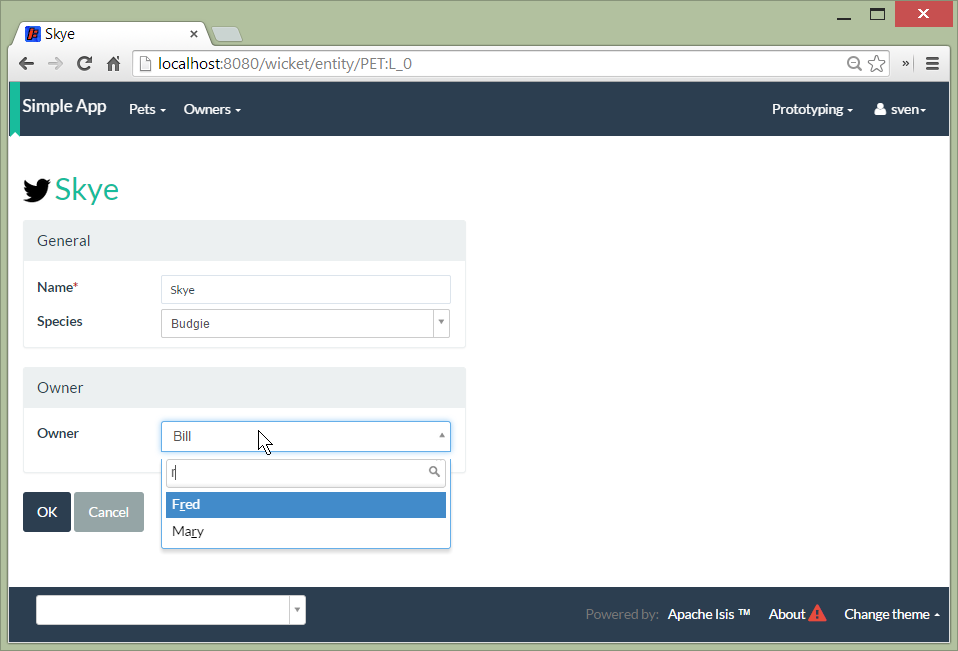

Title: Step-by-step tutorial: Petclinic

{step-by-step

{note
A step-by-step tutorial to building a petclinic application using Apache Isis.
}

This tutorial builds a simple petclinic application, consisting of just three domain classes:

</img>

The above diagram was built using [yuml.me](http://yuml.me]); the DSL that defines this diagram is:

    [Pet|-name:String{bg:green}]<-0..*[Visit|-checkIn:LocalDate;-checkout:LocalDate;-diagnosis:String|{bg:pink}]
    [Owner|-firstName:String;-lastName:String{bg:green}]<0..1-0..*>[Pet]
    [PetSpecies|-name:String{bg:blue}]<species-[Pet]

This supports the following use cases:

* register a Pet
* register an Owner
* maintain a Pet's details
* check in a Pet to visit the clinic
* enter a diagnosis
* check out a Pet to visit the clinic

    
Either follow along or check out the tags from the corresponding [github repo](https://github.com/danhaywood/isis-app-petclinic).

## Prerequisites

You'll need:

* Java 7 JDK
* [Maven](http://maven.apache.org/) 3.2.x
* an IDE, such as [Eclipse](http://www.eclipse.org/) or [IntelliJ IDEA](https://www.jetbrains.com/idea/).

## Run the archetype

{note
git checkout [249abe476797438d83faa12ff88365da2c362451](https://github.com/danhaywood/isis-app-petclinic/commit/249abe476797438d83faa12ff88365da2c362451)
}

As per the [Isis website](http://isis.apache.org/intro/getting-started/simpleapp-archetype.html), run the simpleapp archetype to build an empty Isis application.  We recommend you use the snapshot release:

    mvn archetype:generate  \
        -D archetypeGroupId=org.apache.isis.archetype \
        -D archetypeArtifactId=simpleapp-archetype \
        -D archetypeVersion=1.8.0-SNAPSHOT \
        -D groupId=com.mycompany \
        -D artifactId=petclinic \
        -D version=1.0-SNAPSHOT \
        -D archetypeRepository=http://repository-estatio.forge.cloudbees.com/snapshot/ \
        -B

This will generate the app in a `petclinic` directory.  Move the contents back:

    mv petclinic/* .
    rmdir petclinic

   
        
## Build and run

Start off by building the app from the command line:

    mvn clean install
    
Once that's built then run using:

    mvn antrun:run -P self-host

A splash screen should appear offering to start up the app.  Go ahead and start; the web browser should be opened at http://localhost:8080

Alternatively, you can run using the mvn-jetty-plugin:

    mvn jetty:run    
     
This will accomplish the same thing, though the webapp is mounted at a slightly different URL

## Using the app

Navigate to the Wicket UI (eg [http://localhost:8080/wicket](http://localhost:8080/wicket)), and login (sven/pass).

<a href="resources/petclinic/010-01-login-page.png"></img></a>

The home page should be shown:

<a href="resources/petclinic/010-02-home-page.png"></img></a>

Install the fixtures (example test data) using the `Prototyping` menu:

<a href="resources/petclinic/010-03-prototyping-menu.png"></img></a>

List all objects using the `Simple Objects` menu:

<a href="resources/petclinic/010-04-simpleobjects.png"></img></a>

To return the objects created:

<a href="resources/petclinic/010-05-simpleobject-list.png"></img></a>

Experiment some more, to:

* create a new object
* list all objects

Go back to the splash screen, and quit the app.  Note that the database runs in-memory (using HSQLDB) so any data created will be lost between runs.

   
   
## Dev environment

Set up an IDE and import the project to be able to run and debug the app

To configure the app, use these links:

* IDE:
  * configure [IntelliJ](http://isis.apache.org/intro/getting-started/ide/intellij.html), import app
  * configure [Eclipse](http://isis.apache.org/intro/getting-started/ide/eclipse.html), import app
* Set up IDE [editor templates](http://isis.apache.org/intro/resources/editor-templates.html)

Then set up a launch configuration so that you can run the app from within the IDE.  To save having to run the fixtures 
every time, specify the following system properties:

    -Disis.persistor.datanucleus.install-fixtures=true -Disis.fixtures=fixture.simple.scenario.SimpleObjectsFixture
    
For example, here's what a launch configuration in IntelliJ idea looks like:    

<a href="resources/petclinic/020-01-idea-configuration.png"></img></a>

where the "before launch" maven goal (to run the DataNucleus enhancer) is defined as:

<a href="resources/petclinic/020-02-idea-configuration.png"></img></a>

  
  
## Explore codebase

Apache Isis applications are organized into several Maven modules.  Within your IDE navigate to the various classes and correlate back to the generated UI:

* `petclinic` : parent module
* `petclinic-dom`: domain objects module
   - entity: `dom.simple.SimpleObject`
   - repository: `dom.simple.SimpleObjects`
* `petclinic-fixture`: fixtures module
   - fixture script:`fixture.simple.SimpleObjectsFixture`
* `petclinic-integtests`: integration tests module
* `petclinic-webapp`: webapp module
  * (builds the WAR file)

  
## Testing

Testing is of course massively important, and Isis makes both unit testing and (end-to-end) integration testing easy.  Building the app from the Maven command line ("mvn clean install") will run all tests, but you should also run the tests from within the IDE.

* `myapp-dom` unit tests
   - run 
   - inspect, eg
        - `SimpleObjectTest`
* `myapp-integtests` integration tests
   - run
   - inspect, eg: 
       - `integration.tests.smoke.SimpleObjectsTest`
       - `integration.specs.simple.SimpleObjectSpec_listAllAndCreate.feature`
   -  generated report, eg
        - `myapp/integtests/target/cucumber-html-report/index.html`
    - change test in IDE, re-run (in Maven)   

If you have issues with the integration tests, make sure that the domain classes have been enhanced by the DataNucleus enhancer.  (The exact mechanics depends on the IDE being used).

    
## Update POM files

{note
git checkout [68904752bc2de9ebb3c853b79236df2b3ad2c944](https://github.com/danhaywood/isis-app-petclinic/commit/68904752bc2de9ebb3c853b79236df2b3ad2c944)
}

The POM files generated by the simpleapp archetype describe the app as "SimpleApp".  Update them to say "PetClinic" instead.

## Delete the BDD specs

{note
git checkout [9046226249429b269325dfa2baccf03635841c20](https://github.com/danhaywood/isis-app-petclinic/commit/9046226249429b269325dfa2baccf03635841c20)
}

During this tutorial we're going to keep the integration tests in-sync with the code, but we're going to stop short of writing BDD/Cucumber specs.

Therefore delete the BDD feature spec and glue in the `integtest` module:

* `integration/specs/*`
* `integration/glue/*`

## Rename the app, and rename the SimpleObject entity

{note
git checkout [bee3629c0b64058f939b6dd20f226be31810fc66](https://github.com/danhaywood/isis-app-petclinic/commit/bee3629c0b64058f939b6dd20f226be31810fc66)
}

Time to start refactoring the app.  The heart of the PetClinic app is the `Pet` concept, so go through the code and refactor.  While we're at it, refactor the app itself from "SimpleApp" to "PetClinicApp".

See the git commit for more detail, but in outline, the renames required are:

* in the `dom` module's production code
    * `SimpleObject` -> `Pet` (entity)
    * `SimpleObjects` -> `Pets` (repository domain service)
    * `SimpleObject.layout.json` -> `Pet.layout.json` (layout hints for the `Pet` entity)
    * delete the `SimpleObject.png`, and add a new `Pet.png` (icon shown against all `Pet` instances).
* in the `dom` module's unit test code
    * `SimpleObjectTest` -> `PetTest` (unit tests for `Pet` entity)
    * `SimpleObjectsTest` -> `PetsTest` (unit tests for `Pets` domain service)
* in the `fixture` module:
    * `SimpleObjectsFixturesService` -> `PetClinicAppFixturesService` (rendered as the prototyping menu in the UI)
    * `SimpleObjectsTearDownService` -> `PetClinicAppTearDownService` (tear down all objects between integration tests)
    * `SimpleObjectAbstract` -> `PetAbstract` (abstract class for setting up a single pet object
        * and corresponding subclasses to set up sample data (eg `PetForFido`)
    * `SimpleObjectsFixture` -> `PetsFixture` (tear downs system and then sets up all pets)
* in the `integtest` module:
    * `SimpleAppSystemInitializer` -> `PetClinicAppSystemInitializer` (bootstraps integration tests with domain service/repositories)
    * `SimpleAppIntegTest` -> `PetClinicAppIntegTest` (base class for integration tests)
    * `SimpleObjectTest` -> `PetTest` (integration test for `Pet` entity)
    * `SimpleObjectsTest` -> `PetsTest` (integration test for `Pets` domain service)
* in the `webapp` module:
    * `SimpleApplication` -> `PetClinicApplication`
    * update `isis.properties`
    * update `web.xml`
    
To run the application will require an update to the IDE configuration, for the changed name of the fixture class:

<a href="resources/petclinic/030-01-idea-configuration-updated.png"></img></a>

Running the app should now show `Pet`s:

<a href="resources/petclinic/030-02-updated-app.png"></img></a>

## Update package names

{note
git checkout [55ec36e520191f5fc8fe7f5b89956814eaf13317](https://github.com/danhaywood/isis-app-petclinic/commit/55ec36e520191f5fc8fe7f5b89956814eaf13317)
}

The classes created by the simpleapp archetype are by default in the `simple` package.  Move these classes to `pets` package instead.  Also adjust package names where they appear as strings:

* in `PetClinicAppFixturesService`, change the package name from "fixture.simple" to "fixture.pets".
* in `PetClinicAppSystemInitializer`, change the package name "dom.simple" to "dom.pets", and similarly "fixture.simple" to "fixture.pets"
* in `WEB-INF/isis.properties`, similarly change the package name "dom.simple" to "dom.pets", and similarly "fixture.simple" to "fixture.pets"

To run the application will require a further update to the IDE configuration, for the changed package of the fixture class:

<a href="resources/petclinic/040-01-idea-configuration-updated.png"></img></a>

## Add PetSpecies (as an enum)

{note
git checkout [55c9cd28ff960220719b3dc7cb8abadace8d0829](https://github.com/danhaywood/isis-app-petclinic/commit/55c9cd28ff960220719b3dc7cb8abadace8d0829)
}

Each `Pet` is of a particular species.  Model these as an enum called `PetSpecies`:

    public enum PetSpecies {
        Cat,
        Dog,
        Budgie,
        Hamster,
        Tortoise
    }

Introduce a new property on `Pet` of this type:

    public class Pet {
        ...   
        private PetSpecies species;
        @javax.jdo.annotations.Column(allowsNull = "false")
        public PetSpecies getSpecies() { return species; }
        public void setSpecies(final PetSpecies species) { this.species = species; }
        ...
    }

Update fixtures, unit tests and integration tests.

## Icon reflects the pet species

{note
git checkout [2212765694693eb463f8fa88bab1bad154add0cb](https://github.com/danhaywood/isis-app-petclinic/commit/2212765694693eb463f8fa88bab1bad154add0cb)
}

Rather than using a single icon for a domain class, instead a different icon can be supplied for each instance.  We can therefore have different icon files for each pet, reflecting that pet's species.

    public class Pet {
        ...
        public String iconName() {
            return getSpecies().name();
        }
        ...
    }

Download corresponding icon files (`Dog.png`, `Cat.png` etc)

Running the app shows the `Pet` and its associated icon:

<a href="resources/petclinic/050-01-list-all.png"></img></a>

with the corresponding view of the `Pet`:

<a href="resources/petclinic/050-02-view-pet.png"></img></a>

<!--

## Add Pet Owner

{note
git checkout [6f92a8ee8e76696d005da2a8b7a746444d017546](https://github.com/danhaywood/isis-app-petclinic/commit/6f92a8ee8e76696d005da2a8b7a746444d017546)
}

<a href="resources/petclinic/060-01-owners-menu.png"></img></a>

<a href="resources/petclinic/060-02-owners-list.png"></img></a>

<a href="resources/petclinic/060-03-pets-list.png"></img></a>

<a href="resources/petclinic/060-04-pet-owner-autoComplete.png"></img></a>

{note
git checkout [xxx](https://github.com/danhaywood/isis-app-petclinic/commit/xxx)
}

-->

}