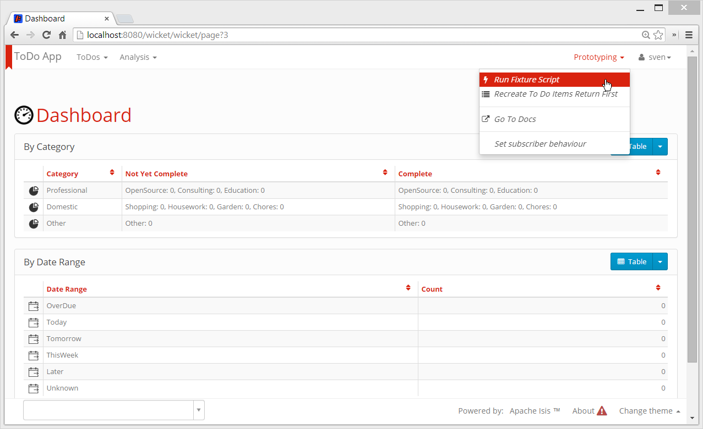
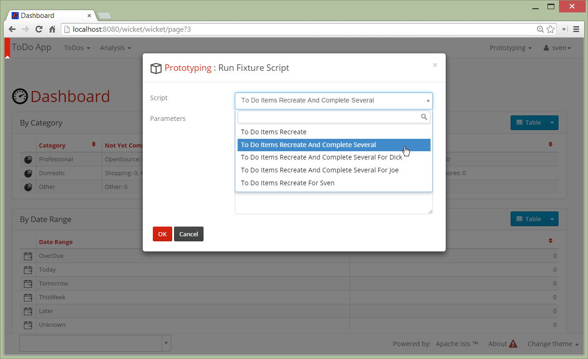
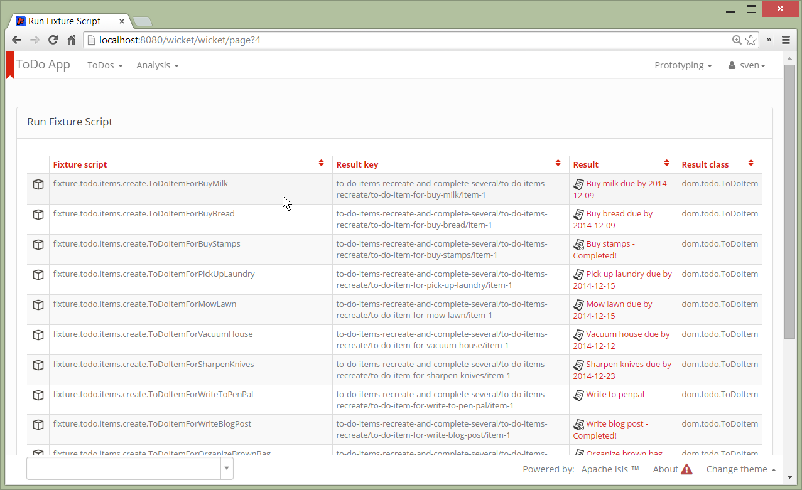
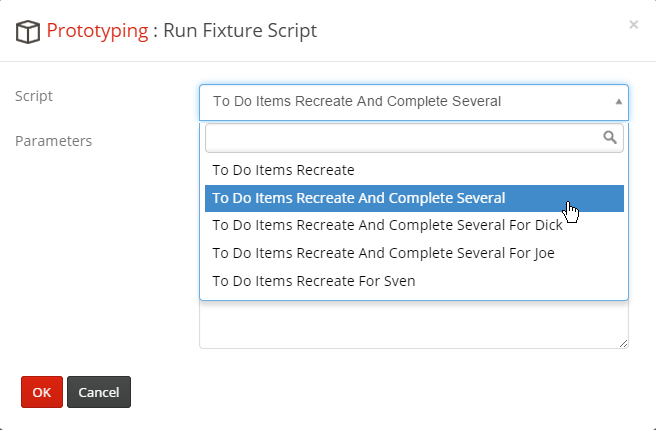
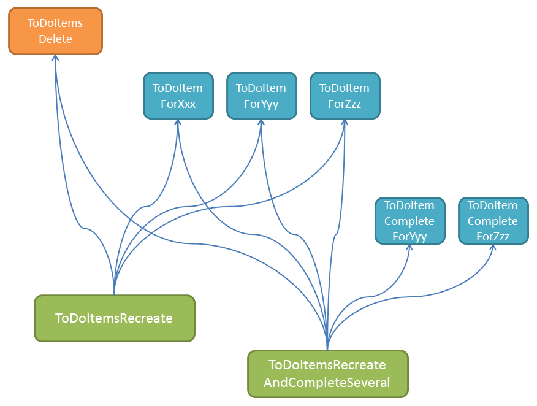
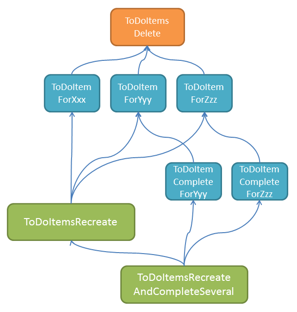

Fixture Scripts
===============

Fixture scripts are intended to support development and testing, by setting up the system into a known state.  A fixture
script are invoked using a "fixture script" service, and typically either call business actions on domain objects, or
call other fixture scripts (that is, the composite pattern).

One simple, but noteworthy point about fixture scripts is that they can be invoked through the UI.  This makes them
useful for more than "just" testing:

* If working with your domain experts/business analyst, fixture scripts allow you to set up the app in the appropriate
  state to start exploring proposed new functionality
  
* if implementing a user story/feature, fixture scripts (by setting up the system into a specific state) can make it 
  faster for you to manually verify that you've implemented the functionality correctly
  
* if writing automated [integration tests](../core/integtestsupport.html), the fixture scripts can be used as the
  "given" in a "given/when/then" style test
  
* if demo'ing your feature to the domain experts/stakeholder, fixture scripts can automate any tedious setup prior to
  demoing that feature.
  
* if performing manual/exploratory testing or user acceptance testing, the fixture script can setup the system into
  a known state for the feature being tested
  
* if training new users, the fixture script can be used to setup the system into a known state so that the users
  can practice using the features of the system.

The "fixture script" service is an application-specific subclass of the abstract `FixtureScripts` service provided in
Isis' applib.  An example of this can be found in the [simple app](../intro/getting-started/simpleapp-archetype.html)
archetype, which defines `SimpleObjectsFixtureService`.  The [todo app](../intro/getting-started/todoapp-archetype.html)
archetype also does something very similar, defining a `ToDoItemsFixtureService`.

## Using Fixture Scripts in the UI ##

The normal convention is to for the (application's) fixture script service to be surfaced on a "Prototyping" menu.  Here's
how the [todo app](../intro/getting-started/todoapp-archetype.html) defines its fixture script service:

    @DomainService
    @DomainServiceLayout(
        named = "Prototyping",
        menuBar = DomainServiceLayout.MenuBar.SECONDARY,
        menuOrder = "10"
    )
    public class ToDoItemsFixturesService extends FixtureScripts {
        ...
    }

On the prototyping menu the fixture script service's "run fixture script" action can be called:

</img>

This brings up an action prompt that lists the available fixture scripts:

</img>

Selecting and running one of these generates a list detailing the results of running the fixture:

</img>

This list acts as a useful transcript of the steps taken by the fixture script.  It also allows the user to navigate
to any of the objects created/updated by the fixture script.

The fixture script framework automatically detects all available fixture scripts by searching the classpath.  The (application-specific) fixture service subclass specifies which packages to search in through the constructor.

So, for example, the `ToDoItemsFixtureService`'s constructor is:

    public class ToDoItemsFixturesService extends FixtureScripts {
        public ToDoItemsFixturesService() {
            super("fixture.todo");
        }
        ...
    }

## Using Fixture Scripts in Integration Tests ##

Fixture scripts can be invoked in integration tests by injecting the `FixtureScripts` service and then using the service to execute the required fixture script.

For example, here's one of the [todo app](../intro/getting-started/todoapp-archetype.html)'s integration tests:

    public class ToDoItemIntegTest extends AbstractToDoIntegTest {

        ToDoItemsRecreateAndCompleteSeveral fixtureScript;

        @Before
        public void setUpData() throws Exception {
            fixtureScript = new ToDoItemsRecreateAndCompleteSeveral();
            fixtureScripts.runFixtureScript(fixtureScript, null);
        }

        @Inject
        FixtureScripts fixtureScripts;

        ...
    }

The integration test can then lookup the object of interest using the `FixtureScript#lookup(...)` method:

    public class ToDoItemIntegTest extends AbstractToDoIntegTest {
        ...
        TodoItem toDoItem;

        @Before
        public void setUp() throws Exception {

            toDoItem = fixtureScript.lookup(
                "to-do-items-recreate-and-complete-several/to-do-item-complete-for-buy-stamps/item-1",
                ToDoItem.class);
            assertThat(toDoItem, is(not(nullValue())));

        }
        ...
    }

The lookup key is the same as is rendered in the UI, and is also printed to the console.  (Although not done in the
[todo app](../intro/getting-started/todoapp-archetype.html)) it's probably good practice to encapsulate this string within the fixture script subclass, eg:

    public class ToDoItemsRecreateAndCompleteSeveral extends FixtureScript {
        ...
        @Override
        protected void execute(ExecutionContext executionContext) {
            ...
            toDoItemNotComplete = fixtureScript.lookup(
                "to-do-items-recreate-and-complete-several/to-do-item-complete-for-buy-stamps/item-1",
                ToDoItem.class);
        }

        public TodoItem toDoItemNotComplete;
    }

allowing the test to be rewritten:

    public class ToDoItemIntegTest extends AbstractToDoIntegTest {
        ...
        TodoItem toDoItem;

        @Before
        public void setUp() throws Exception {
            toDoItem = fixtureScript.toDoItemNotComplete;
        }
        ...
    }

Alternatively (and arguably a more 'purist' approach), the test could find data just by searching for it, eg:

    public class ToDoItemIntegTest extends AbstractToDoIntegTest {
        ...
        TodoItem toDoItem;

        @Before
        public void setUp() throws Exception {
            toDoItem = toDoItems.notYetComplete().get(0);
        }

        @Inject
        ToDoItems toDoItems;
        ...
    }

## Writing Fixture Scripts ##

Fixture scripts are implemented by subclassing the `FixtureScript` class, implementing the `execute(ExecutionContext)` method:

    public abstract class FixtureScript ... {
        @Programmatic
        protected abstract void execute(final ExecutionContext executionContext);
        ...
    }

The `ExecutionContext` provides two main capabilities to the fixture script:

* the script can execute other child fixture scripts

<pre>
    executionContext.executeChild(this, someObject);
</pre>

* the script can add created or updated objects to the fixture's results, so that they can be rendered in the UI, or looked up by an integration test

<pre>
    executionContext.addResult(this, someObject);
</pre>

The script can do whatever is necessary within its `execute` method to set up the state of the system (read: insert data
into the database).  One way of doing this would be simple SQL INSERT or UPDATE statements, or calling stored procs to
do the same.  This can lead to unmaintainable tests, however: if the business logic changes, then the knowledge encoded
in those SQL statements will be out-of-date.

Therefore a better approach is to have the fixture scripts simply invoke the relevant actions and other business logic
on the domain objects.  Then, if those actions change in the future, the scripts remain valid.  Put another way: have
the fixture scripts replay the "cause" of the change (business actions) rather than the "effect" (data inserts).

We therefore find it's helpful to distinguish:

* scenario fixture scripts - coarse-grained, accomplish a single business goal (or set up a bunch of related data)
* action fixture scripts - fine-grained, perform a single action on a domain object or service

Thus, scenario scripts call action scripts, with the action scripts as the atomic building blocks.

### Example Usage

The [todo app](../intro/getting-started/todoapp-archetype.html)  uses fixture
scripts to create a number of todo items, in different states (some complete, some not).  Its design is:

* `ToDoItemAbstract` is an (abstract) action script that knows how to create a todo item
* `ToDoItemXxx` are (concrete) action scripts (subclassing `ToDoItemAbstract`) that specify the "what" (action arguments) to be created

similarly:

* `ToDoItemCompleteAbstract` is an (abstract) action script that knows how to complete a (not yet complete) todo item
* `ToDoItemCompleteXxx` are (concrete) action scripts (subclassing `ToDoItemCompleteAbstract`) that specify which actual todo item to complete

while:

* `ToDoItemsRecreate` is a scenario script that creates about a dozen or so todo items
* `ToDoItemsRecreateAndCompleteSeveral` is a scenario script that creates a dozen or so todo items and completes a handful of them

The `ToDoItemsRecreateAndCompleteSeveral` script actually calls `ToDoItemsRecreate`, and so the nesting can be as deep as required.
In practice though we recommend keeping the hierarchy relatively shallow.

### Action script examples

The [todo app](../intro/getting-started/todoapp-archetype.html)'s `ToDoItemForBuyStamps` fixture script creates a single, not yet complete todo item:

    public class ToDoItemForBuyStamps extends ToDoItemAbstract {

        public static final String DESCRIPTION = "Buy stamps";

        @Override
        protected void execute(ExecutionContext executionContext) {
            createToDoItem(
                    DESCRIPTION,
                    Category.Domestic, Subcategory.Shopping,
                    nowPlusDays(0),
                    BD("10.00"),
                    executionContext);
        }
    }

where in turn `ToDoItemAbstract` inherits from `FixtureScript` and provides the `createToDoItem(...)` method:

    public abstract class ToDoItemAbstract extends FixtureScript {

        protected ToDoItem createToDoItem(
                final String description,
                final Category category, final Subcategory subcategory,
                final LocalDate dueBy,
                final BigDecimal cost,
                final ExecutionContext executionContext) {

            // validate parameters
            final String ownedBy = executionContext.getParameter("ownedBy");
            if(ownedBy == null) {
                throw new IllegalArgumentException("'ownedBy' must be specified");
            }

            // execute
            ToDoItem newToDo = toDoItems.newToDo(
                    description, category, subcategory, ownedBy, dueBy, cost);
            return executionContext.addResult(this, newToDo);
        }
        ...

        @javax.inject.Inject
        private ToDoItems toDoItems;
    }

Similarly, the following fixture script looks up a todo item (assumed to have been created earlier on) and then complete it:

    public class ToDoItemCompleteForBuyStamps extends ToDoItemCompleteAbstract {

        @Override
        protected void execute(ExecutionContext executionContext) {
            complete(ToDoItemForBuyStamps.DESCRIPTION, executionContext);
        }
    }

where once more the superclass provides the "know-how":

    public abstract class ToDoItemCompleteAbstract extends FixtureScript {

        protected void complete(final String description, final ExecutionContext executionContext) {
            String ownedBy = executionContext.getParameter("ownedBy");
            final ToDoItem toDoItem = findToDoItem(description, ownedBy);
            toDoItem.setComplete(true);
            executionContext.addResult(this, toDoItem);
        }

        private ToDoItem findToDoItem(final String description, final String ownedBy) {
            final Collection<ToDoItem> filtered = Collections2.filter(
                getContainer().allInstances(ToDoItem.class),
                    new Predicate<ToDoItem>() {
                        @Override
                        public boolean apply(ToDoItem input) {
                            return Objects.equal(description, input.getDescription()) &&
                                   Objects.equal(ownedBy, input.getOwnedBy());
                        }
                    });
            return filtered.isEmpty()? null: filtered.iterator().next();
        }
    }

### Scenario scripts examples

The `ToDoItemsRecreate` fixture script sets up a whole bunch of todo items:

    public class ToDoItemsRecreate extends FixtureScript {

        public ToDoItemsRecreate() {
            withDiscoverability(Discoverability.DISCOVERABLE);
        }
        ...
        @Override
        protected void execute(ExecutionContext executionContext) {
            ...

            // prereqs
            executionContext.executeChild(this, new ToDoItemsDelete());

            // create items
            executionContext.executeChild(this, new ToDoItemForBuyMilk());
            executionContext.executeChild(this, new ToDoItemForBuyBread());
            executionContext.executeChild(this, new ToDoItemForBuyStamps());
            executionContext.executeChild(this, new ToDoItemForPickUpLaundry());
            executionContext.executeChild(this, new ToDoItemForMowLawn());
            executionContext.executeChild(this, new ToDoItemForVacuumHouse());
            executionContext.executeChild(this, new ToDoItemForSharpenKnives());
            executionContext.executeChild(this, new ToDoItemForWriteToPenPal());
            executionContext.executeChild(this, new ToDoItemForWriteBlogPost());
            executionContext.executeChild(this, new ToDoItemForOrganizeBrownBag());
            executionContext.executeChild(this, new ToDoItemForSubmitConferenceSession());
            executionContext.executeChild(this, new ToDoItemForStageIsisRelease());
        }
    }

There's a couple of things worth pointing out here.  First, in the `execute(...)` method, note the call to the `ToDoItemsDelete` fixture script.  This is responsible for tearing down all relevant data first:

    public class ToDoItemsDelete extends FixtureScript {

        protected void execute(ExecutionContext executionContext) {
            final String ownedBy = executionContext.getParameter("ownedBy");
            isisJdoSupport.executeUpdate("delete from \"ToDoItem\" where \"ownedBy\" = '" + ownedBy + "'");
        }

        @javax.inject.Inject
        private IsisJdoSupport isisJdoSupport;
    }

Usually tear down fixture scripts will delete some logic partition of data that is under the exclusive control of the test; in the case the fact that every todo item has an owner is exploited.

Second, the scenario script is made available in the UI through the call to `withDiscoverability(...)` in its constructor:

    public class ToDoItemsRecreate extends FixtureScript {

        public ToDoItemsRecreate() {
            withDiscoverability(Discoverability.DISCOVERABLE);
        }
        ...
    }

This tells the fixture script framework that the fixture script should be listed as a choice in the UI:

</img>

## Using Deeper Hierarchies

While we suggest that you organize fixture scripts in two levels - coarse-grained scenario scripts and fine-grained action scripts - you can if you wish create deeper hierarchies than this.  Put another way: fixture scripts form a hierarchy (composite pattern) and the nesting can be as deep as you require.

The [todo app](../intro/getting-started/todoapp-archetype.html)'s fixture hierarchy as implemented is quite flat:

</img>

where each dependency represents one fixture script using `ExecutionContext#executeChild(...)` to execute another.

However, it would be possible to refactor it to use a deeper hierarchy, for example as:

</img>

With this design each fixture script takes responsibility for setting up its prerequisites, up to and including
running the `ToDoItemsDelete` teardown script.

To support this design, by default the fixture script framework (specifically, `ExecutionContext`) will only ever run
a fixture script once; or to be more precise, it will only ever run one instance of a given class of fixture script once.
Thus, although in the refactored design each of `ToDoItemForXxx`, `ToDoItemForYyy`, `ToDoItemForZzz` etc all call
`ToDoItemsDelete`, it will only be called once for the first of these, and thereafter the call will be skipped.

If you don't want this behaviour (ie you prefer that every script should always be called) then it can be overridden
in the constructor:

    public class ToDoItemsFixturesService extends FixtureScripts {

        public ToDoItemsFixturesService() {
            super("fixture.todo", MultipleExecutionStrategy.EXECUTE);
        }

## Parameters

A lot of the value for fixture scripts arises if they can perform their setup with a minimum of inputs, in other words
using sensible defaults for action arguments if none are created.  Indeed, they may well make use of a library to
generate random test data (a quick google search throws up [this ASLv2 licensed port](https://github.com/DiUS/java-faker)
of the popular Ruby Faker library.

But, sometimes we want the ability to influence the behaviour of a fixture script by overriding these defaults.  In the
context of an automated integration test, the overridden arguments help to highlight the data that is important to the
test.  In the context of manual exploratory testing, these make it easier for the tester to play around with variations
on different starting scenarios.

As the screenshots above show, the `FixtureScripts#runFixtureScript` action allows optional parameters to be provided to the called fixture scripts:

    public abstract class FixtureScripts {
        ...
        public List<FixtureResult> runFixtureScript(
                final FixtureScript fixtureScript,
                @ParameterLayout(
                    named="Parameters",
                    describedAs="Script-specific parameters (if any).  The format depends on the script implementation...",
                    multiLine = 10
                )
                @Optional
                final String parameters) {
            ...
        }
        ...
    }

These parameters are then made available in `ExecutionContext` to be consumed by the fixture script (and any child
fixture scripts that might be called in turn):

    public class ExecutionContext {
        ...
        public String getParameters() { ... }
        ...
    }

The fixture script framework itself places no conditions on the format of these parameters, but it does provide API
to support parameters specified in key=value pairs.  These can be read and also updated:

    public class ExecutionContext {
        ...
        public String getParameter(String parameterName) { ... }
        public Map<String,String> getParameterMap() { ... }
        ...
        public void setParameterIfNotPresent(String parameterName, String parameterValue) { ... }
        ...
    }

The last method `setParameterIfNotPresent(...)`, provides a useful way by which the fixture script can supply defaults
if they haven't been specified in the calling script.

For example, the `ToDoItemsRecreate` fixture script uses this API to default an "ownedBy" parameter (so that every
todo item created is for a particular user):

    public class ToDoItemsRecreate extends FixtureScript {
        ...

        private String ownedBy;
        public String getOwnedBy() { return ownedBy; }
        public void setOwnedBy(String ownedBy) { this.ownedBy = ownedBy; }

        @Override
        protected void execute(ExecutionContext executionContext) {

            // defaults
            executionContext.setParameterIfNotPresent(
                    "ownedBy",
                    Util.coalesce(getOwnedBy(), getContainer().getUser().getName()));

            ...
        }
    }

Thus, if in the UI the end-user specifies a parameter "ownedBy=fred" then this will be available to all fixture scripts
as `executionContext.getParameter("ownedBy"), but if not set then it will default to the current user.

Similarly, if an integration test programmatically calls `setOwnedBy(...)` on this script, then again the value will be
set for the script and all child scripts.

## Running a fixture script automatically on start up

If working or prototyping a particular user story (running with an in-memory database) it can be useful to have the
application automatically run a specific fixture script.  There are several ways to accomplish this.

### Using isis.properties

First, the fixture script class name can be specified in `isis.properties` config file:

    isis.fixtures=fixture.todo.scenarios.ToDoItemsRecreateForSven

The app must also be started using the following system property:

    -D isis.persistor.datanucleus.install-fixtures=true

### On the command line, using --fixture

Alternatively, the fixture class itself can be specified on the command line using the `--fixture` flag:

    --fixture fixture.todo.scenarios.ToDoItemsRecreateForSven \
    -D isis.persistor.datanucleus.install-fixtures=true

### On the command line, using system properties

A variation on this is to specify the fixture class using the following system properties:

    -D isis.fixtures=fixture.todo.scenarios.ToDoItemsRecreateForSven \
    -D isis.persistor.datanucleus.install-fixtures=true

Note that the key is "isis.fixtures", not "isis.fixture".

### Running the standalone jetty-console

A final variation allows the app to be run as a standalone WAR using jetty-console (ie `xxx-jetty-console.war`).  This
is accomplished using the `--initParam` flag:

    java -jar todoapp-jetty-console.war \
        --initParam isis.fixtures=fixture.todo.scenarios.ToDoItemsRecreateForSven \
        --initParam isis.persistor.datanucleus.install-fixtures=true

In this case any initParam named "isis." wil be loaded into Isis' configuration.
