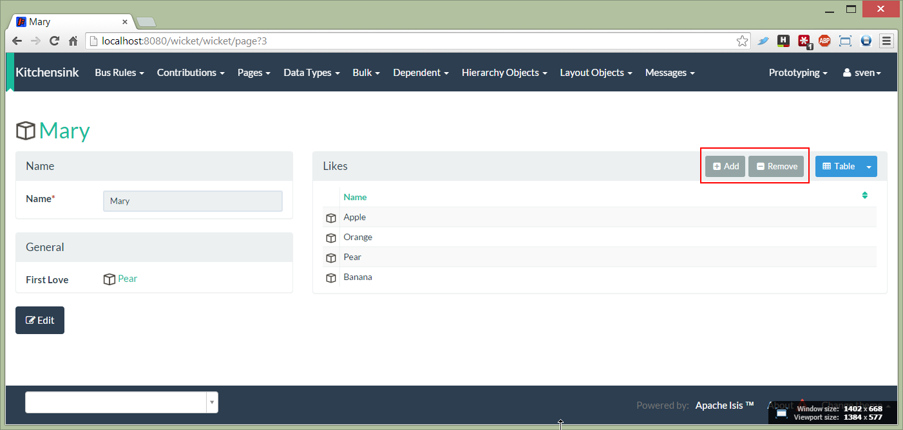

How to suppress contributions to action parameters
------------------------------------------------

If a contributed action has multiple parameters, then that action will be contributed to each of the parameter types.
While this will often be what you want (or at least harmless), on some occasions you may want to suppress the contributed
action on one of those parameter types.

The [kitchen sink app](https://github.com/isisaddons/isis-app-kitchensink) (part of [isisaddons.org](http://www.isisaddons.org/)
includes an example showing how this can be done.

In its `contrib` package there are three entities:

* [Person](https://github.com/isisaddons/isis-app-kitchensink/tree/d4fd4e8b799af42c343b7e451bbf6f5d218869a1/dom/src/main/java/org/isisaddons/app/kitchensink/dom/contrib/contributee/Person.java)
* [Preference](https://github.com/isisaddons/isis-app-kitchensink/tree/d4fd4e8b799af42c343b7e451bbf6f5d218869a1/dom/src/main/java/org/isisaddons/app/kitchensink/dom/contrib/contributed/Preference.java)
* [FoodStuff](https://github.com/isisaddons/isis-app-kitchensink/tree/d4fd4e8b799af42c343b7e451bbf6f5d218869a1/dom/src/main/java/org/isisaddons/app/kitchensink/dom/contrib/contributee/FoodStuff.java)

eg Mary LIKEs Apple, Mungo HATEs Banana, Midge LOVEs Oranges

Neither `Person` nor `FoodStuff` knows about `Preference`s; the `Preference` is the tuple that associates the two together.

The [PreferenceContributions](https://github.com/isisaddons/isis-app-kitchensink/tree/d4fd4e8b799af42c343b7e451bbf6f5d218869a1/dom/src/main/java/org/isisaddons/app/kitchensink/dom/contrib/contributed/PreferenceContributions.java) service contributes the following:

* `likes(...)` - a contributed collection to `Person`:

<pre>
    @NotContributed(NotContributed.As.ACTION) // ie contributed as collection
    @NotInServiceMenu
    @ActionSemantics(ActionSemantics.Of.SAFE)
    public List<FoodStuff> likes(final Person person) { ... }
</pre>

* `firstLove(...)` - contributed property, also to `Person`

<pre>
    @NotContributed(NotContributed.As.ACTION) // ie contributed as property
    @NotInServiceMenu
    @ActionSemantics(ActionSemantics.Of.SAFE)
    public FoodStuff firstLove(final Person person) { ... }
</pre>

* `addPreference(...)` - a contributed action to both `Person` and `FoodStuff`

<pre>
    @NotInServiceMenu
    public Preference addPreference(
            final Person person,
            final @Named("Type") Preference.PreferenceType preferenceType,
            final FoodStuff foodStuff) { ... }
</pre>

* `removePreference(...)` - a contributed action to both `Person` and `FoodStuff`

<pre>
    @NotInServiceMenu
    public Person removePreference(final Person person, final FoodStuff foodStuff) {
        final List<Preference> preferences1 = preferences.listAllPreferences();
        for (Preference preference : preferences1) { ... }
</pre>

While `addPreference(...)` and `removePreference(...)` are contributed to both `Person` and `FoodStuff`, each customizes the representation of those action (and in the case of `FoodStuff`, hides one of them completely).

For the `Person` entity, the actions are associated with the (contributed) `likes` collection:

which is accomplished using this <a href="https://github.com/isisaddons/isis-app-kitchensink/blob/d4fd4e8b799af42c343b7e451bbf6f5d218869a1/dom/src/main/java/org/isisaddons/app/kitchensink/dom/contrib/contributee/Person.layout.json#L44-L61">fragment</a> in the `Person.layout.json` file:

    "collections": {
      "likes": {
        "collectionLayout": {
          "render": "EAGERLY"
        },
        "actions": {
          "addPreference": {
            "actionLayout": {
              "named": "Add"
            }
          },
          "removePreference": {
            "actionLayout": {
              "named": "Remove"
            }
          }
        }
      }
    }

For the `FoodStuff` entity meanwhile, only the `addPreference` action is made available:

which is accomplished using this [fragment](https://github.com/isisaddons/isis-app-kitchensink/blob/d4fd4e8b799af42c343b7e451bbf6f5d218869a1/dom/src/main/java/org/isisaddons/app/kitchensink/dom/contrib/contributee/FoodStuff.layout.json#L48-L59) in the `FoodStuff.layout.json` file: we have:

    "actions": {
      "addPreference": {
        "actionLayout": {
          "cssClass": "btn-success"
        }
      },
      "removePreference": {
        "actionLayout": {
          "cssClass": "btn-warn",
          "hidden": "EVERYWHERE" /* contributed action is hidden on one of its contributees */
        }
      }
    }
