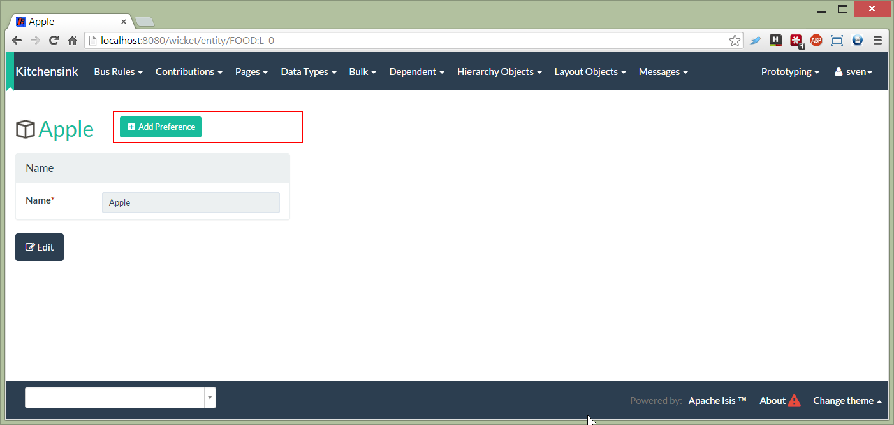

How to suppress contributions to action parameters
------------------------------------------------

If a contributed action has multiple parameters, then that action will be contributed to each of the parameter types.
While this will often be what you want (or at least harmless), on some occasions you may want to suppress the contributed
action on one of those parameter types.

The [kitchen sink app](https://github.com/isisaddons/isis-app-kitchensink) (part of [isisaddons.org](http://www.isisaddons.org/)
includes an example showing how this can be done.

In its `contrib` package there are three entities:

* [Person](https://github.com/isisaddons/isis-app-kitchensink/tree/d4fd4e8b799af42c343b7e451bbf6f5d218869a1/dom/src/main/java/org/isisaddons/app/kitchensink/dom/contrib/contributee/Person.java)
* [Preference](https://github.com/isisaddons/isis-app-kitchensink/tree/d4fd4e8b799af42c343b7e451bbf6f5d218869a1/dom/src/main/java/org/isisaddons/app/kitchensink/dom/contrib/contributed/Preference.java)
* [FoodStuff](https://github.com/isisaddons/isis-app-kitchensink/tree/d4fd4e8b799af42c343b7e451bbf6f5d218869a1/dom/src/main/java/org/isisaddons/app/kitchensink/dom/contrib/contributee/FoodStuff.java)

eg Mary LIKEs Apple, Mungo HATEs Banana, Midge LOVEs Oranges

Neither `Person` nor `FoodStuff` knows about `Preference`s; the `Preference` is the tuple that associates the two together.

The [PreferenceContributions](https://github.com/isisaddons/isis-app-kitchensink/tree/d4fd4e8b799af42c343b7e451bbf6f5d218869a1/dom/src/main/java/org/isisaddons/app/kitchensink/dom/contrib/contributed/PreferenceContributions.java) service contributes the following:

* "likes" - a contributed collection to `Person`
* "firstLove" - contributed property, also to `Person`
* "addPreference" - a contributed action to both `Person` and `FoodStuff`
* "removePreference" - a contributed action to both `Person` and `FoodStuff`

However, although "addPreference" and "removePreference" *are* contributed to both `Person` and `FoodStuff`, this can be hidden using the `.layout.json` file.  Thus, in [FoodStuff,layout.json](https://github.com/isisaddons/isis-app-kitchensink/tree/d4fd4e8b799af42c343b7e451bbf6f5d218869a1/dom/src/main/java/org/isisaddons/app/kitchensink/dom/contrib/contributee/FoodStuff.layout.json#L57-57) we have:

  "actions": {
    ...
    "removePreference": {
      "actionLayout": {
        "cssClass": "btn-warn",
        "hidden": "EVERYWHERE"
      }
    }
  }

which means that the "removePreference" action cannot be seen when viewing a FoodStuff entity.

You can see this in the screenshots below; `Person` has both actions:

while `FoodStuff` has only one:

