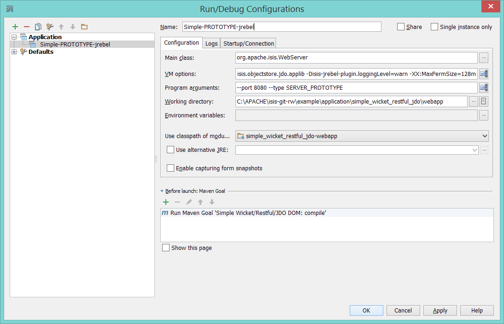
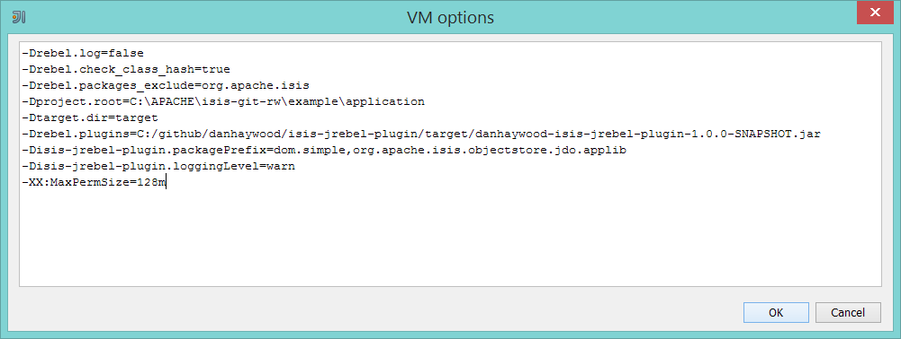

Title: Eclipse and JRebel plugin

> See also:
> * [IntelliJ and JRebel](./intellij-and-jrebel.html)
> * [Maven and JRebel](./maven-and-jrebel.html)

The Apache Isis JRebel plugin for [JRebel](http://zeroturnaround.com/software/jrebel/) allows you to alter the domain classes in your development environment and have the running app pick up those changes (avoiding a restart).

JRebel monitors the compiled bytecode of the domain object classes, and reloads whenever these are changed.  The Isis plugin then recreates the Isis and JDO metamodels automatically.

This page describes how to use the JRebel with:

* Maven
* Eclipse IDE
* IntelliJ IDE

The Isis JRebel plugin itself is free for use, and is hosted on [github](https://github.com/danhaywood/isis-jrebel-plugin).  However, JRebel itself is commercial software.  There is though  a community version that is [free for open source use](https://my.jrebel.com/).   Please check terms and conditions before using.

## Screencasts

The following screencasts show how to develop your app without having to redeploy using a JRebel plugin.

#### Using Maven with JRebel (1.4.2-snapshot)

This screencast shows how to use Maven in conjunction with JRebel:

<iframe width="640" height="354" src="//www.youtube.com/embed/jpYNZ343gi4" frameborder="0" allowfullscreen></iframe>

The command used to run the webapp is:

    mvn -P jrebel antrun:run \
        -Djrebel.jar="C:/Users/Dan/.IdeaIC13/config/plugins/jr-ide-idea/lib/jrebel/jrebel.jar" \
        -Disis_jrebel_plugin.jar="C:/github/danhaywood/isis-jrebel-plugin/target/danhaywood-isis-jrebel-plugin-1.0.0-SNAPSHOT.jar"

Change the values of `rebel.jar` and `isis_jrebel_plugin.jar` as necessary.

#### Using Eclipse with JRebel

This screencast shows how to use Maven in conjunction with Eclipse:

<iframe width="640" height="354" src="//www.youtube.com/embed/uPfRXllQV1o" frameborder="0" allowfullscreen></iframe>

#### Using IntelliJ with JRebel

This screencast shows how to use Maven in conjunction with IntelliJ:

> TODO

These screenshots show the VM arguments as configured in IntelliJ:

and

If you want to copy-n-paste those VM args, they are:

    -Drebel.log=false \
    -Drebel.check_class_hash=true \
    -Drebel.packages_exclude=org.apache.isis \
    -Dproject.root=C:\APACHE\isis-git-rw\example\application\simple_wicket_restful_jdo \
    -Dtarget.dir=target \
    -Drebel.plugins=C:/github/danhaywood/isis-jrebel-plugin/target/danhaywood-isis-jrebel-plugin-1.0.0-SNAPSHOT.jar \
    -Disis-jrebel-plugin.packagePrefix=dom.simple,org.apache.isis.objectstore.jdo.applib \
    -Disis-jrebel-plugin.loggingLevel=warn \
    -XX:MaxPermSize=128m

You'll need to adjust the value of some of these:
* `rebel.plugins` for the location of the plugin JAR
* `project.root` for the root directory of the application
* `isis-jrebel-plugin.packagePrefix` for the prefix of the application (eg `com.mycompany.myapp.dom`)
    
You can probably leave the other properties as is.

## Download

The plugin can be downloaded from [github](https://github.com/danhaywood/isis-jrebel-plugin).

## Usage

The README on the github page how to set up the plugin.

One final note: you do need to run Isis in prototype mode to automatically pick up changes.
