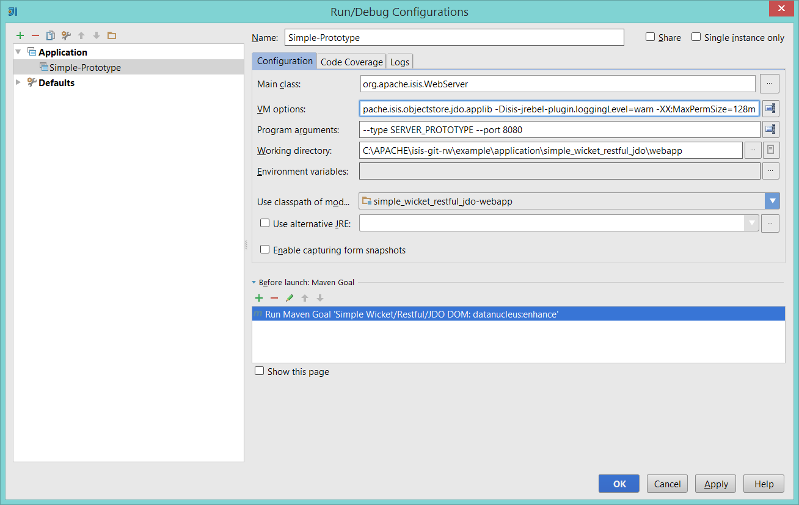

Title: Eclipse and JRebel plugin

> See also:
> * [IntelliJ and JRebel](./intellij-and-jrebel.html)
> * [Maven and JRebel](./maven-and-jrebel.html)

The Apache Isis JRebel plugin for [JRebel](http://zeroturnaround.com/software/jrebel/) allows you to alter the domain classes in your development environment and have the running app pick up those changes (avoiding a restart).

JRebel monitors the compiled bytecode of the domain object classes, and reloads whenever these are changed.  The Isis plugin then recreates the Isis and JDO metamodels automatically.

This page describes how to use the JRebel with:

* Maven
* Eclipse IDE
* IntelliJ IDE

The Isis JRebel plugin itself is free for use, and is hosted on [github](https://github.com/danhaywood/isis-jrebel-plugin).  However, JRebel itself is commercial software.  There is though  a community version that is [free for open source use](https://my.jrebel.com/).   Please check terms and conditions before using.

> Note that Isis must be run in prototype mode to automatically pick up changes.

## Prerequisites

There are two prerequisites:
* first, you'll need to download the JRebel JAR (or install the plugins into the IDE) and set up a license
* second, you'll need to build/download the Isis JRebel plugin.  Do this by cloning the [github repo]((https://github.com/danhaywood/isis-jrebel-plugin)), and building using maven.

## <a name="maven"><a name="screencast">Using Maven with JRebel (1.4.2-snapshot)</a></a>

This screencast shows how to use Maven in conjunction with JRebel:

<iframe width="640" height="360" src="//www.youtube.com/embed/jpYNZ343gi4" frameborder="0" allowfullscreen></iframe>

The command used to run the webapp is:

    mvn -P jrebel antrun:run \
        -Djrebel.jar="C:/Users/Dan/.IdeaIC13/config/plugins/jr-ide-idea/lib/jrebel/jrebel.jar" \
        -Disis_jrebel_plugin.jar="C:/github/danhaywood/isis-jrebel-plugin/target/danhaywood-isis-jrebel-plugin-1.0.0-SNAPSHOT.jar"

Change the values of `rebel.jar` and `isis_jrebel_plugin.jar` as necessary:
* the `rebel.jar` property is the location of the JRebel jar file.  You can either download this or (as the above example shows) simply use the embedded JRebel from an IDE
* the `isis_jrebel_plugin.jar` property points to the Isis plugin JAR that you built previously
* `isis-jrebel-plugin.packagePrefix` for the prefix of the application (eg `com.mycompany.myapp.dom`)

## <a name="eclipse">Using Eclipse with JRebel</a>

> Remember to install the JRebel plugin for Eclipse from the Eclipse Marketplace (Help > Eclipse Marketplace), and set up a license.

This screencast shows how to use Maven in conjunction with Eclipse:

<iframe width="640" height="360" src="//www.youtube.com/embed/uPfRXllQV1o" frameborder="0" allowfullscreen></iframe>

The archetypes already include a `.launch` file for JRebel.  AS the screencast showed, you will need to adjust some settings:
* `isis-jrebel-plugin.packagePrefix` for the prefix of the application (eg `com.mycompany.myapp.dom`)
* `rebel.plugins` for the location of the Isis plugin JAR (from the github repo)

## <a name="intellij>Using IntelliJ with JRebel</a>

>  Remember to installed the JRebel plugin for IntelliJ (File > Settings > Plugins), and set up a license.

This screencast shows how to use Maven in conjunction with IntelliJ:

<iframe width="640" height="360" src="//www.youtube.com/embed/XXX" frameborder="0" allowfullscreen></iframe>

> This screencast follows on from the one that explains [how to setup IntelliJ](../../intro/getting-started/ide/intellij.html#screencast) as your IDE.

These screenshots show the VM arguments as configured in IntelliJ:

and

If you want to copy-n-paste those VM args, they are:

    -Drebel.log=false \
    -Drebel.check_class_hash=true \
    -Drebel.packages_exclude=org.apache.isis \
    -Dproject.root=C:\APACHE\isis-git-rw\example\application\simple_wicket_restful_jdo \
    -Dtarget.dir=target \
    -Drebel.plugins=C:/github/danhaywood/isis-jrebel-plugin/target/danhaywood-isis-jrebel-plugin-1.0.0-SNAPSHOT.jar \
    -Disis-jrebel-plugin.packagePrefix=dom.simple,org.apache.isis.objectstore.jdo.applib \
    -Disis-jrebel-plugin.loggingLevel=warn \
    -XX:MaxPermSize=128m

You'll need to adjust the value of some of these:
* `rebel.plugins` for the location of the Isis plugin JAR (from the github repo)
* `isis-jrebel-plugin.packagePrefix` for the prefix of the application (eg `com.mycompany.myapp.dom`)
* `project.root` for the root directory of the application
    
You can probably leave the other properties as is.

