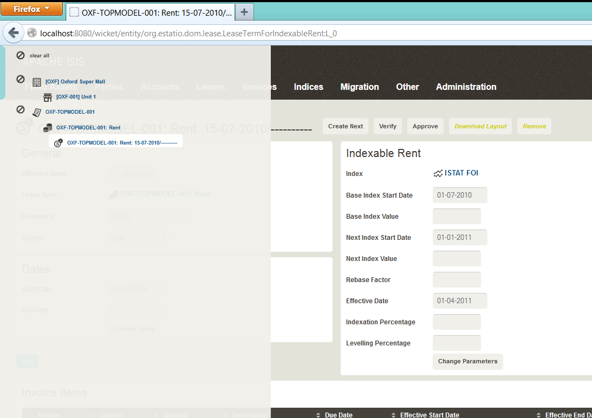

Title: @Bookmarkable

[//]: # (content copied to _user-guide_xxx)

> Deprecated, use instead [@DomainObject#bookmarking()](./DomainObject.html).

The `@Bookmarkable` annotation indicates that an entity or an action (with safe [action semantics](./ActionSemantics.html)) is automatically bookmarked.

(In the Wicket viewer), a link to a bookmarked object is shown in the bookmarks panel that slides out from the left:

 
For example:

    @Bookmarkable
    public class ToDoItem ... {
        ...
    }

indicates that the `ToDoItem` class is bookmarkable, while:

    @Named("ToDos")
    public class ToDoItems {

        @Bookmarkable
        @ActionSemantics(Of.SAFE)
        @MemberOrder(sequence = "1")
        public List<ToDoItem> notYetComplete() {
            ...
        }
        
    }

indicates that the "not yet complete" action is bookmarkable.

It is also possible to nest bookmarkable entities.  For example, this screenshot is taken from [Estatio](http://github.com/estatio/estatio):

For example, the `Property` entity "[OXF] Oxford Super Mall" is a root bookmark (the default), but the `Unit` child entity "[OXF-001] Unit 1" only appears as a bookmark if its parent `Property` has already been visited.  This is accomplished with the following annotations:

    @Bookmarkable
    public class Property { ... }
    
and

    @Bookmarkable(BookmarkPolicy.AS_CHILD)
    public abstract class Unit { ... }

The nesting can be done to any level; the Estatio screenshot also shows a bookmark nesting 3 deep: `Lease` -> `LeaseItem` -> `LeaseTerm`.

