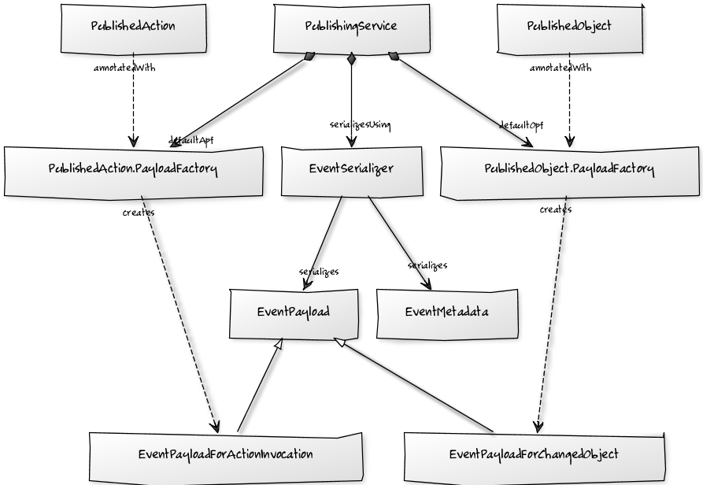

Title: Publishing Service

The Publishing Service enables Isis to publish both changes to domain objects, and also action invocations to third parties.  A typical use case is to publish onto a pub/sub bus such as [ServiceMix](http://servicemix.apache.org/) or [ActiveMQ](http://activemq.apache.org/) to keep other systems up to date.

Publishing requires at minimum two things:

*  domain classes annotated with `PublishedAction` or `PublishedObject`
   
   The former causes any invocations of an action to be published, the latter causes any changes to the object to be published.  You can annotate with either or both.  

* an implementation of the `org.apache.isis.applib.services.publish.PublishingService` interface must be registered as a domain services

   This is done in the usual way, registering the service in the `isis.properties` config file

Over and above this, the service does provide considerable flexibility for fine-tuning the serialized form and the contents (payload) of the event.

> Publishing of action invocations is supported by all objectstores.  Publishing of changed objects is currently only supported by the [JDO objectstore](../../components/objectstores/jdo/about.html).

## Annotating the Domain Model

To indicate that an action should be published, use the `PublishedAction` annotation.  For example:

<pre>
  public class ToDoItem {
    ...
    @PublishedAction
    public void completed() { ... }
    ...
  }
</pre>

Similarly, to indicate that any changes to an object should be published, use the `PublishedObject` annotation:

<pre>
  @PublishedObject
  public class ToDoItem {
    ...
  }
</pre>

Either or both of these annotations can be used.

As described further down in this article, it is possible to fine-tune the payload.  However, simply using the above annotations will suffice in many cases.

## API

The `PublishingService` interface is:

    public interface PublishingService {
        public void publish(EventMetadata metadata, EventPayload payload);
        void setEventSerializer(EventSerializer eventSerializer);
    }

Typically implementations will use the injected `EventSerializer` to convert the metadata and payload into a form to be published:

    public interface EventSerializer {
        public Object serialize(EventMetadata metadata, EventPayload payload);
    }

The serialized form returned by `EventSerializer` will typically be something like JSON, XML or a string.  The signature of `serialize(...)` returns an object 
Although not necessary to implement `EventSerializer`, typically one should also for maximum flexibility, but its important to make sure that the `PublishingService` is able to handle the serialized form.  Strings are a good
lowest common denominator, but in some cases are type-safe equivalent, such as a
`org.w3c.dom.Document` or an `org.json.JSONObject` might be returned instead.

### Fine-tuning the payload

The `EventPayload` that is serialized identifies the object(s) being interacted with or changed, and in the case of the action invocation provides details of the action arguments and result (if any) of that action.  However, the payload does not include the new state of these objects.  It is therefore the responsibility of the subscriber to call back to Isis to determine any information that has not been published.

Doing this is comparatively straightforward if using the Restful Object serializer and Restful Objects viewer; the JSON provided includes hrefs to the objects.

In some circumstances, however, it may make more sense to eagerly "push" information about the change to the subscriber by including that state within the payload.  

To accomplish this, an implementation of a "`PayloadFactory`" must be specified in the annotation.  For actions, implement `@PublishedAction.PayloadFactory`:

    public @interface PublishedAction {
        public interface PayloadFactory {
          @Programmatic
          public EventPayload payloadFor(
              Identifier actionIdentifier, 
              Object target, List<Object> arguments, Object result);
        }
        Class<? extends PayloadFactory> value()  default PayloadFactory.class;
    }

For objects, the interface to implement is `@PublishedObject.PayloadFactory`:

    public @interface PublishedObject {
        public interface PayloadFactory {
          @Programmatic
          public EventPayload payloadFor(Object changed);
        }
        Class<? extends PayloadFactory> value() default PayloadFactory.class;
    }

For example, the following will eagerly include the `ToDoItem`'s `description` property whenever it is changed:

    @PublishedObject(ToDoItemPayloadFactory.class)
    public class ToDoItem {
        ...
    }

where `ToDoItemPayloadFactory` is defined as:

    public class ToDoItemChangedPayloadFactory implements PayloadFactory {
        public static class ToDoItemPayload 
            extends EventPayloadForChangedObject<ToDoItem> {

          public ToDoItemPayload(ToDoItem changed) {
              super(changed);
          }
            
          public String getDescription() {
              return getChanged().getDescription();
          }
        }
        @Override
        public EventPayload payloadFor(Object changedObject) {
          return new ToDoItemPayload((ToDoItem) changedObject);
        }
    }

## Default Implementations

A simple implementation of `PublishingService` (which must be configured as a domain service) is available; it simply writes to stderr.

The implementation is as follows:

    public interface PublishingService {
    ...
        public static class Stderr implements PublishingService {
            private EventSerializer eventSerializer = new EventSerializer.Simple();
            @Programmatic
            @Override
            public void publish(EventMetadata metadata, EventPayload payload) {
                Object serializedEvent = eventSerializer.serialize(metadata, payload);
                System.err.println(serializedEvent);
            }

            @Override
            public void setEventSerializer(EventSerializer eventSerializer) {
                this.eventSerializer = eventSerializer;
            }
        }
        ...
    }

As can be seen, the above implementation in turn uses a default implementation of `EventSerializer`, which simply concatenates the metadata and payload together into a single string:

    public interface EventSerializer {
        ...
        public static class Simple implements EventSerializer {
            @Programmatic
            @Override
            public Object serialize(EventMetadata metadata, EventPayload payload) {
                return "PUBLISHED: \n    metadata: " + 
                        metadata.getGuid() + ":" + 
                        metadata.getUser() + ":" + 
                        metadata.getTimestamp() + ":" +
                        payloads:\n" + payload.toString();
            }
        }
        ...
    }

The default `PublishingService` (or indeed any implementation) can be configured to run with a different `EventSerializer` by configuring the serializer implementation in the `isis.properties` file. 

#### Configuration

To configure the above, add the following to `isis.properties`:

    isis.services=...,\
                  org.apache.isis.applib.services.publish.PublishingService$StdErr,\
                  ...

## Alternative Implementations

An alternative implementation of the `PublishingService` is provided by the [JDO Objectstore](../../components/objectstores/jdo/services/publishing-service-jdo.html).  This implementation persists the events to a table.

An alternative implementation of the `EventSerializer` is provided by the [Restful Objects viewer](../../components/viewers/restfulobjects/event-serializer-rospec.html).  This implementation serializes the payload using the conventions of the [Restful Objects spec](http://restfulobjects.org).

#### Related Services

Dan Haywood's [camel-isis-pubsubjdo](https://github.com/danhaywood/camel-isis-pubsubjdo) project up on github shows how to poll and process the persisted `PublishedEvent` table using [Apache Camel](http://camel.apache.org).

## Class Diagram

The following class diagram shows how the above components fit together:

 

The diagram was generated at [yuml.me](http://yuml.me/edit/23db58a4) using the following description:

<pre>
[PublishingService]++-serializesUsing>[EventSerializer]
[PublishingService]++-defaultOpf>[PublishedObject.PayloadFactory]
[PublishingService]++-defaultApf>[PublishedAction.PayloadFactory]
[EventPayload]^-[EventPayloadForChangedObject]
[EventPayload]^-[EventPayloadForActionInvocation]
[PublishedObject]annotatedWith-.->[PublishedObject.PayloadFactory]
[PublishedAction]annotatedWith-.->[PublishedAction.PayloadFactory]
[PublishedObject.PayloadFactory]creates-.->[EventPayloadForChangedObject]
[PublishedAction.PayloadFactory]creates-.->[EventPayloadForActionInvocation]
[EventMetadata]
[EventSerializer]-serializes>[EventMetadata]
[EventSerializer]-serializes>[EventPayload]
</pre>
