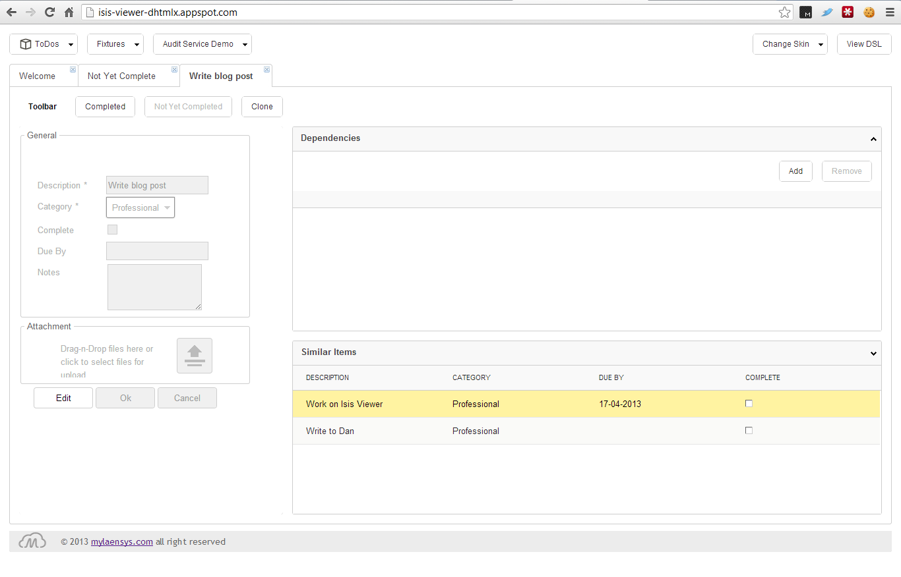

Title: DHTMLX (third-party) viewer

The DHTMLX viewer integrates the [DHTMLX](http://dhtmlx.com) Javascript library with Apache Isis.  The viewer (being developed by [Mylaensys](http://www.mylaensys.com/)) has so far been as a prototype to validate the approach; we now expect it to be taken through to production-ready code later this year (2013).

The viewer has some innovative features, including:

* custom layouts using (a dialect of) the [Naked Objects View Language](http://www.slideshare.net/marciusbrandao/naked-objects-view-languageinfo-brasil) DSL

* proactive notification when another user modifies an object

* skinnable

You can try out the online demo of the viewer (running on Google App Engine) [here](http://isis-viewer-dhtmlx.appspot.com).  You should see an app that (as of Apr 2013) looks something like:

</img>

The intention *is* for this viewer to be open sourced, though the dependency on DHTMLX (dual licensed as GPL/commercial) means that it cannot be rolled into the Isis codebase.

### Further reading:

- [Slideshare presentation](http://www.slideshare.net/mylaensys/dhtmlx-isis-viewer)
- [Blog post](http://blog.mylaensys.com/2013/04/isis-viewer-dhtmlx-preview.html)

This page will be updated once the repo is available.  In the meantime, you can find out more by asking on the Isis mailing lists.
